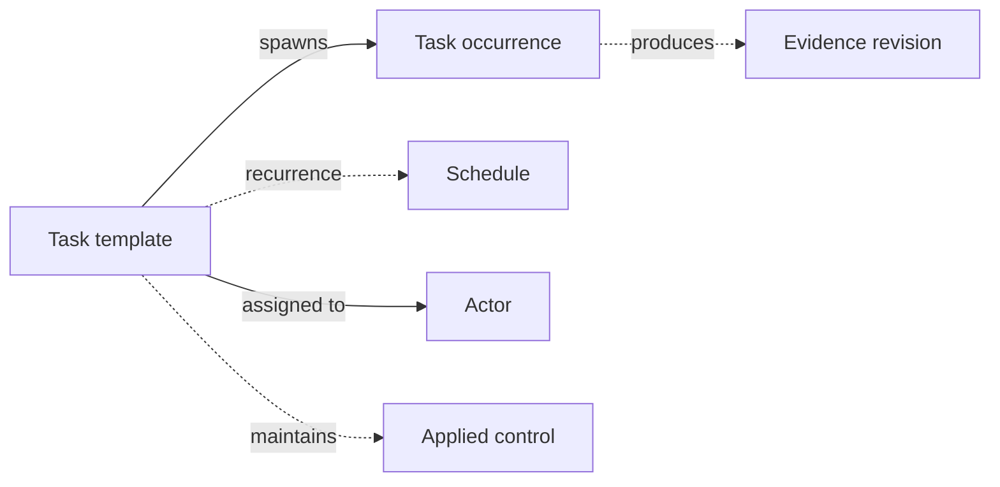

# Tasks

Tasks are how CISO Assistant tracks the operational work that keeps controls effective: the weekly access review, the monthly backup test, the quarterly policy refresh, the one-off offboarding checklist. They are deliberately separate from applied controls — a control says _what is done_; a task says _that someone has actually done it on a given date_.

## Mental model

The task template is the definition — assignee, recurrence rule, expected evidence — and the task occurrence is the actual unit of work scheduled from it. The schedule is a JSON field describing the cadence (DAILY / WEEKLY / MONTHLY / YEARLY with the usual iCalendar refinements). Templates can be wired to many other objects — applied controls being the canonical one (the "maintains" semantics: this work keeps that control healthy) — and when an occurrence is completed, the evidence revision it produces is back-linked through `task_node` so the audit trail closes the loop.

| User-facing | Internal | Notes |
|---|---|---|
| Task definition / template | `TaskTemplate` | One spec, one schedule |
| Task occurrence | `TaskNode` | One scheduled run |
| Schedule | `schedule` JSON field on the template | iCal-style recurrence rule |

## Definition vs occurrence

Tasks come in two layers, mirroring the **template → instance** pattern used elsewhere in the platform:

- A **task definition** is the reusable spec — the title, description, assignee, expected evidence, and the recurrence rule (`every Monday`, `the 1st of each month`, `every 90 days`). It says _what should happen_ and _how often_. Internally a `TaskTemplate`.
- A **task occurrence** is a single scheduled run produced from a definition — the actual row with a due date, a status (pending → in progress → completed / cancelled), and the evidence collected when the work was done. Internally a `TaskNode`.

A one-off task is just a definition that produces a single occurrence.

## Lifecycle

1. **Define.** Create a task definition with the assignee, the cadence, and what's expected when the task runs.
2. **Schedule.** Occurrences are materialised from the recurrence rule. The platform creates them as their due dates come into view, so the list of upcoming work is always visible.
3. **Work the occurrence.** When a due date arrives, the assignee opens the occurrence, records what they did, attaches evidence, and marks it completed.
4. **Iterate.** Edit the definition to adjust the cadence, assignee, or expected evidence — existing occurrences keep their state; future occurrences pick up the change.

## Why tasks (and not just calendar reminders)

The point of tracking tasks inside the platform — rather than in a calendar or ticketing system — is so that the **evidence** of execution lives next to the rest of your compliance record. An auditor asking "show me proof of monthly backup testing" can be answered by pointing at the task and walking through the completed occurrences with their attached evidence.

## Related

- [Applied controls](applied-controls.md)
- [Evidence](evidence.md)
- [Vocabulary → Task definition / Task occurrence](../introduction/vocabulary.md)
