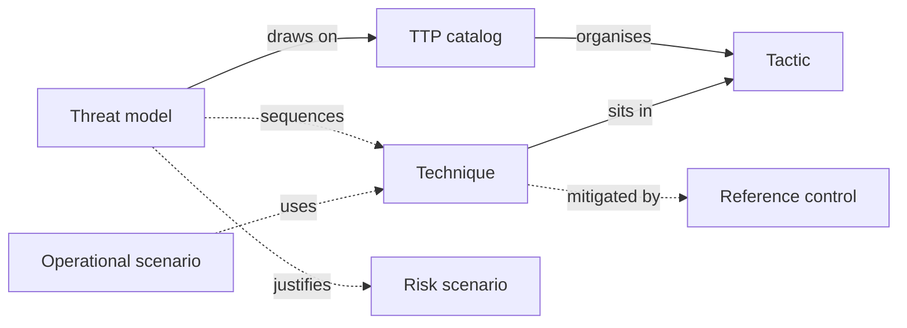

# TTP catalogs and threat models

A **TTP catalog** is a reference matrix of adversary behaviour: the **tactics** an attacker pursues (the _why_ of a step, such as Initial Access or Exfiltration) and the **techniques** used to achieve them (the _how_, such as Phishing or Data Obfuscation). CISO Assistant ships MITRE ATT&CK and MITRE ATLAS as TTP catalogs.

A **threat model** is an attack sequence you build on top of one catalog. You pick the techniques that apply to your system, lay them out tactic by tactic, chain them into a graph, and link the result to the risk scenarios it justifies.

## Techniques and threats

A [threat](threats.md) and a technique answer different questions:

- A **threat** is _what could happen_: a source of harm such as "Ransomware" or "Loss of power". It's what a risk scenario materialises.
- A **technique** is _how an adversary does it_: a concrete, observed behaviour such as "Phishing" or "Exfiltration Over Web Service", catalogued with its tactics, platforms and mitigations.

Both can sit on the same EBIOS RM operational scenario: threats name the harm, techniques describe the attacker's operating mode.

## Mental model

A **TTP catalog** organises **tactics** in their published order. Each **technique** sits in one or more tactics; a sub-technique also points to its parent technique. A technique can list the **reference controls** (the catalog's mitigations) that address it. A **threat model** always draws on exactly one catalog, chosen at creation and locked afterwards; it optionally sequences that catalog's techniques into a graph, and optionally justifies one or more risk scenarios or quantitative risk scenarios. Separately, an EBIOS RM **operational scenario** can directly reference the techniques it uses, without going through a threat model.

| User-facing | Internal | Notes |
|---|---|---|
| TTP catalog | `TTPCatalog` | One matrix per library, e.g. MITRE ATT&CK Enterprise Matrix |
| Tactic | `Tactic` | Matrix column; keeps the source order |
| Technique | `Technique` | Can sit in several tactics; sub-techniques have a parent |
| Reference control | `ReferenceControl` | The catalog's mitigations (e.g. ATT&CK `M1031`) |
| Threat model | `ThreatModel` | Lives in a domain; bound to one catalog |
| Graph node | `ThreatModelNode` | Technique, AND/OR operator, or custom step |
| Graph edge | `ThreatModelEdge` | Directed link between two nodes |
| Operational scenario | `OperationalScenario` | EBIOS RM workshop 4; has a **Techniques** field |

## Enabling the feature

Two [feature flags](../configuration/settings/feature-flags.md) control this area. Both are off by default.

- **TTP catalogs** (`ttps`) — shows **TTP catalogs** under **Catalog** in the sidebar, technique pages, and the **Techniques** field on operational scenarios.
- **Threat modeling** (`threat_modeling`) — shows **Threat modeling** under **Risk** in the sidebar and the **Threat model** field on risk scenarios and quantitative risk scenarios.

Threat models are built on a TTP catalog, so turn on both flags to use them.

## Loading the catalogs

TTP catalogs come from [libraries](libraries.md). Load one or more from the **Libraries** page:

| Library | Catalog | Matrix filters |
|---|---|---|
| Mitre ATT&CK v19.1 - TTPs and Mitigations | MITRE ATT&CK Enterprise Matrix | Platform (Windows, Linux, macOS, IaaS, SaaS, Containers, …) |
| Mitre ATT&CK for ICS v19.2 - TTPs and Mitigations | MITRE ATT&CK for ICS Matrix | Asset (Control Server, Data Historian, …) |
| Mitre ATT&CK for Mobile v19.2 - TTPs and Mitigations | MITRE ATT&CK for Mobile Matrix | Platform (Android, iOS) |
| Mitre ATLAS v2026.07 - TTPs and Mitigations | MITRE ATLAS Matrix | Platform (Predictive AI, Generative AI, Agentic AI, …) and maturity (Realized, Demonstrated, Feasible) |

Each library brings the catalog, its tactics, its techniques, and the mitigations as reference controls already linked to the techniques they address. When a newer version of a library drops a technique, the technique is marked deprecated rather than deleted, so existing links keep working; deprecated techniques are hidden from the matrix and from pickers.


If your instance loaded an earlier version of the ATT&CK library, its techniques were loaded as threats. Those entries remain in **Threats** so existing risk scenarios keep their links. Updating the library to the current version adds the TTP catalog alongside them.


## The matrix view

Open **TTP catalogs** and pick a catalog to see it as a matrix: one column per tactic, in the publisher's order, with each technique listed under every tactic it belongs to. Techniques that have sub-techniques show a counter that expands them in place. Clicking a technique opens its detail page: description, tactics, parent technique, mitigations, and the groups (platforms, assets) it applies to.

Above the matrix, a search box filters by reference ID or name, and the catalog's filter chips, grouped by dimension (platform, asset, maturity), narrow the matrix further. Chips in the same dimension combine with OR; different dimensions combine with AND. A parent technique stays visible when only one of its sub-techniques matches. **Clear filters** resets everything.

## Techniques on EBIOS RM operational scenarios

With **TTP catalogs** enabled, the operational scenario form in [EBIOS RM](ebios-rm.md) workshop 4 gains a **Techniques** field next to **Threats**: "Adversary techniques (MITRE ATT&CK and other TTP catalogs) used in this operational scenario". The selected techniques are listed on the operational scenario page (or **No technique** when none is set) and in the EBIOS RM study report, each linking to its technique page.

## Threat models

Open **Threat modeling** in the sidebar and click **Add threat model**. Give it a name, choose its domain, and pick its **TTP catalog**. The catalog can't be changed later: "The catalog cannot be changed after creation."

The threat model page shows the usual details plus a read-only preview of the graph, with two actions: **Select techniques** and **Edit graph**. Both views share a **Selection** / **Graph** switch so you can move between them.

### Selection

The **Selection** view is the catalog matrix in selection mode. Click the techniques that apply to highlight them, then **Save**; the header shows how many are selected. A selection is per cell: the same technique selected under two tactics is two separate steps, because a tactic changes what the technique means in the sequence.


Deselecting a cell and saving removes that step from the graph, together with its edges and the context attached to it.


### Graph

The **Graph** view is an editor laid out in one lane per tactic, left to right in the catalog's order.

- **Add techniques** — drag them from the palette into a lane. A technique only drops into the lanes of tactics it belongs to.
- **Connect steps** — draw an edge from one node to another. Loops and backward edges are allowed, only self-loops and duplicates are refused.
- **AND / OR** — when a node gets a second incoming edge, an operator node is inserted in front of it, set to OR. Use **Toggle AND / OR** to switch it: "AND requires every incoming step; OR accepts any of them."
- **Add a step** — adds a custom node for a step the catalog doesn't cover.
- **Auto-link** — "Draw an edge from every technique to every technique in the next occupied tactic. Existing edges are kept."
- **Hide empty tactics** — collapses lanes with no node.

Select a node to edit its context in the side panel: a **Label**, a **Description**, a **Key step** flag to highlight it, and links to the **Assets** it targets, the **Applied controls** that counter it, and the **Vulnerabilities** it exploits. Changes are kept locally until you click **Save**; **Discard** drops them.

### Linking to risk scenarios

With **Threat modeling** enabled, the risk scenario edit page has a **Threat model** field ("The attack sequence that justifies this scenario") and a button to create a new threat model on the spot. The risk scenario page then lists the linked threat model with a direct link to its graph. Quantitative risk scenarios have the same **Threat model** field.

## Permissions

Analysts and domain managers can create, edit and delete threat models in their domains; readers and approvers can view them. TTP catalogs, tactics and techniques are catalog objects: readable by every built-in role except third-party respondents, and loaded or updated through libraries.

## Related

- [Threats](threats.md)
- [EBIOS RM](ebios-rm.md)
- [Risk assessments](risk-assessments.md)
- [Quantitative risk studies](quantitative-risk-studies.md)
- [Libraries](libraries.md)
- [Threat intelligence](threat-intel.md)
- [Feature flags](../configuration/settings/feature-flags.md)
