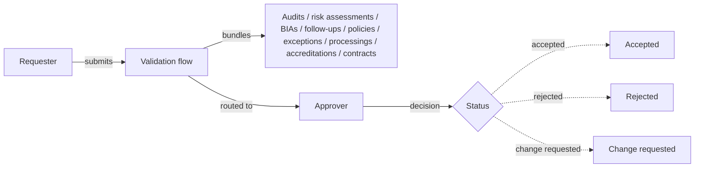

# Validation flows

A **validation flow** (labelled **Validations** in the sidebar) is the platform's structured sign-off workflow. It takes one or more objects — an audit, a risk assessment, a policy, a security exception, a contract, an accreditation — bundles them into a single request, and routes that request to a designated approver for a formal decision. The decision and its context are preserved as an audit trail.

It's the answer to _"who approved this, when, and on what evidence?"_ — the question that comes up in every certification audit, every internal review, and every regulator visit.

## Mental model

A **requester** submits a validation flow for one or more objects in their domain. The flow carries optional **request notes**, a **validation deadline**, and is routed to a designated **approver**. The approver moves the flow through a status machine ending in one of: _Accepted_, _Rejected_, _Change requested_, _Revoked_, _Expired_, or _Dropped_. The original objects remain unchanged — what's recorded is the validation flow itself, with the link back to whatever was up for approval.

| User-facing | Internal | Notes |
|---|---|---|
| Validation flow | `ValidationFlow` | Lives in a domain; carries the request, the bundled objects, the deadline, and the decision |
| Validations (sidebar) | `validationFlows` i18n key | The list view label |
| Requester | `requester` FK to User | The platform account that submitted the flow |
| Approver | `approver` FK to User | Foreign key to a **User** (not an actor) — approval is always personal accountability, even if assignment elsewhere can fan out to a team |
| Request notes | `request_notes` | Free-text explanation of what's being asked for |
| Validation deadline | `validation_deadline` | Optional date used for expiry and dashboards |

## What can be validated

There are two ways to start a flow, and they cover slightly different objects:

- **From the Validations list** — click **+**, then expand the **More** section to attach objects. The picker offers **Audits**, **Risk assessments**, **Business impact analyses**, **Findings assessments** (follow-ups), **Security exceptions**, **Processings** (privacy), **Accreditations**, and **Contracts** (third-party). You can mix several types in one flow when they belong to the same approval decision (e.g. "approve this audit and the related exceptions").
- **From an object's own page** — objects that carry a validation section let you submit the open object directly. This is the only way to route a **Policy** through a flow, and it's also available on audits, risk assessments, BIAs, follow-ups, exceptions, processings, accreditations, and contracts.

So the full set of objects that can go through a validation flow is: audits, risk assessments, business impact analyses, follow-ups, policies, security exceptions, processings, accreditations, and contracts.

## Status lifecycle

The flow moves through a small state machine:

| Status | Meaning |
|---|---|
| **Submitted** | Sent to the approver; awaiting decision |
| **Change requested** | Approver wants edits before deciding; the requester reworks and resubmits |
| **Accepted** | Approved — decision and timestamp recorded |
| **Rejected** | Declined — decision and rationale recorded |
| **Revoked** | Approval was rescinded after the fact (e.g. underlying conditions changed) |
| **Expired** | Validation deadline passed without a decision |
| **Dropped** | Requester withdrew the flow before a decision was reached |

The status is the audit-trail field that gets cited in evidence reports — "policy v3 was _Accepted_ by Jane Doe on 2026-03-12" is what makes the decision provable later.

## Approver — user, not actor

Most ownership/assignment fields across the platform hold an **actor** (which can resolve to a user, a team, or an entity). The validation-flow **approver** is the deliberate exception: it's a foreign key to a **User** directly. Approval is a personal accountability act — _"a named individual signed off"_ — and a team can't approve in the same way it can co-own work.

When the [My assignments](../features/my-assignments.md) page surfaces validation flows, it wraps the user-only approver field so the team-broadening toggle still works: switching to "include team assignments" adds every team member's user ID into the approver filter, giving you a per-team queue without changing the underlying _"one named user approves"_ semantics.

## Reference ID

Each validation flow carries an optional, unique **reference ID** — useful when you need to cite the approval in external systems (a change-management ticket, a regulator submission, an internal governance record). The platform enforces uniqueness across the instance.

## When to use a validation flow

The pattern fits anywhere a decision needs **formal, traceable sign-off**:

- A policy moving from _validated_ to _published_ — the approver records that the document is fit for release.
- A security exception being granted — naming the risk-owner who accepted the residual risk.
- An audit's results being signed off before publication to stakeholders.
- A risk assessment's residual-risk acceptance — the formal capture required by ISO 27005 and most internal risk frameworks.
- A third-party contract going through procurement sign-off.

It is _not_ the right tool for casual review or peer feedback — for those, use comments, the requirement-assessment review status, or a [findings assessment](findings-assessments.md). Validation flows are explicitly heavy: they exist so that the approval is preserved as evidence.

## Related

- [Policies](policies.md) — typical objects routed through validation flows for publication
- [Findings assessments](findings-assessments.md) — lighter-weight review/remediation tracking
- [Risk assessments](risk-assessments.md) — formal risk acceptance is one of the most common reasons a validation flow is submitted
- [My assignments](../features/my-assignments.md) — where approvers see flows queued for them
- [Actors and teams](actors-and-teams.md) — explains why approver is a user, not an actor
