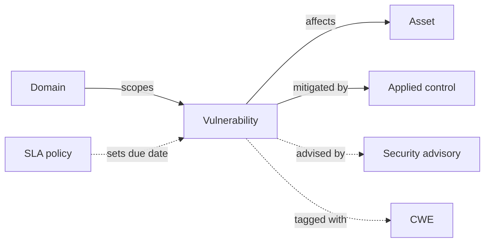

# Vulnerabilities

A **vulnerability** is a weakness in a system, process, or product that could be exploited to compromise confidentiality, integrity, or availability. CISO Assistant tracks vulnerabilities as first-class objects, separately from the **incidents** they may cause and the **risk scenarios** they feed into.

The vulnerability surface answers two operational questions: _what's exposed_ and _are we treating it fast enough?_

## Mental model



A vulnerability sits inside a domain and points outward at what it affects (assets) and what's treating it (applied controls). Threat-intel feeds enrich it asynchronously — KEV/NVD/EUVD feeds attach security advisories, NVD enrichment tags it with CWEs. The vulnerability SLA policy is a single platform-wide setting that maps severity to a deadline: when severity changes and no explicit due date has been set, the platform recomputes the due date from the policy.

| User-facing | Internal | Notes |
|---|---|---|
| Vulnerability | `Vulnerability` | First-class object |
| Security advisory | `sec_intel.SecurityAdvisory` | Ingested from KEV / NVD / EUVD |
| CWE | `sec_intel.CWE` | Common Weakness Enumeration |
| SLA policy | `GlobalSettings("vulnerability-sla")` | Severity → days mapping |

## What a vulnerability captures

- **Identification** — a name, an optional reference ID (typically a CVE), a description.
- **Severity** — the shared scale (undefined / info / low / medium / high / critical).
- **Status** — undefined, potential, exploitable, mitigated, fixed, not exploitable, unaffected.
- **Affected scope** — the assets exposed, and the entities (third parties) involved when relevant.
- **Treatment** — linked applied controls (the remediations), security exceptions (formal deviations), CWE entries, and one or more security advisories.
- **Timing** — detection date, publication date, ETA, and the SLA due date computed from the severity-driven policy.

## SLA-driven due dates

Vulnerabilities are unusual in that the platform sets a **due date** automatically based on severity, via the [Vulnerability SLA policy](../configuration/settings/vulnerability-sla.md). The flow:

1. A vulnerability is created (or its severity changes).
2. If no explicit due date is set, the SLA policy is applied — high severity gets a tighter deadline than medium, and so on.
3. The bulk "refresh due dates" action re-applies the policy across existing rows when the SLA configuration changes.

Explicit due dates the user (or an import) sets are preserved — the policy only fills in the blank.

## Threat-intelligence enrichment

Vulnerabilities don't live in isolation. CISO Assistant can pull from external feeds to enrich them automatically — see [Security intelligence feeds](../configuration/settings/sec-intel-feeds.md):

- **KEV feed** flags vulnerabilities confirmed exploited in the wild.
- **EPSS feed** attaches a probabilistic exploitation score.
- **NVD enrichment** pulls CWE mappings, affected configurations, and references.

These enrichments link a vulnerability to its **security advisory** and **CWE** entries, making severity triage less guesswork.

## Lifecycle

```
detected → triaged → treated (mitigated / fixed / exception / accepted) → closed
```

The status field captures where each vulnerability sits in that flow; the linked applied controls and security exceptions explain _how_ it's being treated.

## Related

- [Applied controls](applied-controls.md)
- [Incidents](incidents.md)
- [Risk assessments](risk-assessments.md)
- [Vulnerability SLA policy](../configuration/settings/vulnerability-sla.md)
- [Security intelligence feeds](../configuration/settings/sec-intel-feeds.md)
- [Vocabulary → Vulnerability / Security advisory / CWE / Severity](../introduction/vocabulary.md)
