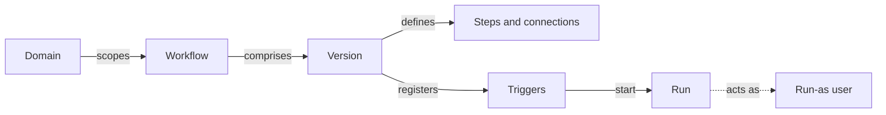

# Workflows

A **workflow** is a small automation you draw on a canvas: a trigger, some steps, and the connections between them. It runs inside CISO Assistant, on your data, as a user you nominate — so it can send the reminder nobody remembers to send, open the remediation control a non-compliant requirement needs, or post a summary of this week's audit progress to your team.

It answers the question every GRC team eventually asks: _"why is a human still doing this by hand every Monday?"_


**Workflows** (automation) and **Validations** (sign-off) are different things. A validation flow routes an object to a person for a decision; a workflow reacts to changes and does work. A workflow can tell you that an approval is waiting — it can never grant one. See [Validation flows](validation-flows.md).


## Mental model

A **workflow** lives in a domain, which fixes what it can ever see or touch. Its content is held in **versions**: you edit a draft, and publishing turns that draft into the published version — the only one that ever runs. Publishing also registers the version's **triggers**, the ways a run can start. Each **run** executes the steps in order, acting as the **run-as user**, so the automation holds exactly that person's permissions and nothing more.

| User-facing | Internal | Notes |
|---|---|---|
| Workflow | `Workflow` | Lives in a domain; carries the name, the pause switch and the run time limit |
| Workflow version | `WorkflowVersion` | Draft or published; publishing freezes the graph |
| Step | `WorkflowNode` | A trigger, action, condition, loop or stop-run node on the canvas |
| Trigger | `WorkflowTrigger` | The registered, switchable state of a trigger step, created on publish |
| Run | `WorkflowInstance` | One execution, with its variables, step outputs and log |
| Variables | `WorkflowVariable` | Named values the graph reads and writes |
| Secrets | `WorkflowSecret` | Write-only values for outgoing HTTP calls |

Workflows live at `/workflows`, and each one opens into the builder.

## Draft and published

Everything you draw goes into a **draft**. The canvas saves as you work, and nothing about the draft can run automatically.

**Publish** turns the draft into the published version. It validates the whole graph first — every branch wired, every referenced step and secret present, every action's configuration accepted — and refuses with `The workflow cannot be published yet` if something is off. Once published, editing starts a new draft; the published version keeps running untouched until you publish again, and the builder shows **Needs republishing** while the two differ. **Discard draft** throws the draft away and returns to the published version.

This split is what makes a workflow safe to change: there is no state in which a half-edited graph is live.

## What starts a run

| Trigger | What it means | State on publish |
|---|---|---|
| **Manual** | Someone presses **Execute** in the builder | n/a — always available |
| **Webhook** | An external system POSTs JSON to a URL | **Enabled** — it is a pull; someone must call it |
| **Schedule** | A cron expression in a timezone you choose | **Disabled** |
| **On event** | Something changed in the platform — an audit updated, a finding created | **Disabled** |

Schedules and event triggers arrive **Disabled** on purpose: publishing a workflow — or importing one from a library — must never start a cron or an event storm by surprise. You arm each one deliberately in the **Triggers** panel, where you can also see **Last fired** and why a firing was skipped.

Event triggers read the platform's own change log, so they cover a wide range of objects. Their filters let you narrow to what actually matters — a status that changed to a specific value, rather than every save.

## What a workflow may do

Steps come from a palette: read objects, create an object, update one, send an email, call an HTTP endpoint, compute a date, set variables, branch on a condition, loop over a list, and provision domains, users or group memberships.

There is a line the engine will not cross, and it is worth stating plainly because it is what makes workflow-written data acceptable to an auditor:

> **Automation may record that time passed, and may attach work, but it may not render the judgment.**

Concretely, a workflow can move a requirement assessment to _In progress_, attach the control it just created, and set a due date — but it can never write the requirement's **result** or **score**. It can mark an evidence or an exception _expired_ — but never _approved_. It can create and link a treatment control on a risk scenario — but the **treatment** decision stays with the analyst. Approvals and revocations are not writable at all. The full list lives in [the workflow reference](../features/workflows.md).

## Who a workflow runs as

Publishing shows **Publish workflow** and the line _"Once published, this workflow runs as you, using these permissions"_. That is the **run-as user**: the run acts with that person's rights, checked live on every step, and reads exactly the rows the API would show them. A run can never touch anything outside its workflow's domain and the domains beneath it.

If the run-as user loses a permission, the affected step fails and says so — the automation degrades into an error you can see, rather than quietly doing more than it should.

## Runs

Every execution is kept: which trigger started it, what the variables held, what each step returned, and where it stopped. From the **Runs** panel you can **Show on canvas** to replay the path visually, **Replay** a run, or pick one as **Use as reference data** so the builder can preview what `{{expressions}}` will resolve to while you edit.

## Two off switches

- **Disable workflow** pauses the whole thing. The builder shows **Paused**, and the hint says it plainly: _automatic triggers are disabled — manual runs still work._
- Each trigger has its own **Enabled** / **Disabled** state, so you can arm the schedule and leave the event trigger off while you tune it.

## Where workflows come from

You draw them, or you install them. Libraries can carry workflows: the **Libraries** page has a **Workflows** tile, a library preview shows the graph before you commit, and installing one creates a workflow in the domain you choose. Imported workflows arrive as **drafts, divorced from the library** — they are yours to edit, they never update themselves underneath you, and their schedule and event triggers arrive disabled like any other. Nothing you install can act before you publish it and arm it.

Workflows can also travel the other way: **Export as YAML** produces a library document you can review, version in git, or hand to another instance.
