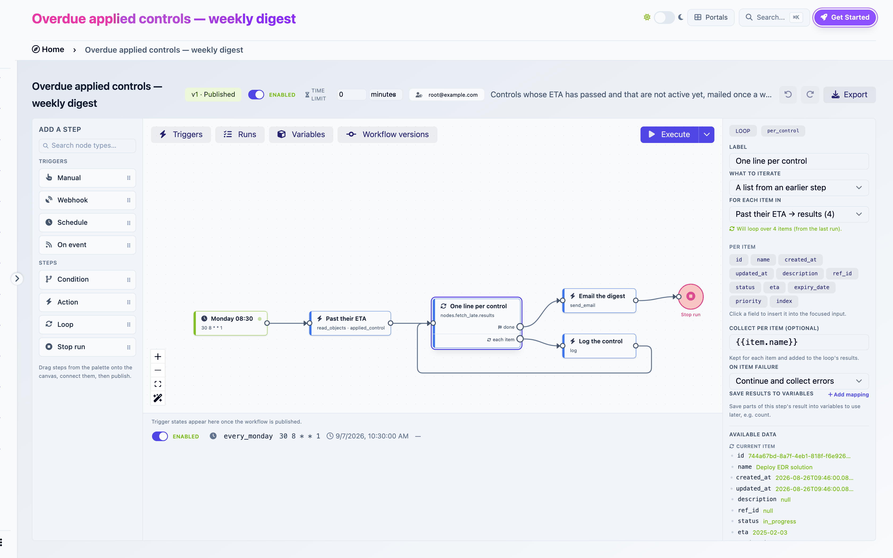
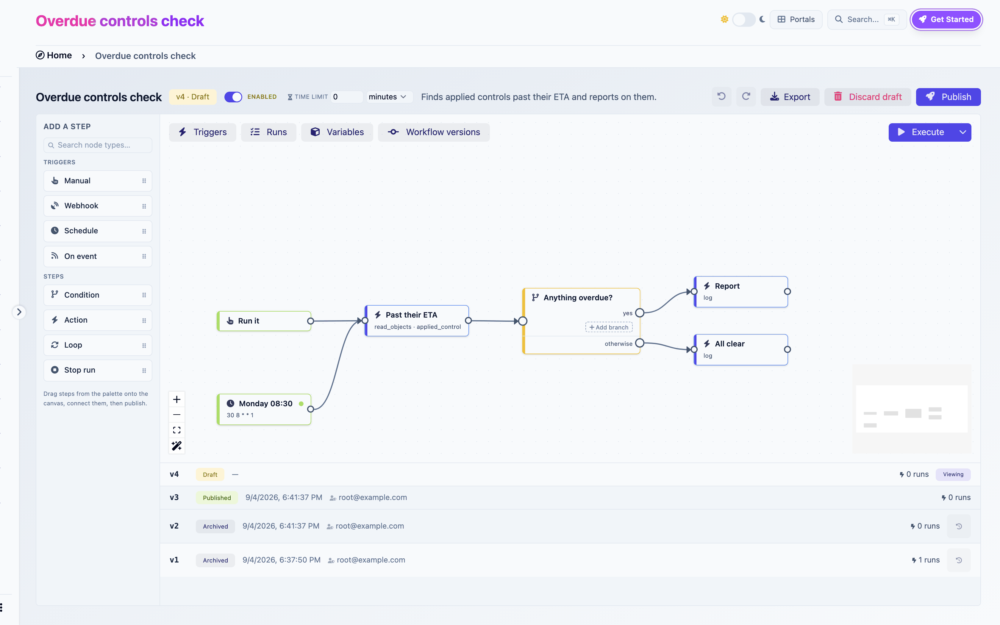

# Workflows

Workflows automate what happens in CISO Assistant. A workflow reacts to something (a schedule, an object changing, an external system calling in, or you pressing a button), then runs a series of steps: read objects, create or update them, branch on a value, loop over a list, send an email, call an external system.

You build workflows visually, on a canvas. No code is involved, and everything a workflow does is bounded by the permissions of the person who published it.

<figure><figcaption><p>The builder: the weekly digest template open, its loop step selected, the Triggers panel showing the enabled schedule</p></figcaption></figure>


**Workflows** (automation) and **Validation flows** (sign-off) are different things. A validation flow routes an object to a person for a decision. A workflow reacts to changes and does work. A workflow can tell you that an approval is waiting, it can never grant one. See [Validation flows](validation-flows.md).


## What you can automate

| Pattern | Example |
|---|---|
| Digests | Every Monday, email the controls past their ETA |
| Reactions | When a finding is created at high severity, open a remediation control and link it |
| Sweeps | Every night, mark lapsed security exceptions as expired |
| Intake | A scanner posts vulnerabilities to a URL and each one is recorded |
| Outbound | When a control goes live, post to your ITSM or chat tool |
| Provisioning | Create a domain, its groups and its first user in one run |

Twenty-five ready-made workflows ship as [templates](../features/workflows/templates.md). Most people start by installing one and adapting it.


## A workflow is a graph

A workflow is a set of **steps** connected by **wires**. A run starts at a **trigger** step and follows the wires. Where a step has several outgoing wires, all of them run, in parallel. Where you want only one path, you use a Condition step, which picks exactly one of its branches.

```
[Monday 08:30] ──▶ [Read overdue controls] ──▶ [Loop] ──each──▶ [Log one line] ──┐
                                                  ▲                                │
                                                  └────────────────────────────────┘
                                                  └──done──▶ [Email the digest] ──▶ [Stop run]
```

A path ends when it reaches a step with no outgoing wire, or a Stop run step. The difference matters: an unconnected step ends that path only, while Stop run ends the whole run, including paths still executing elsewhere.

## Versions: draft, published, archived

A workflow has versions. At any time it has at most one **draft** and at most one **published** version. Older published versions are **archived**.

| State | Editable | Runs automatically | Can be executed by hand |
|---|---|---|---|
| Draft | Yes | No | Yes, as you |
| Published | No. Editing it creates a new draft | Yes, when its triggers are enabled | Yes, as its publisher |
| Archived | No. Can be restored as a new draft | No | No |

Publishing is the moment a graph becomes real. It runs a set of [checks](../features/workflows/publish-checks.md), freezes the graph, registers its triggers and stamps the publisher as the version's **run identity**. The previously published version is archived. Runs that were already in flight keep executing their own frozen version.

You can always edit a published workflow. The first change you make silently creates a new draft. The published version keeps running until you publish the draft, and you can discard the draft at any time to go back.

<figure><figcaption><p>Workflow versions</p></figcaption></figure>

## Runs

A **run** is one execution of one version. It has a status:

| Status | Meaning |
|---|---|
| Active | Still executing, or waiting for an email to be delivered |
| Completed | Every path finished, or a Stop run step was reached with no failure elsewhere |
| Failed | A step failed, or the run hit its time limit |

Each run keeps its **variables**, the **payload** that started it, the **output of every step**, and a **log** of everything that happened. You browse all of it from the Runs panel, replay it on the canvas, and pin a run as reference data so the builder can show you real values while you edit.

## Data flows through expressions

Steps exchange data through [expressions](../features/workflows/expressions.md): `{{today}}`, `{{payload.object_repr}}`, `{{nodes.fetch_late.count}}`, `{{item.name}}`. A step's settings are text with expressions inside. When the step runs, the expressions are replaced with values from the run.

**Variables** are named values declared on the workflow with a type and a default. A trigger can fill them from incoming data, a Set variables step can assign them, and conditions compare against them.

**Secrets** are named credentials for HTTP calls. They are write-only and scoped to one workflow.

## Scope and identity

A workflow lives in a **domain**. Its runs can only see and change objects in that domain and its sub-domains. Every published version runs **as the person who published it**, with their permissions checked live at every step. Publishing grants nothing: you can automate exactly what you could do by hand, in the domain where the workflow lives.

Read [Permissions and security](../features/workflows/permissions-and-security.md) for the full model.

## Vocabulary

| Term | Meaning |
|---|---|
| Step | A node on the canvas: trigger, Condition, Action, Loop or Stop run |
| Wire | A connection between two steps |
| Trigger | The step a run starts at |
| Branch | One output of a Condition step, with its own conditions |
| Ref | A step's identifier in expressions, derived from its label |
| Run | One execution of a version |
| Run identity | The user whose permissions a published version's runs use |
| Reference run | The run pinned in the builder to show real data while editing |
| Template | A ready-made workflow shipped as a library |

## Where to go

- [Building your first workflow](../guides/first-workflow.md): enable the feature and build one end to end.
- [Workflow builder](../features/workflows/README.md): every part of the canvas, then triggers, steps, expressions, variables, runs, sharing and troubleshooting.
- [Template catalog](../features/workflows/templates.md): the ready-made workflows and which one to start from.
- [Permissions and security](../features/workflows/permissions-and-security.md): who a run acts as and what it can reach.
