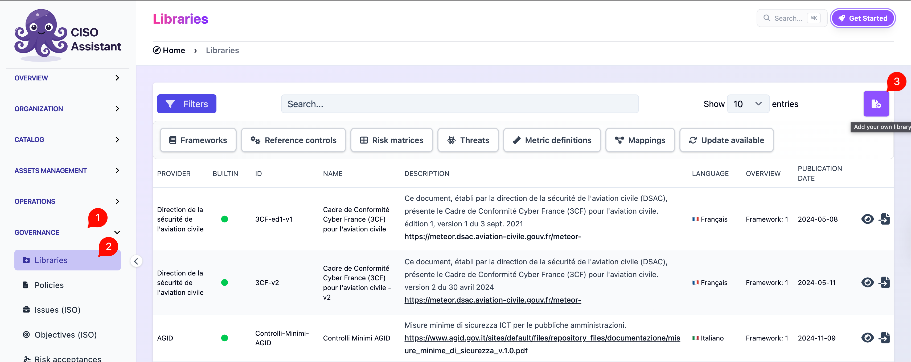

# CIS Controls / Cloud Controls Matrix (CCM)

CIS Controls and the Cloud Security Alliance's Cloud Controls Matrix (CCM) ship as Excel spreadsheets that CISO Assistant can convert and load directly — no command-line preparation required.


CIS and CSA have restrictive licence terms on their content, so the spreadsheets are not bundled with CISO Assistant. You have to download the official spreadsheet from CIS or CSA yourself and then upload it to the platform.


## Direct import

1. Download the CIS Controls or CCM spreadsheet from the relevant authority's website.
2. In CISO Assistant, go to **Libraries** and click **Add your own library**.

   <figure><figcaption></figcaption></figure>
3. Select the downloaded spreadsheet and upload it. CISO Assistant converts it to the platform's library format on the fly.

   .png>)
4. Once the conversion finishes, load the new library like any other.

## Advanced: customise the conversion

If you need to adjust the conversion (custom packager name, modified spreadsheet, additional mappings), the conversion logic is available as standalone Python tools in the repository:

- [CIS Controls converter](https://github.com/intuitem/ciso-assistant-community/tree/main/tools/excel/cis)
- [CCM converter](https://github.com/intuitem/ciso-assistant-community/tree/main/tools/excel/ccm)

The standard flow is to copy the spreadsheet into the tools folder and run `convert_cis.sh` (Linux/Mac) or `convert_cis.bat` (Windows). For finer control, run `tools/excel/cis/prep_cis.py` first to set a custom packager string, then pass the prepared spreadsheet to `convert_library_v2.py`. The output YAML can be uploaded as a custom library and loaded.

See the [dedicated README for CIS Controls](https://github.com/intuitem/ciso-assistant-community/blob/main/tools/excel/cis/README.md) and the [dedicated README for CCM](https://github.com/intuitem/ciso-assistant-community/blob/main/tools/excel/ccm/README.md) for parameters and edge cases.
