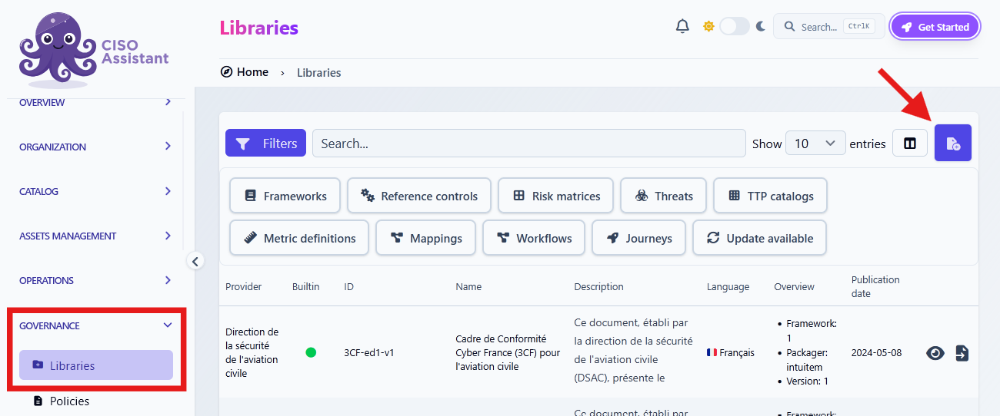

# Guided example: create your first framework

We will use the two-page [Octopus Habitat Security Standard (OHSS)](../../.gitbook/assets/octopus-habitat-security-standard-en.pdf) as our source. In this fictional standard, an octopus must secure a permanently submerged home to meet the Mermaid Authority's certification criteria. Read the PDF before continuing: we will turn its content into a CISO Assistant Framework.


This walkthrough mainly shows how to create the library in Excel. If you prefer the [Library builder](../authoring/library-builder.md), you can follow the same reasoning to organize the standard. Only the way you enter the content changes.


## Before you begin

First, look at how the standard is organized. You do not need to decide on every Excel sheet yet. Identify:

- The three sections and their numbered requirements. These form the main structure of the Framework.
- The assessment questions included in requirements `OH 2.2` and `OH 3.2`, and the score scale at the end of the document.
- The review themes used to filter requirements. They are optional: a requirement can have several themes or none.

We will use these observations to decide what to create in the library, then build it one part at a time.

## 1. Start small, then build up

For this example, we assume that the workbook already contains `library_meta`, `fwk_meta`, and `fwk_content`. We will fill the metadata sheets first, then outline the Framework's sections and requirements.


To generate these sheets already filled, use the `prepare_framework_v2_config.xlsx` Excel workbook with `prepare_framework_v2.py`. Open the collapsed section below to see what to enter in its `base` sheet, then [run the script as explained here](create-library.md#generate-a-framework-workbook).

<details>
<summary>Show the values to enter in the configuration workbook</summary>

In the `base` sheet of `prepare_framework_v2_config.xlsx`, replace the example values with these ones:

| Property | Value | Why this value? |
| --- | --- | --- |
| `urn_root` | `octopus-habitat-security-standard` | A stable identifier for this standard, without a version number, so minor updates can keep the same URNs. |
| `locale` | `en` | The source standard is in English. |
| `ref_id` | `OHSS.v1` | The standard's abbreviation and edition, useful for readers without making it part of the URNs. |
| `framework_name` | Octopus Habitat Security Standard | The title used in the source document. |
| `description` | The Octopus Habitat Security Standard (OHSS) sets baseline safeguards for an octopus-managed home that remains submerged beneath the reef. To qualify for certification by the Mermaid Authority, the owner must show that access is controlled, essential habitat systems remain safe, and incidents can be handled. | The opening two sentences of the standard describe its scope. A shorter summary would also be fine. |
| `copyright` | © 2026 intuitem | The attribution chosen for this example. |
| `provider` | Mermaid Authority | The fictional authority behind the standard and its certification criteria. |
| `packager` | `intuitem` | The organization preparing the library for CISO Assistant. |
| `framework_sheet_base_name` | `fwk` | This produces the `fwk_meta` and `fwk_content` sheets used below. |

Leave the optional entries beginning with `#` disabled for now. We will add other objects only when we need them. The script uses these shared values to fill both metadata sheets.

</details>


## 2. Fill in the metadata

We start with the metadata because it is usually quick to fill in. It also establishes the library's identity and the Framework's identifiers before we add content, helping us keep those values consistent later.

Both metadata sheets use one property per row, with its name in column A and its value in column B. The table headers below are only here to make the examples easier to read.

### 2.1 Fill `library_meta`

This sheet identifies the library that will contain our Framework. For this example, the Mermaid Authority provides the standard, while intuitem packages it for CISO Assistant.

| Property | Value |
| --- | --- |
| `type` | `library` |
| `urn` | `urn:intuitem:risk:library:octopus-habitat-security-standard` |
| `version` | `1` |
| `locale` | `en` |
| `ref_id` | `OHSS.v1` |
| `name` | Octopus Habitat Security Standard |
| `description` | The Octopus Habitat Security Standard (OHSS) sets baseline safeguards for an octopus-managed home that remains submerged beneath the reef. To qualify for certification by the Mermaid Authority, the owner must show that access is controlled, essential habitat systems remain safe, and incidents can be handled. |
| `copyright` | © 2026 intuitem |
| `provider` | Mermaid Authority |
| `packager` | intuitem |

Here is how we chose the values:

- `name` is the title on the PDF. We copied the opening two sentences into `description`, though a shorter summary would also work. `locale` is `en` because the source is in English.
- `ref_id` combines the standard's acronym, `OHSS`, with `v1` to identify this edition.
- `urn` follows `urn:<packager>:risk:library:<identifier>`. Here, `intuitem` is the packager, but you can use your organization's name for your own library. If you do, use it consistently in `packager` and the URNs. `library` identifies the object type, and the final part is a lowercase identifier based on the title. It has no version suffix, so the same URN can identify later updates to this library.


The `v1` in `ref_id` marks this edition of the standard, while `library_meta.version` tracks updates to the library. For a correction or minor addition, keep the library and Framework URNs and the identifiers of existing requirements, then increase `library_meta.version` from `1` to `2`. If a new edition substantially changes the Framework's structure or requirements, create a separate library with a distinct URN and new Framework and requirement URNs. Replacing the existing structure under the same identifiers can break existing audits.


See [Library metadata](library-objects/library-metadata.md) for what each property means.

### 2.2 Fill `fwk_meta`

For a library built around one Framework, `ref_id`, `name`, and `description` are generally the same in both metadata sheets. We keep them identical here. The `type` and `urn` differ because they identify two different objects. The Framework also needs a `base_urn` for its sections and requirements.

| Property | Value |
| --- | --- |
| `type` | `framework` |
| `urn` | `urn:intuitem:risk:framework:octopus-habitat-security-standard` |
| `base_urn` | `urn:intuitem:risk:req_node:octopus-habitat-security-standard` |
| `ref_id` | `OHSS.v1` |
| `name` | Octopus Habitat Security Standard |
| `description` | The Octopus Habitat Security Standard (OHSS) sets baseline safeguards for an octopus-managed home that remains submerged beneath the reef. To qualify for certification by the Mermaid Authority, the owner must show that access is controlled, essential habitat systems remain safe, and incidents can be handled. |

We will add links to other objects here when we introduce them. For the full list of fields, see [Framework](library-objects/framework.md).

## 3. Plan the Framework structure

Before filling `fwk_content`, make a simple outline of the standard. The sheet will have one row per section or requirement, in the same order as the source document.
The `depth` column expresses the hierarchy. Often, `1` marks a main section, `2` its requirements, and `3` their subrequirements, but the meaning of each level depends on the source Framework. In `assessable`, leave headings empty and enter `x` for requirements users will assess. Use `name` for a short title and `description` for the full requirement text. See [Framework](library-objects/framework.md) for the fields in this sheet.

For OHSS, identify the three main sections, then list the numbered requirements beneath each one. Decide which rows are headings and which are assessable before copying the text into Excel. Keep the source identifiers at hand: they will help us choose stable `ref_id` values.

This planning step matters. If the hierarchy turns out to be wrong after you have added questions, themes, and scores, you may need to reorganize much of the workbook. It is harder to change once the Framework is used in audits.


Some Frameworks can have sections or requirements without an identifier. In that case, leave `ref_id` empty for those rows and fill in `name`, `description`, or both.


## 4. Build the Framework hierarchy in `fwk_content`

### 4.1 Add the first section

Start with **Access and identity**. Add its heading at `depth` `1` with an empty `assessable` cell, then add its requirements at `depth` `2` with `x` in `assessable`. For now, fill only `ref_id`, `name`, and `description` alongside these two columns.

Here is the first section in `fwk_content`:

| assessable | depth | ref_id | name | description |
| --- | --- | --- | --- | --- |
|  | `1` | `OH.1` | Access and identity |  |
| `x` | `2` | `OH.1.1` |  | Maintain an inventory of permanent residents and authorized visitors, including the areas each may enter. |
| `x` | `2` | `OH.1.2` |  | Use a controlled entry procedure for visitors. Record the host, entry and exit times, and review the log at least monthly. |
| `x` | `2` | `OH.1.3` |  | Revoke access within one tide cycle when a resident or contractor no longer needs it. |

The PDF uses identifiers such as `OH 1.1`. As a best practice, we avoid spaces in `ref_id`, so we write `OH.1.1` in the workbook and follow the same pattern for the other rows. We also assign `OH.1` to the first section so it is easy to identify in CISO Assistant and its requirements are easier to locate.

If you are still unsure about the outline, you can enter just the three main section headings in Excel first and check whether the structure makes sense. Then add their requirements. Leave the questions, review themes, and score scale for later. The goal here is to establish the Framework's hierarchy before adding more objects.

### 4.2 Add the second section

Continue in the same sheet with **Habitat and equipment**. Its heading is at `depth` `1`, just like the first section.

This time, `OH 2.1` has two subrequirements: put the parent at `depth` `2` and its children at `depth` `3`. Here, `OH 2.1` serves as a section heading. Its source wording goes in `name`, `description` stays empty, and it is not assessable. Its two specific children receive `x`, so we assess them without assessing the parent again. The following requirements, `OH 2.2` and `OH 2.3`, return to `depth` `2` because they are not children of `OH 2.1`.

| assessable | depth | ref_id | name | description |
| --- | --- | --- | --- | --- |
|  | `1` | `OH.2` | Habitat and equipment |  |
|  | `2` | `OH.2.1` | Inspect and maintain habitat structures and access points. |  |
| `x` | `3` | `OH.2.1.1` |  | Inspect structural supports, anchoring points and entry hatches at least quarterly. |
| `x` | `3` | `OH.2.1.2` |  | Record and repair defects that could destabilize the habitat or permit unauthorized entry. |
| `x` | `2` | `OH.2.2` |  | Equip the habitat with alerts for strong currents and unauthorized entry, and test both alerts at least monthly. |
| `x` | `2` | `OH.2.3` |  | Keep a tested backup power source for critical lighting, alerts and communication equipment. |

The source also includes assessment questions under `OH 2.2`. We keep only the requirement text for now and will return to its questions and answers after the hierarchy is in place.


If you want a reminder, you can add the `questions` column now and put a temporary `x` in the `OH.2.2` row.


### 4.3 Add the third section

The final section, **Monitoring and response**, follows the simpler pattern we used for the first one: one heading at `depth` `1`, followed by three assessable requirements at `depth` `2`.

| assessable | depth | ref_id | name | description |
| --- | --- | --- | --- | --- |
|  | `1` | `OH.3` | Monitoring and response |  |
| `x` | `2` | `OH.3.1` |  | Maintain an emergency contact route and a safe evacuation path from each occupied chamber. |
| `x` | `2` | `OH.3.2` |  | Record security and safety incidents, including the time, affected area, actions taken and outcome. |
| `x` | `2` | `OH.3.3` |  | Review every incident within seven days and track corrective actions to closure. |

The question attached to `OH 3.2` will be added next, alongside the questions under `OH 2.2`.

## 5. Add the assessment questions

The structure is now in place. The PDF includes two questions under `OH 2.2` and one under `OH 3.2`. We will write those questions in the Framework first, then define how users can answer them.

### 5.1 Write the questions in `fwk_content`

Add a `questions` column to `fwk_content`. In the rows for `OH.2.2` and `OH.3.2`, copy the questions from the PDF.

The table below shows only these two rows:

| assessable | depth | ref_id | name | description | questions |
| --- | --- | --- | --- | --- | --- |
| `x` | `2` | `OH.2.2` |  | Equip the habitat with alerts for strong currents and unauthorized entry, and test both alerts at least monthly. | Are both alerts enabled?<br>Which alerts were tested in the past month? |
| `x` | `2` | `OH.3.2` |  | Record security and safety incidents, including the time, affected area, actions taken and outcome. | Where is the latest incident record stored, and how can it be retrieved? |

For `OH.2.2`, the two questions go on separate lines **in the same cell**. If you placed a temporary `x` there earlier, replace it with these questions. Leave `questions` empty for rows without questions.

### 5.2 Create the Answers sheets

The `questions` column contains only the question text. CISO Assistant also needs to know the expected answer type (single choice, multiple choices, or free text) and, where applicable, the possible answers users can select. An [Answers](library-objects/answers.md) object defines both.

Create two sheets named `answ_meta` and `answ_content`. We chose `answ` as their shared prefix, just as we chose `fwk` for the Framework sheets. These prefixes are names you choose, not fixed names required by CISO Assistant. 

Fill `answ_meta` with one property per row:

| Property | Value |
| --- | --- |
| `type` | `answers` |
| `name` | `answ` |

### 5.3 Link Answers in `fwk_meta`

Add this property to the existing `fwk_meta` sheet, beneath its other metadata:

| Property | Value |
| --- | --- |
| `answers_definition` | `answ` |

The value must match `name` in `answ_meta`. This tells the Framework where its answer sets are defined.

### 5.4 Fill `answ_content`

Create one row for each kind of answer needed by the PDF. Add the `id`, `question_type`, and `question_choices` columns:

| id | question_type | question_choices |
| --- | --- | --- |
| `alerts_enabled` | `unique_choice` | Yes<br>No |
| `alerts_tested` | `multiple_choice` | Strong current<br>Intrusion |
| `incident_record` | `text` |  |

For the first two rows, enter each choice on a separate line **in the same cell**. Leave `question_choices` empty for the free-text answer. The `id` values are identifiers we choose so the Framework can refer to these answer sets. See [Answers](library-objects/answers.md) for other answer types and optional fields.

### 5.5 Assign answer IDs in `fwk_content`

Add an `answer` column to `fwk_content`. In each row that has questions, enter the matching IDs from `answ_content`.

Here are the same rows with the new column:

| assessable | depth | ref_id | name | description | questions | answer |
| --- | --- | --- | --- | --- | --- | --- |
| `x` | `2` | `OH.2.2` |  | Equip the habitat with alerts for strong currents and unauthorized entry, and test both alerts at least monthly. | Are both alerts enabled?<br>Which alerts were tested in the past month? | `alerts_enabled`<br>`alerts_tested` |
| `x` | `2` | `OH.3.2` |  | Record security and safety incidents, including the time, affected area, actions taken and outcome. | Where is the latest incident record stored, and how can it be retrieved? | `incident_record` |

The two IDs for `OH.2.2` must be on separate lines **in the same cell**, in the same order as its questions. The first ID belongs to the first question, and the second to the second question.

In our case, when an auditor will assess `OH.2.2` on CISO Assistant, they will see **"Are both alerts enabled?"** with a single choice between **"Yes"** and **"No"**, followed by **"Which alerts were tested in the past month?"** where they can select **"Strong current"**, **"Intrusion"**, or both. These questions complement the requirement.

## 6. Add the assessment scores

The PDF defines a score from `0` to `2` for every requirement. We will add its labels and descriptions so auditors know what each score means. Unlike questions, this scale applies to the whole Framework, so we do not need to change `fwk_content`.

### 6.1 Create the Scores sheets

Create `scr_meta` and `scr_content`. We chose `scr` as the prefix for this [Scores](library-objects/scores.md) object.

Fill `scr_meta` with one property per row:

| Property | Value |
| --- | --- |
| `type` | `scores` |
| `name` | `scr` |

### 6.2 Link Scores in `fwk_meta`

Add these properties to the existing `fwk_meta` sheet without removing the metadata already there:

| Property | Value |
| --- | --- |
| `scores_definition` | `scr` |
| `min_score` | `0` |
| `max_score` | `2` |

The `scores_definition` value matches `name` in `scr_meta`. The minimum and maximum set the range used to assess this Framework.

### 6.3 Fill `scr_content`

Add one row for each score in the PDF:

| score | name | description |
| --- | --- | --- |
| `0` | Not met | No reliable evidence that the requirement is met. |
| `1` | Partly met | The safeguard exists but is incomplete, untested or inconsistently applied. |
| `2` | Met | The safeguard is in place and supported by current evidence. |

The score numbers must match the range defined in `fwk_meta`. See [Scores](library-objects/scores.md) for the available fields and for cases where a requirement needs a different scale.

In our case, when an auditor will assess a requirement such as `OH.2.2`, they can use the **"Not met"**, **"Partly met"**, or **"Met"** score and read its meaning. The questions help to gather information, but the score is based on the requirement and its evidence. For this standard, certification requires a score of `2` for every requirement.

## 7. Add Review Themes as Implementation Groups

The PDF uses **Review Themes** to help inspectors focus on a topic. They are optional filters, not requirements or levels of compliance. A requirement can have several themes or none. This is why we can represent them as [Implementation Groups](library-objects/implementation-groups.md). When you create or edit an audit, you can select one or more groups to limit the audit to the requirements of those topics.

### 7.1 Create the Implementation Groups sheets

Create `imp_grp_meta` and `imp_grp_content`. We chose `imp_grp` as the prefix for this object, following the same naming principle as `answ` and `scr`.

Fill `imp_grp_meta` with one property per row:

| Property | Value |
| --- | --- |
| `type` | `implementation_groups` |
| `name` | `imp_grp` |

### 7.2 Link Implementation Groups in `fwk_meta`

Add this property to the existing `fwk_meta` sheet:

| Property | Value |
| --- | --- |
| `implementation_groups_definition` | `imp_grp` |

The value matches `name` in `imp_grp_meta`, so the Framework knows which implementation groups it can use.

### 7.3 Fill `imp_grp_content`

Add one row for each Review Theme named in the PDF:

| ref_id | name |
| --- | --- |
| `access` | Access |
| `operations` | Operations |
| `habitat` | Habitat |
| `monitoring` | Monitoring |
| `response` | Response |

We use short `ref_id` values to assign the implementation groups to requirements. The `name` values preserve the theme labels readers will recognize from the PDF. See [Implementation Groups](library-objects/implementation-groups.md) for the other available fields.

### 7.4 Assign the groups in `fwk_content`

Add an `implementation_groups` column to `fwk_content`. For each assessable requirement, enter the `ref_id` of its Review Theme. Separate multiple IDs with commas. Leave the cell empty for non-assessable headings or when the PDF gives no theme.

The table below lists all assessable requirements that have a Review Theme. It keeps every column introduced in `fwk_content` so far:

| assessable | depth | ref_id | name | description | questions | answer | implementation_groups |
| --- | --- | --- | --- | --- | --- | --- | --- |
| `x` | `2` | `OH.1.1` |  | Maintain an inventory of permanent residents and authorized visitors, including the areas each may enter. |  |  | `access` |
| `x` | `2` | `OH.1.2` |  | Use a controlled entry procedure for visitors. Record the host, entry and exit times, and review the log at least monthly. |  |  | `access,operations` |
| `x` | `2` | `OH.1.3` |  | Revoke access within one tide cycle when a resident or contractor no longer needs it. |  |  | `access` |
| `x` | `3` | `OH.2.1.1` |  | Inspect structural supports, anchoring points and entry hatches at least quarterly. |  |  | `habitat` |
| `x` | `3` | `OH.2.1.2` |  | Record and repair defects that could destabilize the habitat or permit unauthorized entry. |  |  | `habitat` |
| `x` | `2` | `OH.2.2` |  | Equip the habitat with alerts for strong currents and unauthorized entry, and test both alerts at least monthly. | Are both alerts enabled?<br>Which alerts were tested in the past month? | `alerts_enabled`<br>`alerts_tested` | `habitat,monitoring` |
| `x` | `2` | `OH.3.1` |  | Maintain an emergency contact route and a safe evacuation path from each occupied chamber. |  |  | `response` |
| `x` | `2` | `OH.3.2` |  | Record security and safety incidents, including the time, affected area, actions taken and outcome. | Where is the latest incident record stored, and how can it be retrieved? | `incident_record` | `response,monitoring` |
| `x` | `2` | `OH.3.3` |  | Review every incident within seven days and track corrective actions to closure. |  |  | `response` |

The PDF assigns **"Habitat"** to `OH.2.1` and both of its subrequirements. Since `OH.2.1` is not assessable, we assign `habitat` only to its two children. `OH.2.3` remains assessable even though it has no theme.

In our example, an inspector can filter by **"Monitoring"** in CISO Assistant to focus on `OH.2.2` and `OH.3.2` instead of viewing every requirement at once. A requirement with several groups can appear under each relevant filter, but it remains a single requirement to assess.


Selecting groups changes the audit's scope: requirements outside them, including `OH.2.3` which has no theme, are left out of its progress and score. For a full certification audit, leave the implementation groups unselected so every requirement is assessed and taken into account. To compare themes without narrowing the audit, you can use the implementation group breakdown in the audit's advanced analytics.


## 8. Review the workbook against the source

Well done! You have now transferred the standard's requirements, questions, answer sets, scores, and Review Themes into the workbook. Before importing it, compare the Excel sheets with the original PDF. Check that the sections and requirements are in the right order, the hierarchy and assessable rows make sense, and the questions, answers, scores, and themes match the source. This is the right time to catch a missing requirement or a detail placed on the wrong row.


For a framework with hundreds of requirements, focus the review on the overall structure and spot-check representative rows. Excel's column filters can help you inspect `depth`, `assessable`, and other fields in groups, making inconsistent values or unexpected gaps easier to find.


## 9. Optional: Convert the workbook to YAML

This step is only for obtaining the YAML version of your workbook. If you do not want one, skip this section and continue with the next step. When you import the Excel file through the Library catalog, CISO Assistant converts it to YAML during the import and loads the library for you. You do not need to run the script or upload a YAML version. The [conversion step in Create a Library](create-library.md#id-5.-optional-convert-the-workbook-to-yaml) also explains this option.


If the `python` command is not recognized, use `python3` instead in the commands below.


1. Install [Python](https://www.python.org/) 3.14 or later if you do not already have it. Check the version available in your terminal:

   ```shell
   python --version
   ```

2. Click [here](https://raw.githubusercontent.com/intuitem/ciso-assistant-community/refs/heads/main/backend/scripts/convert_library_v2.py) to download the [`convert_library_v2.py`](https://raw.githubusercontent.com/intuitem/ciso-assistant-community/refs/heads/main/backend/scripts/convert_library_v2.py) script. If your browser displays the code instead, right-click save the page as `convert_library_v2.py`. Place it in the same folder as your completed Excel workbook. You do not need to download the whole repository.

3. Open a terminal in that folder and create a virtual environment:

   ```shell
   python -m venv .venv
   ```

4. Activate the virtual environment. On Windows, use PowerShell:

   ```powershell
   .\.venv\Scripts\Activate.ps1
   ```

   On macOS or Linux, use:

   ```shell
   source .venv/bin/activate
   ```

5. Install the two packages used by the conversion script in the active virtual environment:

   ```shell
   python -m pip install openpyxl PyYAML
   ```

6. Run the downloaded script with your workbook. Replace the example name if your Excel file is named differently:

   ```shell
   python convert_library_v2.py "octopus-habitat-security-standard.xlsx"
   ```

The script creates a `.yaml` file in the current directory with the same base name as the Excel workbook you chose. For example, `octopus-habitat-security-standard.xlsx` becomes `octopus-habitat-security-standard.yaml`. You can open it in a text editor to inspect the result. If the script reports an error, correct the Excel workbook and run the command again.

## 10. Import the library into CISO Assistant

Your workbook is now ready to import. If you generated a YAML version with the previous step, you can upload that instead.

1. In CISO Assistant, open **Governance > Libraries**.
2. Click on the  button.
3. Select your Excel (`.xlsx`) workbook or `.yaml` library and upload it. Your library will be automatically loaded into your instance.



If the file is valid, CISO Assistant confirms the import. The OHSS Framework becomes available under **Catalog > Frameworks**. If the import reports an error, correct the source file and try again. See [Import a library](import-library.md) for more details.

## 11. Check the Framework in a test audit

An import can succeed even if the Framework does not look or behave as you intended. Before using OHSS in a real audit, create a test audit with it. If you need help creating one, follow [Creating your first Audit](../../guides/first-audit.md).

Open the test audit and check that:

- The three main sections appear in order. Under **"Habitat and equipment"**, `OH.2.1` is a heading with two assessable subrequirements, not a requirement to score itself.
- `OH.2.2` shows both questions with the expected single-choice and multiple-choice answers, while `OH.3.2` accepts free text.
- Assessable requirements use the `0` to `2` score scale and display the labels and meanings from the standard.
- Check that the Review Themes are available as Implementation Groups. For example, select the group **"Monitoring"** in the test audit settings and check that only `OH.2.2` and `OH.3.2` are visible. Then clear the selection to view the full Framework and check that `OH.2.3`, which has no theme, is also present.

If something is missing or misplaced, correct the workbook before using the library for real audits. If no audit uses this Framework yet, or you have removed the test audit, you can [unload and delete the library](unload-or-delete-library.md) and import the corrected workbook as a replacement. If you need to keep an existing audit, [update the library](update-library.md) instead.

## Extra: Add a French translation

We have built, imported and checked the English version of OHSS. Congratulations!  Now, let's imagine that you are working with a French-speaking colleague who has a little trouble understanding technical terms of the framework in English. We can use the [French version of OHSS](../../.gitbook/assets/octopus-habitat-security-standard-fr.pdf) to add that language to the same Framework, rather than creating a second one. Keep `locale` as `en`, leave the English values in place, and do not change the URNs, `ref_id` values, answer IDs, score numbers, or Implementation Group IDs.


We are adding French after completing the English version to make this example easier to follow. You can add both languages to the Excel workbook before its first import. There is no need to import an English-only library and then update it just to add French or any other language.


For each field that supports translation, add a row or column with `[fr]` appended to its name. The [translation guide](translations.md) explains this rule in detail. The tables below show only the new French fields and an identifier to locate each row. Keep all the original columns and values in your workbook.

### Translate `library_meta`

Add these two properties as new rows. The description uses the opening two sentences of the French standard, just as we did for the English description.

| Property | Value |
| --- | --- |
| `name[fr]` | Référentiel de Sécurité de l'Habitat du Poulpe |
| `description[fr]` | Le Référentiel de Sécurité de l'Habitat du Poulpe (RSHP) fixe les protections de base d'une maison de poulpe immergée en permanence sous le récif. Pour être certifié par l'Autorité des Sirènes, son propriétaire doit démontrer que les accès sont maîtrisés, que les systèmes essentiels de l'habitat restent sûrs et que les incidents peuvent être traités. |

The French document calls the authority **"Autorité des Sirènes"**, but do not add `provider[fr]`: `provider` does not support translations.

### Translate `fwk_meta`

Add `name[fr]` and `description[fr]` as new rows here too, using the same French values as in `library_meta`. The existing `name` and `description` remain in English. The Framework identifiers and its links to Answers, Scores, and Implementation Groups do not change.

### Translate `fwk_content`

Add `name[fr]`, `description[fr]`, and `questions[fr]` as new columns. Fill each translated cell from the French PDF. As before, put two questions on separate lines in the **same cell** for `OH.2.2`, in the same order as the English questions.

| ref_id | name[fr] | description[fr] | questions[fr] |
| --- | --- | --- | --- |
| `OH.1` | Accès et Identités |  |  |
| `OH.1.1` |  | Tenir un inventaire des résidents permanents et des visiteurs autorisés, avec les zones auxquelles chacun peut accéder. |  |
| `OH.1.2` |  | Appliquer une procédure d'entrée contrôlée pour les visiteurs. Noter l'hôte ainsi que les heures d'entrée et de sortie, puis vérifier le registre au moins chaque mois. |  |
| `OH.1.3` |  | Révoquer les accès dans un délai d'un cycle de marée lorsqu'un résident ou un prestataire n'en a plus besoin. |  |
| `OH.2` | Habitat et Équipements |  |  |
| `OH.2.1` | Inspecter et entretenir la structure et les points d'accès de l'habitat. |  |  |
| `OH.2.1.1` |  | Inspecter les supports de la structure, les points d'ancrage et les sas au moins une fois par trimestre. |  |
| `OH.2.1.2` |  | Consigner et réparer les défauts pouvant déstabiliser l'habitat ou permettre une intrusion. |  |
| `OH.2.2` |  | Équiper l'habitat d'alertes en cas de forts courants ou d'intrusion, puis tester les deux alertes au moins chaque mois. | Les deux alertes sont-elles actives ?<br>Quelles alertes ont été testées au cours du dernier mois ? |
| `OH.2.3` |  | Disposer d'une alimentation de secours testée pour l'éclairage, les alertes et les équipements de communication critiques. |  |
| `OH.3` | Surveillance et Réponse |  |  |
| `OH.3.1` |  | Maintenir un moyen de contacter les secours et un chemin d'évacuation sûr depuis chaque pièce occupée. |  |
| `OH.3.2` |  | Consigner les incidents de sécurité et de sûreté, avec l'heure, la zone touchée, les actions menées et le résultat. | Où est conservé le dernier compte rendu d'incident et comment peut-on le retrouver ? |
| `OH.3.3` |  | Examiner chaque incident dans les sept jours et suivre les actions correctives jusqu'à leur clôture. |  |

Only the text changes. The `answer` column still uses the same IDs, so each translated question keeps its answer type.

### Translate `answ_content`

Add a `question_choices[fr]` column for the two choice-based answer sets. Keep each choice on a separate line, in the same order as `question_choices`.

| id | question_choices[fr] |
| --- | --- |
| `alerts_enabled` | Oui<br>Non |
| `alerts_tested` | Forts courants<br>Intrusion |

Leave `question_choices[fr]` empty for `incident_record`, because it is a free-text answer.

### Translate `scr_content`

Add `name[fr]` and `description[fr]` to the existing score rows. The numeric `score` values stay the same.

| score | name[fr] | description[fr] |
| --- | --- | --- |
| `0` | Non atteint | Aucune preuve fiable ne montre que l'exigence est satisfaite. |
| `1` | Partiellement atteint | La protection existe, mais elle est incomplète, non testée ou appliquée de façon irrégulière. |
| `2` | Atteint | La protection est en place et appuyée par des preuves récentes. |

### Translate `imp_grp_content`

Add a `name[fr]` column to the Review Themes. Keep each `ref_id` unchanged so the requirements still point to the right group.

| ref_id | name[fr] |
| --- | --- |
| `access` | Accès |
| `operations` | Exploitation |
| `habitat` | Habitat |
| `monitoring` | Surveillance |
| `response` | Réponse |

If you already imported the English library, increase `version` in `library_meta` from `1` to `2`, then follow [Update a library](update-library.md) to publish these translations. Then check the French display in a test audit as you did for the English version.

## Solution: Final Excel & YAML files

If you got stuck or want to check your work, [download the completed OHSS Excel workbook](../../.gitbook/assets/octopus-habitat-security-standard.xlsx). It contains every sheet we built in this guide, including the French translations from the extra section. Compare it with your workbook one sheet at a time, starting with `library_meta`, `fwk_meta`, and `fwk_content`, then check the Answers, Scores, and Implementation Groups sheets.

The solution workbook starts at `version` `1`. If you have already imported your own OHSS library and want to use this workbook as a corrected version, set `version` in `library_meta` higher than the version you imported (for example, `2` if yours is `1`), then follow [Update a library](update-library.md).

You can also [view the YAML version](../../.gitbook/assets/octopus-habitat-security-standard.yaml) if you want to inspect the converted library.
