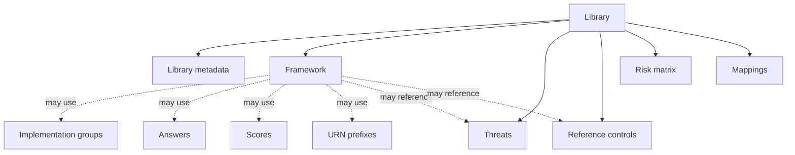

# Library objects

A library is made of one or more objects. Some define what you assess, others provide supporting content, and some connect content together.

## Objects by purpose

| Object | Use it when you need to... |
| --- | --- |
| [Library metadata](library-metadata.md) | Define the required identity and properties of the library itself. This object type is mandatory. |
| [Framework](framework.md) | Define a hierarchy of sections and requirements for an audit. |
| [Implementation groups](implementation-groups.md) | Offer different requirement scopes, such as Basic, Standard, and Advanced. |
| [Answers](answers.md) | Define reusable answer sets for questions in framework requirements. |
| [Scores](scores.md) | Optionally define the scoring scale used by a framework. |
| [Threats](threats.md) | Reuse a catalogue of threat events or situations. |
| [Reference controls](reference-controls.md) | Reuse control templates that support requirements or reduce risk. |
| [Risk matrices](risk-matrices.md) | Define probability, impact, and risk-level combinations. |
| [Mappings](mappings.md) | Relate requirements between two frameworks. |
| [URN prefixes](urn-prefixes.md) | Optionally define the technical prefixes a framework uses to reference external or internal threats and reference controls. |

## General information

A **framework** is the main object in a compliance library. It can optionally use implementation groups, scores, and questions to shape how requirements are assessed. Questions are defined directly in framework requirements and can use reusable answer sets.

A risk matrix supports risk assessments. A mapping can connect requirements from frameworks in different libraries, without the need of being tied to any framework sheets. URN prefixes are optional technical data used by a framework to reference external or internal threats and reference controls.

## Object relationships

## Where to find the details

This page is an overview. Each object page explains its purpose, how it relates to the other objects, and the Excel sheets, fields, and values used to author it.

For the structure shared by every Excel workbook, see [Excel file anatomy](../excel-file-anatomy.md). For the full authoring journey, see [Create a library with Excel](../create-library-with-excel.md).

## Related

- [Libraries](../README.md)
- [Examples](../examples.md)
- [Guided example: create your first framework](../guided-example.md)
