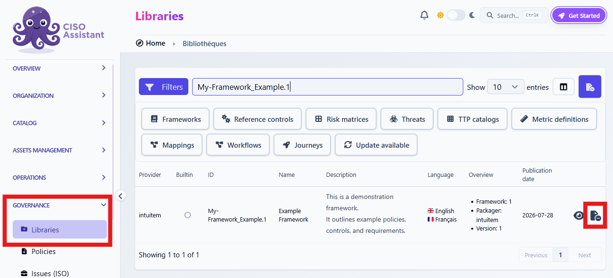
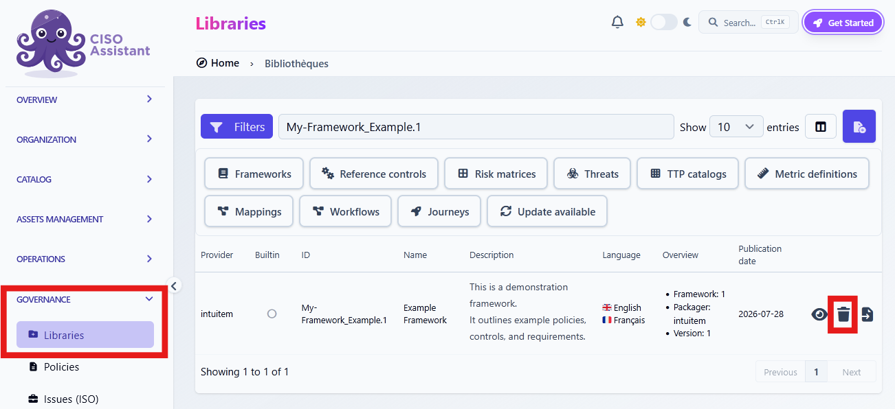

# Unload or delete a library

Unloading a library makes its content unavailable for use, but keeps the library in the catalog so you can load it again later. Deleting a library removes it from the catalog entirely. To use it again, you must re-import its Excel or YAML file into your instance.

## Unload a library

1. Open **Governance > Libraries** and find the library you want to unload.
2. In the relevant row, click the  button at the far right.


If existing audits use a Framework from the library you want to unload, the unload button will not appear. You must delete those audits before unloading the library. Other objects that use the library can also prevent unloading.

If you only want to update the library, follow [Update a library](update-library.md) instead.


## Delete a custom library

1. If the library is loaded, unload it first using the steps above.
2. In **Governance > Libraries**, find the library you want to remove.
3. In the relevant row, click the  button at the far right.


Libraries provided by CISO Assistant cannot be deleted from the catalog. If you want to import the library you are about to delete at a later time, keep a copy of its Excel or YAML file in a safe place before deleting it.

