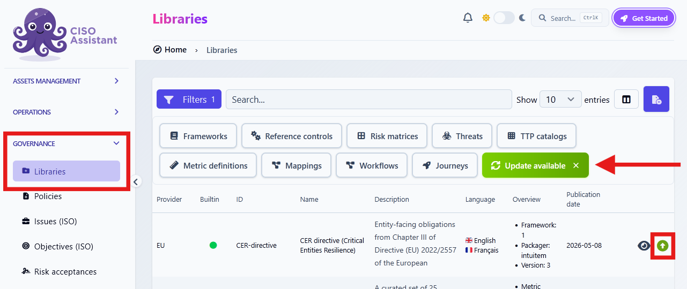

# Update a library

To update a custom library, make changes in its Excel file and upload the new version to CISO Assistant. You can upload the updated Excel file directly. Converting it to YAML before importing is completely optional.


Before updating a library, it is strongly recommended to keep a backup copy of the original Excel or YAML file in a safe place.


## Publish a new version

1. Edit the library's Excel (`.xlsx`) file.
2. Increase `version` in the `library_meta` sheet. Keep the library's `urn` and the identifiers of existing content stable. CISO Assistant matches content by URN, and a requirement's URN is built from its `ref_id` (or from its position when it has none).
3. Upload the updated Excel (`.xlsx`) file as described in [Import a library](import-library.md). If you prefer, [convert it to YAML first](create-library.md#id-5.-optional-convert-the-workbook-to-yaml), then upload the generated `.yaml` file.
4. After the upload, follow [Update a library from the catalog](#update-a-library-from-the-catalog) below to load the new version in your instance.


CISO Assistant accepts the upload only if `version` is higher than the version already stored. Otherwise, it displays *"This library has already been loaded"* (same version) or *"A newer version of this library is already stored"* (older version). Set `version` above the stored value, then upload the file again.


## Update a library from the Catalog

Use this action to load a newer library version into your instance. This applies both to an updated custom library you imported using the steps above and to a built-in library update made available after a CISO Assistant upgrade:

1. Go to **Governance > Libraries**.
2. Click **Update available** to filter the list to libraries with a newer version.
3. In the relevant row, click the  button at the far right.


Updating a library from the catalog changes every object linked to it, including existing audits:

- New requirements are added to every audit that uses the Framework.
- Requirements missing from the new version are deleted, together with their assessments in existing audits (result, score, answers, and observation). Linked evidence and applied controls are kept, but are no longer attached to them.
- A requirement whose `ref_id` changed gets a new URN. It is treated as deleted and re-added, so its assessments are lost.

Always click the library in the catalog and inspect its updated content before starting the update.


If the new version changes the score range (`min_score` or `max_score`), CISO Assistant asks how to adjust the scores of existing audits: **Clamp** keeps them within the new bounds, **Rule of Three** rescales them to the new range, and **Reset** clears them. Requirements with their own `min_score` and `max_score` keep their scores.
