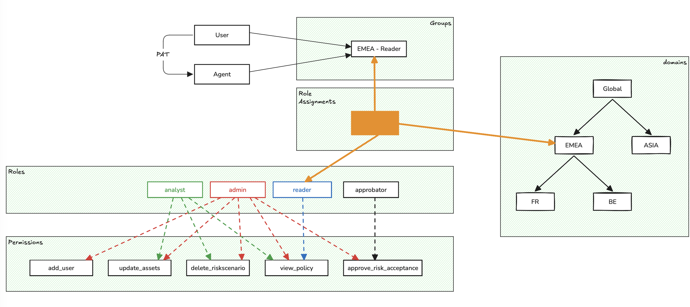

# Understanding the IAM model

Access security is a foundational aspect of any risk or compliance management platform. In this article, we’ll explore how **authentication**, **authorization**, and **accounting** — the three pillars of the AAA model — are structured and applied within **CISO Assistant**.

***

### 1. Authentication: SAML vs OIDC 

CISO Assistant integrates with leading identity providers (IdPs) via **SAML** and **OIDC**, enabling secure and seamless single sign-on (SSO).

#### SAML 

* legacy protocol based on XML
* common in large enterprises, especially for AD
* browser-based redirection with signed assertions

#### OIDC (OpenID Connect) 

* modern standard built on OAuth2
* uses JWT tokens for identity transport
* also browser-based, but more lightweight and versatile

> **Recommendation**: If your IdP supports both, **prefer OIDC** — it's more modern, flexible, and aligned with today’s security practices.

***

### 2. MFA 

Multi-Factor Authentication (MFA) is critical for access protection. CISO Assistant supports MFA in two distinct modes, depending on how users authenticate:

#### SSO-Based Authentication (SAML / federated OIDC) 

* MFA is handled entirely by the identity provider (IdP)
* the IdP enforces the policy (push notifications, TOTP, biometrics, etc.)

#### Local Authentication 

* for local accounts, CISO Assistant includes native MFA
* based on **TOTP** (e.g., Google/Microsoft Authenticators) and **WebAuthn / passkeys** (hardware security keys, platform authenticators)
* recovery codes are issued at enrolment so the user can self-recover from a lost factor
* if a user loses every factor and runs out of recovery codes, an **administrator can disable their MFA** from the user's edit page — see [Setting up MFA → Admin recovery](../mfa.md#admin-recovery-disabling-another-users-mfa). The link is hidden on your own edit page; to disable your own MFA, use the standard MFA settings page on My profile → Settings.

***

### 3. Authorization: Structured and Hierarchical RBAC 

CISO Assistant implements a robust **Role-Based Access Control (RBAC)** model that balances flexibility, clarity, and operational simplicity.

#### Fine-Grained Permissions 

Each object type has granular **CRUD permissions** (create, read, update, delete). This model applies across all business entities: users, backups, risks, policies, incidents, data processing, and more. There are more than 200 permissions in CISO Assistant.

#### Predefined Roles 

Permissions are grouped into a small set of **standard roles** — Administrator, Domain manager, Analyst, Reader, Approver, Respondent, Third-party respondent and Technical tester.

See [User groups → Roles](user-groups.md#roles) for what each of them can and cannot do.

#### Hierarchical Domains 

Roles are assigned **within a domain** — a flexible concept representing any relevant business context.

For example, a domain can represent:

* a **legal entity**
* a **country** or **region**
* a **subsidiary**
* a **business unit**
* any other meaningful organizational structure

> Domains are **hierarchical**: a role assigned to a parent domain (e.g., "Group") automatically applies to all its subdomains (e.g., subsidiaries, teams).

#### Role Assignments 

Access control is defined via explicit assignments:

> _A role_ ➡️ _on a domain_ ➡️ _for a group of users_

#### User Groups 

Users **do not have direct roles**. They inherit permissions through **membership in one or more groups**.

Groups act as the central pivot for managing access:

* receive role assignments
* grant users permissions via group membership
* defined locally
* optionally synced with an IdP (via external plugin)

🚀 This simple yet powerful model accommodates the vast majority of real-world access scenarios. And when needed, the system is fully extensible: it supports **custom roles**, **custom role assignments**, and **custom user groups** to fit even the most specific organizational needs.

***

### 4. Machine Identity: Personal Access Tokens with Expiration & Control 

CISO Assistant doesn’t just secure human access — it also supports secure, auditable access for **automated systems** and **integrations** through **Personal Access Tokens (PATs)**.

#### Definition 

A **Personal Access Token** is a time-limited secret that allows a script, CI/CD pipeline, or service to authenticate with the platform's API on behalf of a user or machine identity — without requiring an interactive login.

#### Key features 

* **time-bounded**: expiration is mandatory
* **RBAC-compliant**: inherits the creator’s permissions
* **revocable**: can be revoked by user or admin

#### Governance controls 

* admins can restrict who may generate PATs
* all tokens are auditable and managed via UI or API

> This ensures **tight control over non-human access**, balancing automation flexibility with strict security hygiene.

### 5. Illustration 

The following schematic illustrates the fundamental concepts of IAM in CISO Assistant.

<figure><figcaption></figcaption></figure>

### 6. Default role mechanism

Every domain has **members**: the people its own and its sub-domains' IAM groups grant roles to. A domain can carry a **default role** — the role it grants its members, on the domain itself: never recursively, and only there.

For example: if the **Domain** domain has the **Reader catalog** default role, then a user granted any role on **Domain** itself or on its sub-domain **ChildDomain** through the IAM groups is a member of **Domain**, and receives **Reader catalog** on it.

Who is *not* a member follows from the definition — no exception list to remember:

* **third parties** hold their grants inside third-party workspaces, which are not the domain's groups → never members;
* **service accounts** hold direct role assignments — no group grants them anything, so they read exactly what their own assignment names (least privilege by design);
* a grant made outside the IAM groups (a direct assignment) gives exactly what it names, nothing ambient;
* deactivated users cannot sign in and therefore exercise no permission at all.

Only roles containing view permissions can be used as a default role, and enclave domains cannot carry one.

Configuring default roles is an **enterprise** capability: the domain form exposes the control there, and it can be tuned per domain — set to a narrower view-only role, or **cleared entirely** for domains that should share nothing ambiently. Clearing the root domain's default role gives the instance an **explicit-grant policy**: no ambient visibility at all, every access traceable to an assigned role. In the community edition, the default role exists only on the root domain, fixed to **Reader catalog**, and cannot be changed.

#### Can I make an object visible to all users without attaching it to global?

Yes — the shelf pattern: attach the object to a sub-domain (e.g. named "shared"), and add the intended readers to that sub-domain's reader group. This uses ordinary role assignments only, works for any object type, and the audience is exactly the group's member list — explicit and auditable.

### 7. Accounting: Full Audit and Traceability 

CISO Assistant includes native tracking of all key actions:

* logins, restorations, configuration changes, approvals…
* a searchable audit log accessible via the UI or API

> This enables complete accountability over critical operations.

### In Summary 

CISO Assistant's AAA model is built on:

* **Open standards** (SAML, OIDC, TOTP, RBAC)
* A **structured yet manageable authorization system**
* **secure automation** through scoped, revocable **Personal Access Tokens** (PATs)
* **Built-in traceability** from the ground up

It supports complex organizations while remaining readable, scalable, and compliant with modern security expectations.
