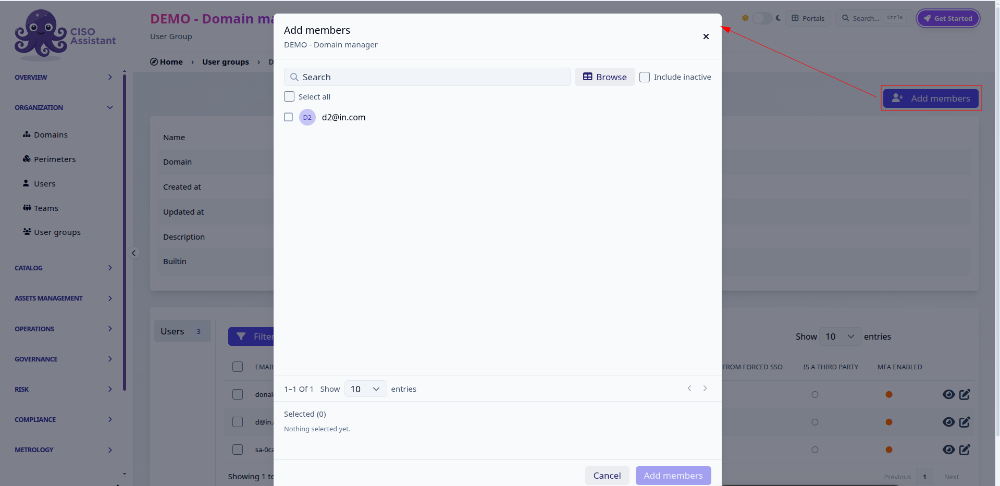
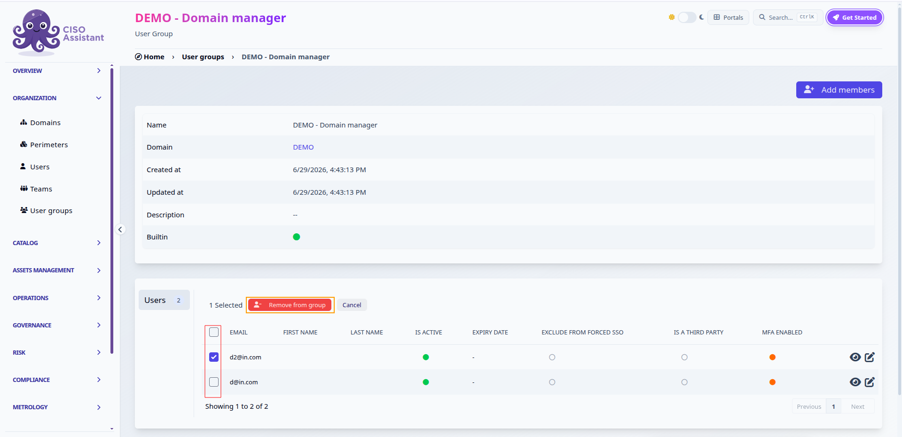

# User Groups

Built-in user groups link a domain with a role, which carries a precise set of permissions. Every user in the group receives those permissions on that domain and its sub-domains. If the built-in roles are not granular enough, the PRO edition also lets you define [custom roles](custom-roles.md).

### Roles

There are 8 built-in roles. The table below gives the high-level shape of each one — the underlying permission matrix has more than 200 entries, so this is deliberately a summary, not an exhaustive list.

| Role                   | Can                                                                                                                                                                                | Cannot                                                                                                                        |
| ---------------------- | ---------------------------------------------------------------------------------------------------------------------------------------------------------------------------------- | ------------------------------------------------------------------------------------------------------------------------------ |
| Administrator          | Everything, on the whole instance: all business objects, plus domains, users, user groups, roles, libraries, instance settings and backups. Also approves risk acceptances.          | — this is the only role that can change instance-wide configuration.                                                             |
| Domain manager         | Everything an Analyst can, on its own domains, plus creating sub-domains and managing the user groups of those domains. Read access to global objects.                               | Approve risk acceptances. Manage users, roles, libraries or instance settings.                                                   |
| Analyst                | Create, update and delete the operational objects of its domains — audits, risk assessments, applied controls, assets, evidences, tasks, findings… Read global and domain objects.   | Touch access control (domains, user groups, roles, users). Approve risk acceptances.                                             |
| Reader                 | Read everything in its domains: assessments, controls, assets, third-party module, dashboards and metrics.                                                                            | Create, update or delete anything.                                                                                               |
| Approver               | Read the objects of its domains, and approve or reject risk acceptances and validation flow steps.                                                                                   | Create or update business objects. Its read scope is slightly narrower than Reader — no third-party module, dashboards or metrics. |
| Respondent             | Answer the requirements assigned to it: set compliance results, attach or create applied controls and evidences, comment. See [assignments.md](../../features/assignments.md "mention"). | Create audits or assessments. Reach the risk, governance or administration modules.                                              |
| Third-party respondent | The same answering capability as a Respondent, restricted to the questionnaire of the entity assessment the user was invited to. See [tprm.md](../../guides/tprm.md "mention").      | See or do anything outside that questionnaire. Create or update applied controls.                                                |
| Technical tester       | Create and run [technical postures](../../concepts/technical-postures.md) and their results, and manage the findings binders and findings that follow up on them.                | Everything else — read-only on assets, frameworks and perimeters, no access to audits or risk assessments.                        |

The _Technical tester_ role is only useful once the `posture_assessments` feature flag is on (default off) — see [Technical postures](../../concepts/technical-postures.md). Its user group is created on every domain regardless.


Django superuser is given administrator rights automatically on startup.


### Global user groups

Once your instance is created, five user groups are already present:

* Global - Administrator
* Global - Analyst
* Global - Reader
* Global - Approver
* Global - Respondent

They give corresponding permissions on Global scope so on every object of your instance.

### Domain user groups

They are created for each domain you add. For example, if you create a domain _R\&D_, there will be:

* R\&D - Domain Manager
* R\&D - Analyst
* R\&D - Reader
* R\&D - Approver
* R\&D - Respondent
* R\&D - Technical tester

They give corresponding permissions on the domain scope so on every object inside _R\&D_.

The _Third-party respondent_ group is the exception: it is not created upfront on domains, but on the [third-party workspace](../../concepts/third-party-risk.md#the-third-party-workspace) of an entity, when you invite that third party's contacts to answer a questionnaire. There is one workspace — and therefore one respondent group — per third party per domain, so a vendor assessed several times keeps the same access across rounds.

### Managing group members

You can manage the members of a user group directly from the group's detail page. This is available to administrators, and to domain managers for the groups of their own domains: membership is governed by the *change user group* permission on the group's domain, so a domain manager can add or remove members without needing global user-management rights.

#### Adding members

Open the user group and click **Add members**. A picker opens listing the users that are not yet in the group:

* type in the search field to filter by email, first name or last name, or switch to **Browse** for a table view with per-column filters;
* tick **Include inactive** to also list deactivated users;
* your selection is kept while you search and change pages, and is summarised at the bottom of the picker;
* click **Add members** to confirm.

<figure><figcaption>
Adding members to a domain user group
</figcaption></figure>

#### Removing members

On the group's **Users** tab, tick the members to remove, then click **Remove from group**:

<figure><figcaption>
Removing selected members from a user group
</figcaption></figure>


Two safeguards apply: the last member of the *Global - Administrator* group can never be removed, and domain managers cannot remove themselves from a domain administrator group — another administrator has to do it.

