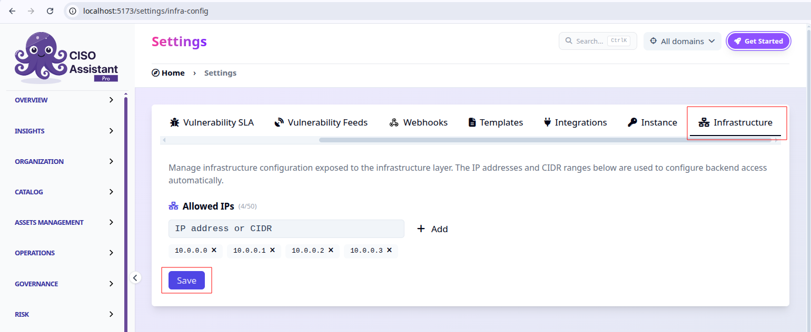

# Allowed IP whitelist

## What it does

The **Allowed IPs** whitelist lets administrators decide which IP addresses and
CIDR ranges are permitted to reach the backend API. It is the simplest way to
restrict API access — for example, to let a CI runner, an office network, or a
machine running the [MCP server](../../integrations/mcp.md) talk to your
instance while keeping everyone else out.

You manage the list from **Settings → Infrastructure**:

<figure><figcaption><p>Settings → Infrastructure → Allowed IPs</p></figcaption></figure>

* Type an **IP address** (e.g. `203.0.113.4`) or a **CIDR range**
  (e.g. `198.51.100.0/24`) and click **Add**.
* Remove an entry with the **✕** next to it.
* Click **Save** to apply your changes.

Both IPv4 and IPv6 are supported, up to 50 entries.


The list is a strict allowlist:

* **Empty list → no access.** Saving with no entries blocks **all** traffic to
  the backend. The UI asks you to confirm before you do this.
* **`0.0.0.0/0` or `::/0` → any IP.** These wildcard ranges open access to
  **everyone**, which defeats the purpose of the allowlist.

Make sure your own IP (and anything that needs API access) is in the list before
you save.



**Changes take ~10 minutes to apply.** After you save, allow up to 10 minutes for
the new rules to take effect — a background job reconciles the allowlist with the
infrastructure on a 10-minute cycle. There's nothing to configure; just wait
before testing.


## Availability

* **CISO Assistant SaaS** — already enabled. The **Infrastructure** tab is
  available to administrators out of the box; just manage your allowed IPs.
* **On-premises** — disabled by default. If you want this self-service
  allowlist, enable it by setting the following environment variable on the
  backend and restarting it:

  ```bash
  ENABLE_INFRA_CONFIG_MANAGEMENT=True
  ```

  When disabled, the **Infrastructure** tab is hidden and the API endpoint below
  is not registered.


If you rely on API access — for instance the
[MCP integration](../../integrations/mcp.md) — IP filtering must be in place and
your IPs added to the allowlist. SaaS administrators only need to add their IPs;
on-premises administrators should enable the feature first.


## How the infrastructure layer consumes it

Once configured, the allowlist is published on an `/infra-config/` endpoint so
your reverse proxy, firewall, or security group can read it and apply the rules
automatically — instead of you editing infrastructure config by hand.

From a machine that can reach the backend (not from the public internet):

```bash
curl http://localhost:8000/infra-config/
```

```json
{
  "allowed_ips": ["203.0.113.4", "198.51.100.0/24"]
}
```


The `/infra-config/` endpoint is **unauthenticated**, exactly like `/metrics`.
Never expose it to the public internet — keep it reachable only from your
infrastructure layer (restrict it to trusted networks or bind it to an internal
interface).


If the endpoint returns a 404, make sure `ENABLE_INFRA_CONFIG_MANAGEMENT=True` is
set and that the backend has been restarted.
