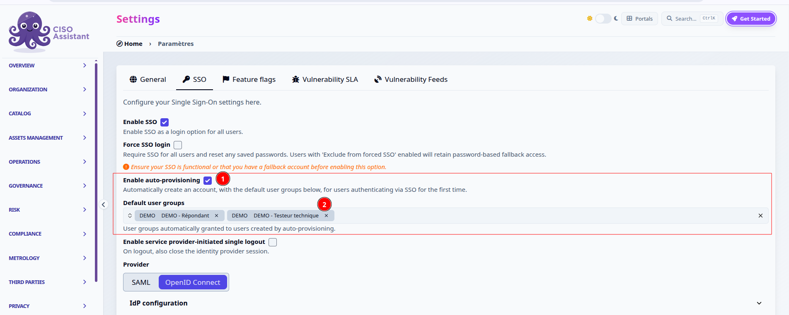

# SSO

### Documented providers

* [Microsoft Entra ID](identity-providers/entra-id.md)
* [Okta](identity-providers/okta.md)
* [Keycloak](identity-providers/keycloak.md)
* [Google Workspace](identity-providers/google-workspace.md)

### Auto-provisioning (JIT)

By default, SSO login is only usable by users who already have a CISO Assistant account. If the email returned by the identity provider does not match an existing user, login is rejected with _"User not found."_

**Auto-provisioning** (just-in-time, or JIT, provisioning) removes that requirement. When enabled, the first successful SSO login for an unknown email automatically creates the account instead of rejecting it, with no administrator action needed. The new account is created without a local password and is placed into whichever **user groups** you configure as defaults, so it starts with exactly the roles you intend for a new user, nothing more.

As with SCIM-provisioned users, an auto-provisioned account stays SSO-only for its whole lifetime (see [Forcing SSO and local-login exceptions](#forcing-sso-and-local-login-exceptions) below): it cannot request a password reset or log in locally, even if Force SSO Login is off, unless an administrator explicitly enables **Keep local login** on that account. This keeps the account's access tied to the identity provider: disable the user there, and they lose access here too, with no local password left behind to fall back on.

Turn it on from **Settings > SSO**:

<figure><figcaption><p>Settings > SSO > Enable auto-provisioning</p></figcaption></figure>

1. **Enable auto-provisioning**: off by default, preserving today's behavior until you opt in.
2. **Default user groups**: the user group(s) automatically granted to accounts created this way. Pick the lowest-privilege group(s) that make sense for a brand-new user (e.g. a read-only or analyst group scoped to the right folder). You can always add more groups to a user by hand afterward.


**Default user groups** is applied once, at account creation, and nowhere else. Changing or removing it afterward does not touch any user already auto-provisioned — they keep whatever groups they were given on their first login, however long ago that was. It is not a standing policy you can dial up or down later, and it is not how you take a permission back. If you need group membership that stays in sync with the identity provider over time — including revoking it — that's what [IdP group mapping](scim.md) does; auto-provisioning's default groups are just a one-time starting point for brand-new accounts.



This is a **Community** feature, gated by the `jit_provisioning` [feature flag](../settings/feature-flags.md "mention") (on by default). Turning it on also unlocks the **IdP groups** menu and column described in [SCIM provisioning and IdP groups](scim.md), so auto-provisioned users can inherit roles through IdP group mapping without needing the PRO-only `idp_groups` flag.



Auto-provisioning trusts the identity provider's assertion that the email is verified and belongs to that user. Only enable it once your IdP integration ([SAML](saml.md) or [OpenID Connect](oidc.md)) is fully configured and tested. Anyone who can authenticate against your IdP with a given email will get a CISO Assistant account with that email.


**Default user groups** covers only the first login. For role assignment that keeps tracking the identity provider afterward — including on IdPs without SCIM — configure **Groups attribute mapping** in the SSO advanced settings so SAML or OIDC assertions carry the user's IdP groups directly, and map those groups under [SCIM provisioning and IdP groups](scim.md). If your identity provider supports SCIM, that same IdP group mapping applies there too, with group membership pushed by the IdP instead of read from the login assertion, and is the better fit for larger organizations.

### Single Logout

By default, logging out of CISO Assistant only ends the local CISO Assistant session. The identity provider session stays open, so clicking **Log in with SSO** again signs the user straight back in without re-authenticating.

To also close the identity provider session on logout, enable **Enable service provider-initiated single logout** in the SSO settings. When it is on, logging out of CISO Assistant redirects the browser through the identity provider's logout endpoint.

This is _service provider-initiated_ single logout: CISO Assistant asks the identity provider to end **its own** session for the user. Whether that in turn signs the user out of other applications federated to the same identity provider depends on the identity provider's single-logout configuration and is not something CISO Assistant controls or can guarantee.

The option is off by default, and each protocol needs a logout endpoint on the identity provider side:

* **OIDC** — the provider must expose an `end_session_endpoint`, and `<frontend_url>/login` must be registered as an allowed post-logout redirect URI. See [OpenID Connect](oidc.md).
* **SAML** — the identity provider Single Logout Service URL must be available (read from the metadata, or set in the **SLO URL** field). See [SAML](saml.md).


Keep `CISO_ASSISTANT_URL` set to the public frontend URL, otherwise the post-logout redirect will not resolve.


### Forcing SSO and local-login exceptions

Enabling SSO adds the **Log in with SSO** button but leaves the email/password form in place, so users can still authenticate locally. To make SSO the only way in, turn on **Force SSO Login** in the SSO settings.

When Force SSO Login is enabled, local password authentication is disabled for everyone — a user who tries the password form is rejected with _"This user is not allowed to use local login."_

To keep a few accounts able to log in locally (typically break-glass administrators, or a service account used while the identity provider is being set up), enable the per-user **Keep local login** flag on their user record. These accounts continue to work through the standard password form even while SSO is forced.

Some accounts get **Keep local login** enabled by default when they are created:

* **Superusers** created with `createsuperuser` (or at first boot), so the initial administrator is not locked out.
* **Third-party users** (portal / TPRM accounts).

Note that this is only a default on the flag, not a permanent exemption: a regular user promoted to superuser afterwards does not get it automatically, and unticking **Keep local login** on any of these accounts removes their local access like anyone else.

SCIM-provisioned and auto-provisioned (JIT) users, by contrast, are SSO-only by design, regardless of the Force SSO Login setting. Their lifecycle is meant to be governed entirely by the identity provider, so they don't get a local password fallback unless you explicitly grant them **Keep local login**.


Turning on Force SSO Login **clears the password** of every account that does not have **Keep local login** enabled. Set **Keep local login** on your exception accounts _before_ you enable Force SSO Login — otherwise their passwords are wiped, and re-enabling the flag afterwards does not restore them (the user has to go through a password reset, which requires a working mailer). Always confirm at least one break-glass account can still log in before forcing SSO.


### Direct SSO login link

By default the login page shows the standard email/password form alongside a **Log in with SSO** button. You can send users straight to your identity provider — skipping the form — by appending `?sso` to the login URL:

```
https://<your-instance>/login?sso
```

Opening that link starts the SSO redirect immediately, exactly as if the user had clicked **Log in with SSO**. It's convenient as a bookmark, or as the link you publish internally when SSO is the expected way in.

To send the user to a specific page after they authenticate, add a `next` parameter:

```
https://<your-instance>/login?sso&next=/analytics
```


`?sso` only triggers the redirect when SSO is enabled. Users who are allowed to keep local login — for example break-glass administrators — can still reach the password form through the plain `/login` URL.

