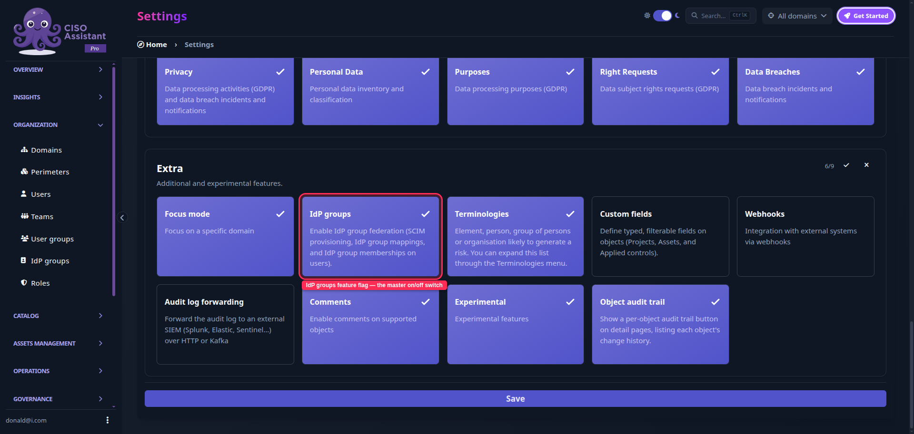
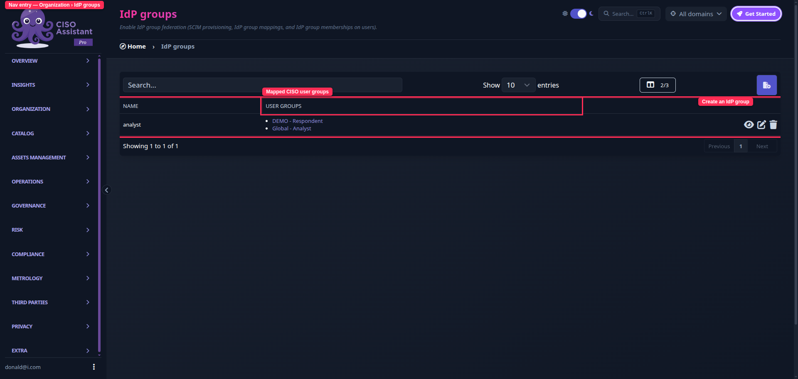
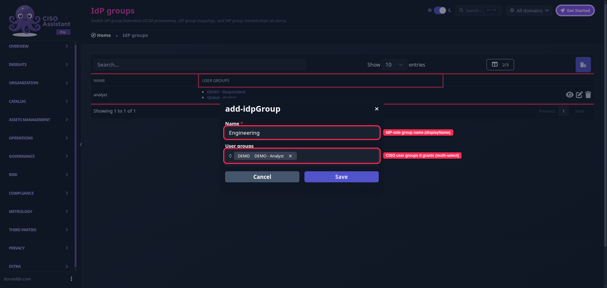
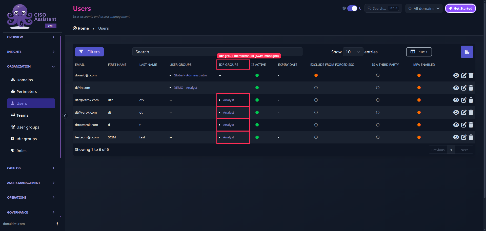
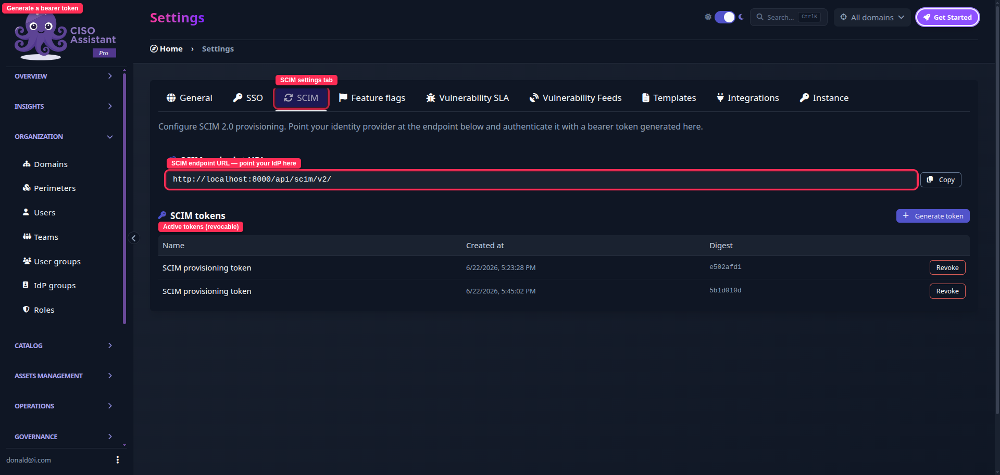

# SCIM provisioning and IdP groups

SCIM 2.0 lets your identity provider (Okta, Microsoft Entra ID, Keycloak, …) push users into CISO Assistant automatically, so you no longer have to create accounts by hand. **IdP groups** are the bridge between a group that exists in your identity provider and the CISO Assistant user groups it should grant.


This is a **PRO** feature. It is gated by the `IdP groups` feature flag (see [feature-flags.md](../settings/feature-flags.md "mention")). While the flag is off, the **IdP groups** menu, the **SCIM** settings tab and the **IdP groups** column on the users table stay hidden. The flag is enabled by default on PRO instances.


<figure><figcaption>
The <strong>IdP groups</strong> feature flag in Settings › Feature flags.
</figcaption></figure>

### How it works

Authentication and provisioning are two separate concerns, handled by two complementary mechanisms:

* Your IdP **authenticates** users through [SAML](saml.md "mention") or [OpenID Connect (OIDC)](oidc.md "mention").
* Your IdP **provisions** users and their group memberships through SCIM.

The link between the two worlds is the **IdP group** — a faithful mirror of a group that exists in your identity provider. An administrator maps each IdP group to one or more **user groups**. A user who belongs to an IdP group then inherits the roles of every user group it is mapped to.

This is a _groups of groups_ model: membership flows from **IdP group → user groups → roles**, and the effective roles are recomputed on the fly. A user's direct (manually assigned) user groups and the ones inherited through their IdP groups are simply added together — neither overrides the other.


An IdP group grants nothing until you map it to at least one user group. SCIM can keep pushing memberships into an unmapped IdP group safely; those users gain access only once the mapping exists.


### Managing IdP groups

IdP groups live under **Organization > IdP groups** in the sidebar. The page behaves like any other object table — view, create, edit and delete.

<figure><figcaption>
Organization › IdP groups — each IdP group and the user groups it grants.
</figcaption></figure>

Creating or editing an IdP group asks for two things:

* **Name** — the display name of the group as it exists in your identity provider.
* **User groups** — one or more CISO Assistant [user groups](../organization/user-groups.md "mention") this IdP group should grant. Edit this list at any time; every member of the IdP group is re-granted immediately.

<figure><figcaption>
Creating an IdP group: its IdP-side name and the user groups it grants.
</figcaption></figure>

The **members** of an IdP group are managed by SCIM and shown read-only. You will also find an **IdP groups** column on the **Organization > Users** table, listing the IdP groups each user belongs to.

<figure><figcaption>
The IdP groups column on the users table shows SCIM-managed memberships.
</figcaption></figure>


IdP groups are administered globally and are only visible to administrators, just like [user groups](../organization/user-groups.md "mention") and roles.


### Configuring SCIM

<figure><figcaption>
Settings › SCIM — the endpoint URL and bearer-token management.
</figcaption></figure>

1. Log in as an **administrator > Extra > Settings** and open the **SCIM** tab.
2. Copy the **SCIM endpoint URL** (for example `https://<your-instance>/api/scim/v2/`). This is the base URL your identity provider connects to.
3. Click **Generate token** and copy the bearer token that is displayed.

   
   <mark style="color:orange;">The token is shown only once. Copy it now — for security reasons it cannot be retrieved again.</mark> If you lose it, revoke it and generate a new one.
   
4. In your identity provider's provisioning settings, enter the SCIM endpoint URL and authenticate with the token using the **`Authorization: Bearer <token>`** scheme.
5. Assign users and groups to CISO Assistant in your identity provider, and let it provision them.

You can generate several tokens (one per integration) and **revoke** any of them at any time from the same screen.

### Identity, renames and deletion

* Each IdP group is identified by the UUID that CISO Assistant assigns it. Your identity provider stores that id and reuses it, so **renaming a group in the IdP simply updates its name** — memberships and the user-group mapping are preserved.
* The first time your IdP pushes a group that does not exist yet, CISO Assistant **creates the IdP group automatically**.
* **Deleting** an IdP group (or removing it from the IdP) removes the access it granted, but never touches a user's manually assigned user groups — those are a separate, direct membership.

### Notes

* SCIM provisions accounts; it does not replace authentication. Provisioned users still sign in through your configured [SSO](README.md "mention") provider.
* CISO Assistant implements the inbound SCIM 2.0 Users and Groups resources (RFC 7643/7644) and is identity-provider agnostic.

### Related

* [SSO](README.md "mention")
* [User Groups](../organization/user-groups.md "mention")
* [Understanding the IAM model](../organization/iam-model.md "mention")
* [Feature flags](../settings/feature-flags.md "mention")
* [Community vs PRO](../../introduction/editions.md "mention")
