# Contributing a framework or library

CISO Assistant's catalogue is extended through **libraries** — YAML files that bundle one or more catalogue objects. Anything you contribute under this path follows the same submission flow regardless of what's in the library.

## What you can contribute

A single library may contain:

- **Frameworks** — a hierarchy of requirements covering a standard, regulation, or internal control model.
- **Mappings** — directed graphs linking the requirements of one framework to another (NIST OLIR convention).
- **Threat catalogues** — reusable lists of threats referenced across frameworks and risk assessments.
- **Risk matrices** — probability × impact grids used by risk assessments.
- **Reference controls** — templates that applied controls can derive from.

Each of these can ship in its own library, or be bundled together where it makes sense (a framework with its companion reference-control catalogue, for example). See [Designing your own libraries](../configuration/libraries/custom-libraries.md) for the format and authoring tooling.

## If you're comfortable with Git

1. Fork the [community repository](https://github.com/intuitem/ciso-assistant-community) and make sure it's in sync with `main`.
2. Add your Excel source under the `tools` folder.
3. Optionally also commit the generated YAML under `backend/library/libraries/` (only if you've tested that it loads cleanly).
4. Open a pull request and accept the **Contributor Licence Agreement** when prompted.

We'll take it from there.

## If you'd rather use the GitHub UI

The walkthrough below uses a framework as the example, but the same flow works for matrices, threat catalogues, mappings, and reference controls.

1. **Author the Excel source.** Start from one of the samples in `tools/` (frameworks) or `tools/excel/matrix/` (risk matrices). The library type drives which sample to copy.
2. **Convert it to YAML** using the `convert_library_v2.py` tool to validate the structure end-to-end.

<figure><figcaption></figcaption></figure>

3. **Test the YAML** by loading it into a local CISO Assistant instance and checking it renders as expected.

<figure>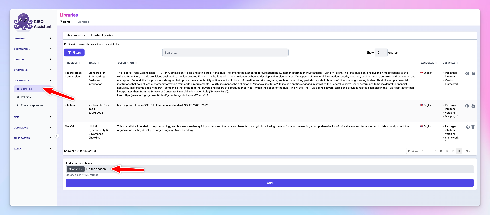<figcaption></figcaption></figure>

<figure>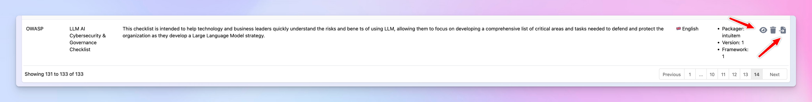<figcaption></figcaption></figure>

4. **Fork the repository** on GitHub (and make sure your fork is up to date if you've contributed before).

<figure>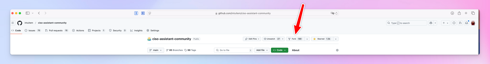<figcaption></figcaption></figure>

<figure><figcaption></figcaption></figure>

<figure>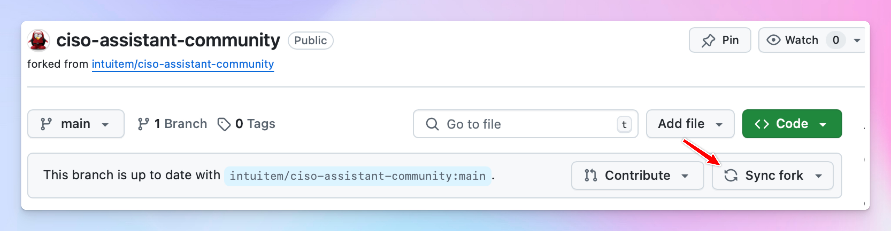<figcaption></figcaption></figure>

5. **Upload the Excel file** to the `tools/` folder via **Add file → Upload files**.

<figure>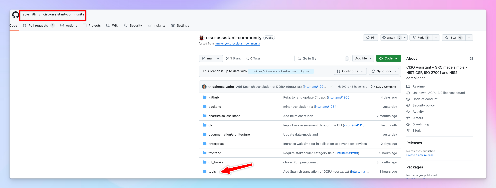<figcaption></figcaption></figure>

<figure>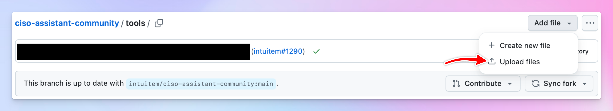<figcaption></figcaption></figure>

6. **Commit** with a clear message ("Submitting framework X" or "Submitting risk matrix Y").

<figure>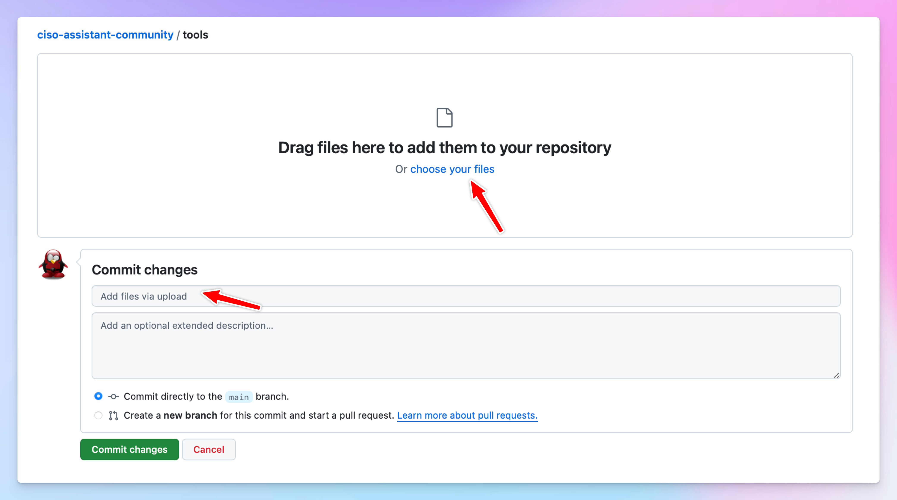<figcaption></figcaption></figure>

<figure>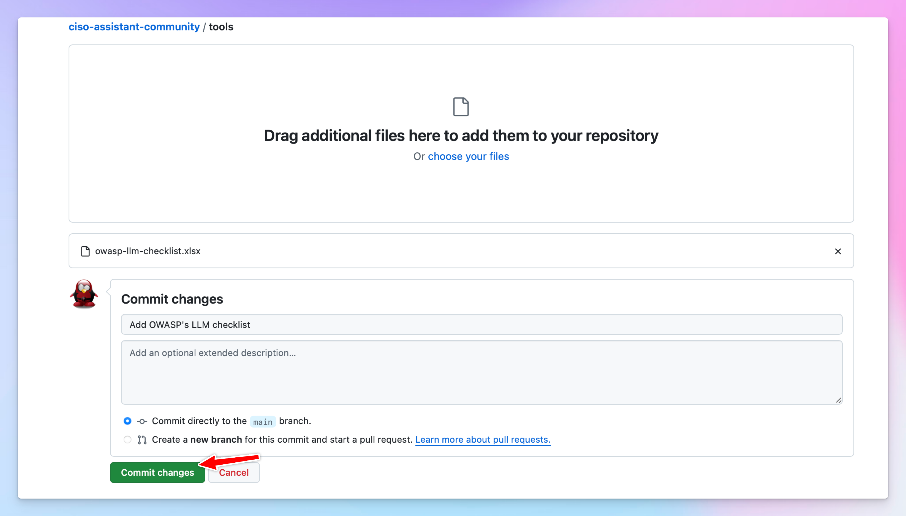<figcaption></figcaption></figure>

7. **(Optional)** repeat the upload step for the YAML under `backend/library/libraries/`.

<figure>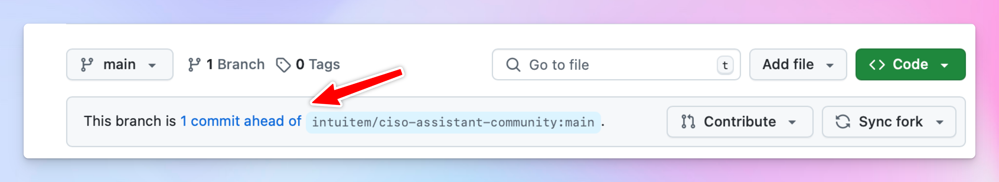<figcaption></figcaption></figure>

8. **Open the pull request** and accept the CLA when prompted.

<figure>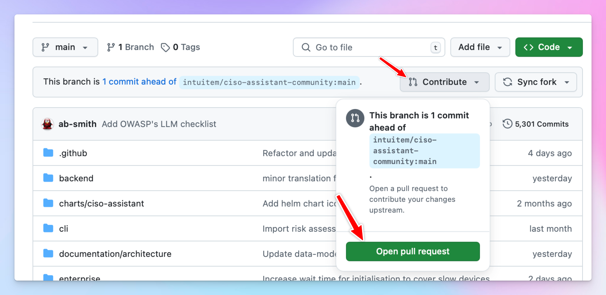<figcaption></figcaption></figure>

<figure>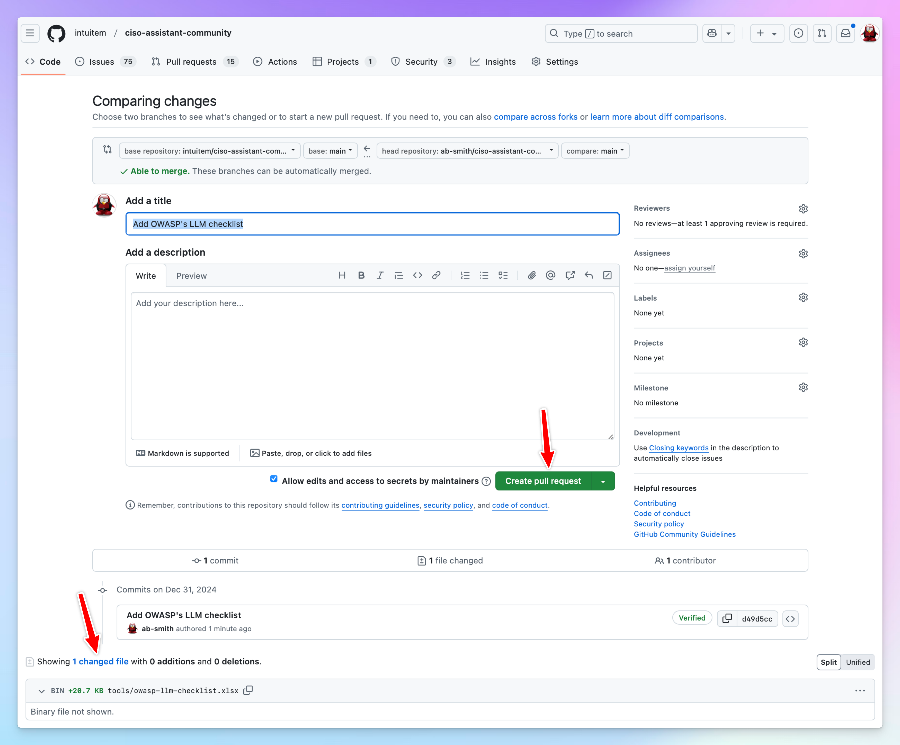<figcaption></figcaption></figure>

## What we look for during review

- The Excel source compiles cleanly with `convert_library_v2.py`.
- URN prefixes don't collide with existing libraries.
- For frameworks: hierarchy depth stays reasonable; assessable vs structural nodes are correctly marked.
- For mappings: source and target framework URNs resolve; relationship types are valid (equal, subset, superset, intersect).
- For risk matrices: the probability/impact/risk grid is internally consistent.
- Licensing — only contribute content you're allowed to redistribute. Restrictively-licensed standards (CIS, CSA CCM) ship as converters, not bundled content.

## Related

- [Designing your own libraries](../configuration/libraries/custom-libraries.md)
- [Libraries concept](../concepts/libraries.md)
- [Mappings feature](../features/mappings.md)
