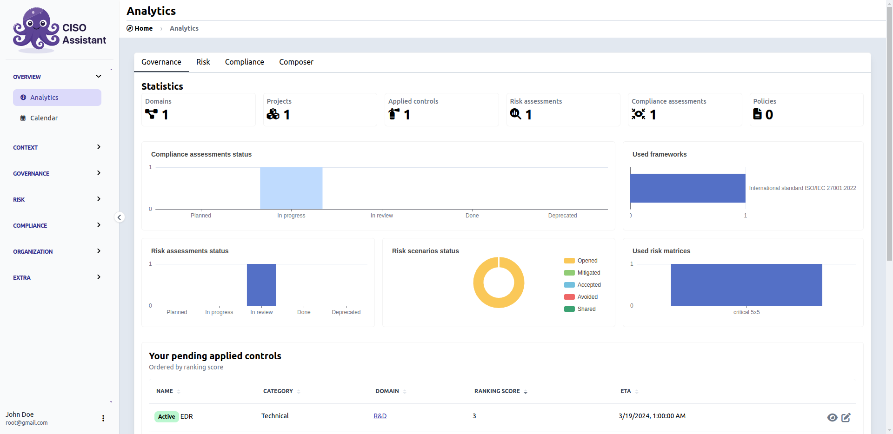
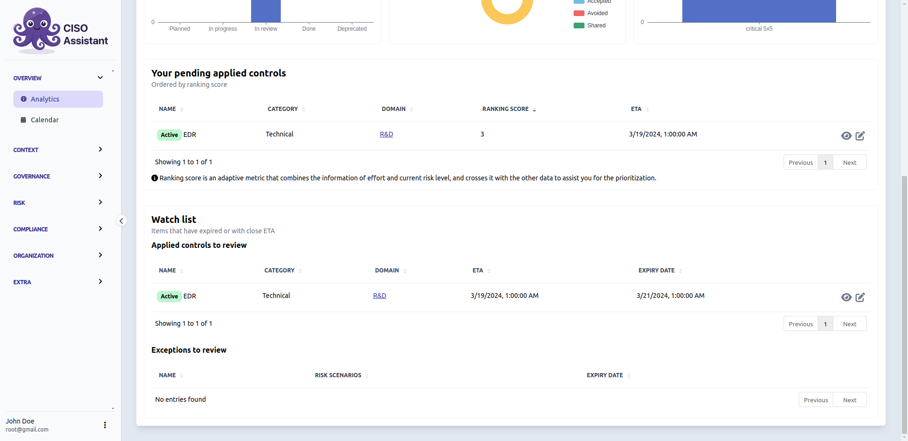
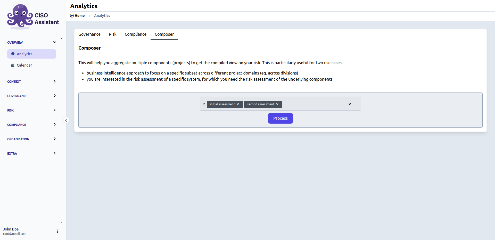
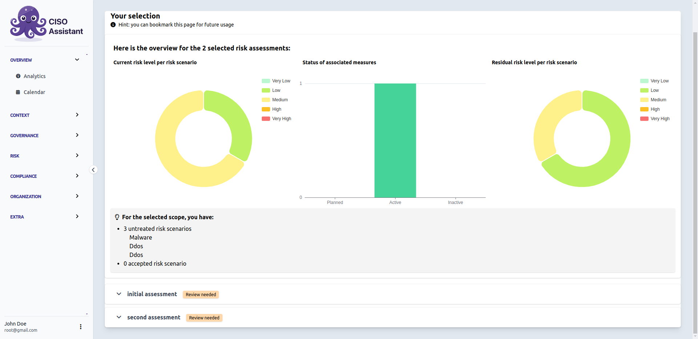

# Analytics

The main page to track your perimeters over time. You can focus on risk or compliance via their respective tabs, or take a global view from the governance one.

At the bottom of the governance tab, you'll find an applied-controls ranking score and a watch list to warn you about upcoming deadlines on applied controls or risk acceptances.


The applied-controls ranking score table is there to help you prioritise.


## Composer

A specific tab where you can cross-reference analytics from different risk assessments.

It will also tell you if one or more selected risk assessments should be reviewed, based on inconsistencies found by [X-rays](x-rays.md).

