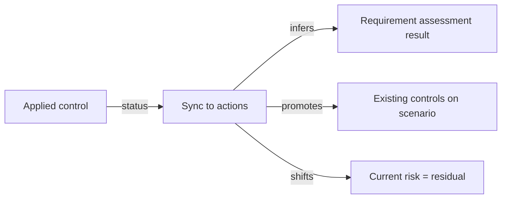

# Sync to actions

**Sync to actions** lets an assessment pull the current state of its linked applied controls back into the assessment itself — closing the gap between "we said we'd do X" and "X is done". It exists in two flavours: a one-shot button you trigger from a detail page, and a daily background job for assessments you've flagged for automatic sync.

## What it does

The exact behaviour depends on the assessment type — the verb is the same ("sync to actions") but the mechanics differ:

### Audit (compliance assessment)

For every requirement assessment that has at least one applied control attached:

- **Single control attached**: requirement becomes _Compliant_ if the control is **Active**, _Non-compliant_ otherwise.
- **Two or more controls attached**:
  - All controls active → _Compliant_.
  - At least one active → _Partially compliant_.
  - None active → _Non-compliant_.

Side-effect: if the audit has _extended results_ enabled and a requirement was sitting on a **Major** or **Minor non-conformity**, but the new result is no longer in the non-compliant range, the extended result is reset to undefined.

### Risk assessment

For every risk scenario in the assessment, runs the scenario-level sync below. The assessment itself is a thin wrapper that iterates.

### Risk scenario

If all "planned" applied controls (`applied_controls`) attached to the scenario are **Active**:

- Promote those controls to **existing applied controls** — they're no longer planned, they're in place.
- Set **current risk** to the previous **residual risk** — the residual state is now the current state.
- _Optionally_ reset residual probability/impact to "not rated" so you can plan a new round of treatment.

If any planned control is not Active, the scenario is left alone — sync is all-or-nothing per scenario.

## Triggering manually

On the detail page of an audit, a risk assessment, or a risk scenario, the **Sync to actions** action opens a confirmation modal showing a **dry-run preview** of what would change — which requirement assessments would move to which result, or which scenarios would be promoted. Confirm to apply.

The dry-run is the default for the preview; only confirming sends `dry_run=false` to the backend. Nothing is changed without that explicit step.

## Triggering automatically

Both audits and risk assessments expose an **Automatic daily sync to actions** checkbox in their **More** dropdown. When on, a Huey periodic task at **02:45 every day** sweeps all eligible assessments and runs sync. Eligibility:

- `auto_sync = true`.
- `is_locked = false` — locked assessments are skipped.
- `status` not in (_Done_, _Deprecated_) — terminal-state assessments are skipped.

If an assessment crosses none of those guards but produces no changes, it's a silent no-op. If it produces changes, they're logged with the assessment ID, name, and the count of changes.

Errors don't halt the sweep — a failure on one assessment is logged and the next is processed.

## Mental model

The applied control's **status field** is the input signal; the assessment's result fields are the output. Nothing else feeds sync — it doesn't read evidences, due dates, or owners.

## When to use it

- **You manage controls in CISO Assistant as the source of truth.** Their status (Active / In progress / Degraded / Deprecated) reflects reality, so propagating it to the assessment side keeps the audit and the risk register honest with one click.
- **End-of-cycle reconciliation.** Run sync before an external review so the audit and risk states match the ground truth in the action plan.
- **Continuous compliance.** Turn on auto-sync on the audits and risk assessments you want to keep "always fresh".

## When _not_ to use it

- **When manual judgement matters more than mechanical inference.** Sync infers compliance from control status — it can't see that a control is "active but inadequate". For nuanced audits, treat sync as a starting point, not a verdict.
- **On locked assessments.** Sync is blocked anyway, but the point stands: locked = frozen.
- **When the action-plan side of the data is incomplete.** Garbage-in, garbage-out: if half your applied controls are stuck on _Undefined_, sync will trivially mark requirements non-compliant.

## See also

- [Customize your audit](../guides/customize-audit.md) — for the `auto_sync` toggle in context.
- [Applied controls](../concepts/applied-controls.md) — what gets read by sync.
- [Risk assessments](../concepts/risk-assessments.md) — the three-tier risk model (inherent / current / residual) that scenario sync collapses.
