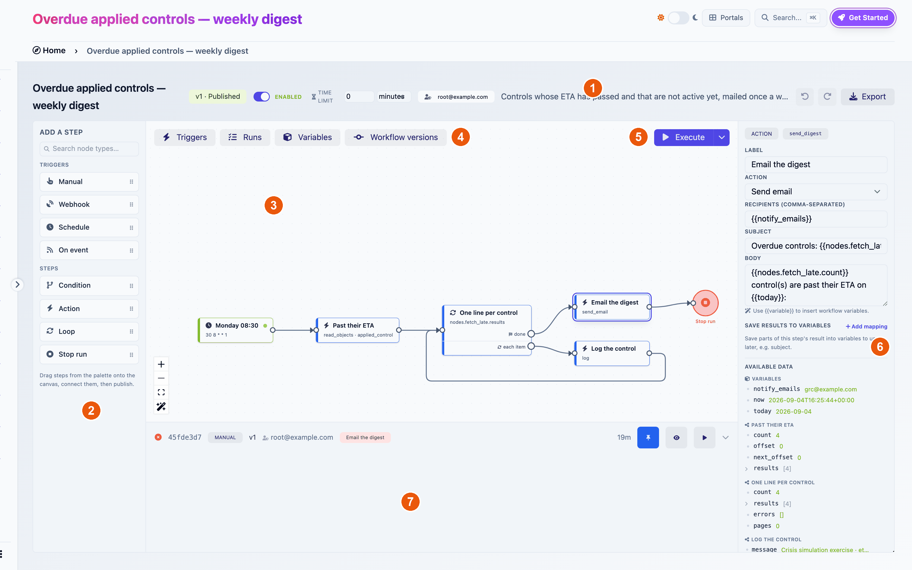
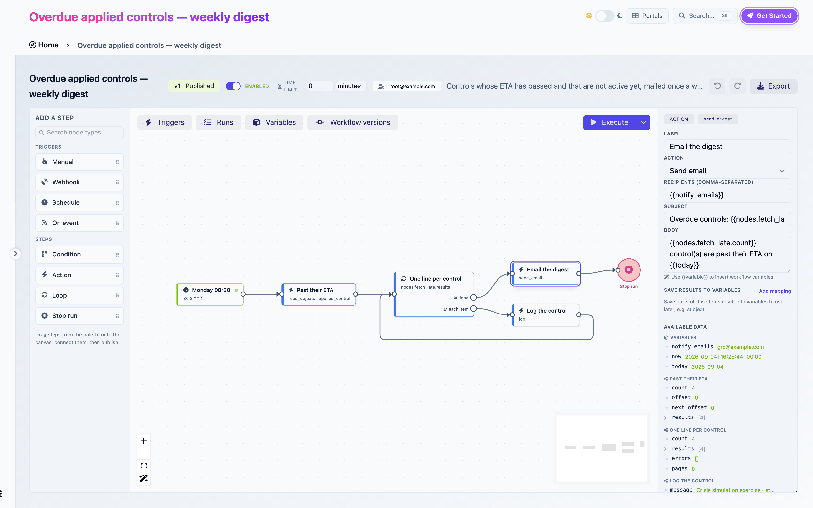
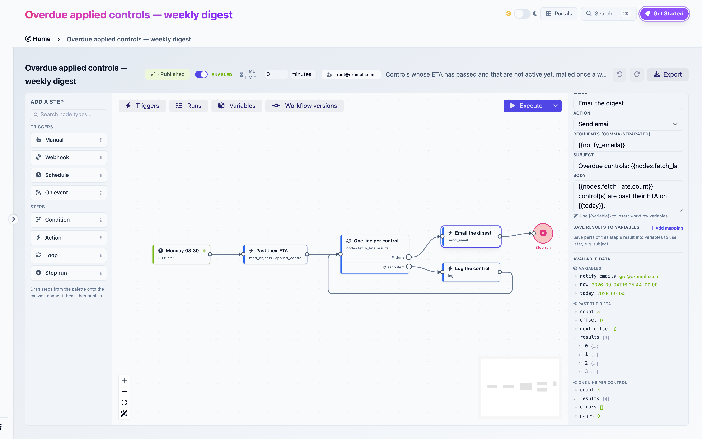
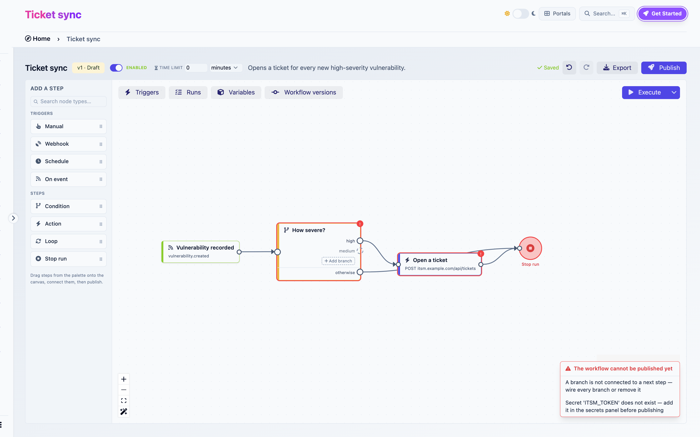
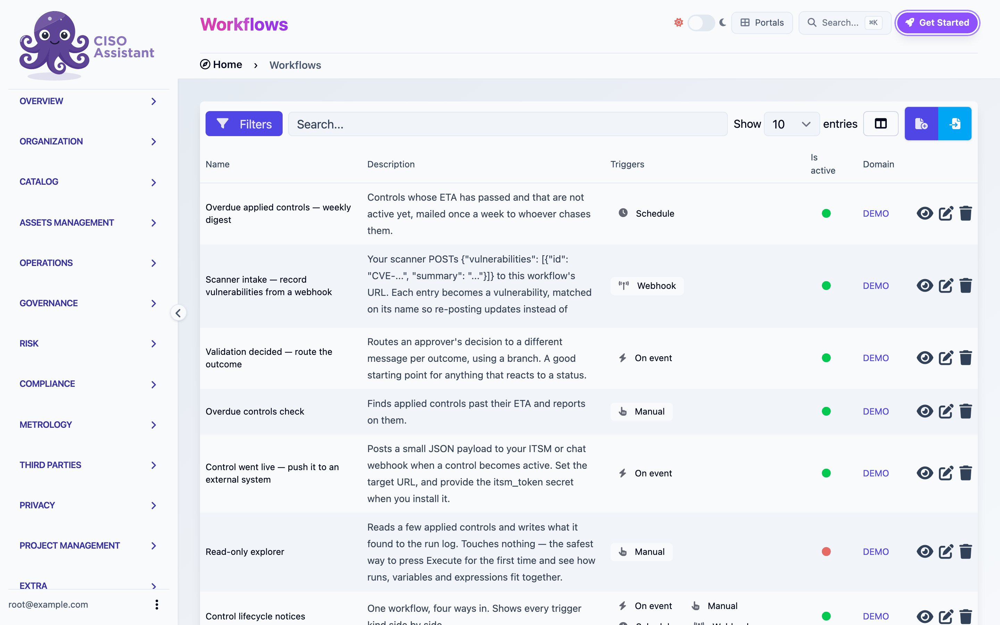

# Workflow builder

Open any workflow from **Operations > Workflows** and you land in the builder. Everything about a workflow happens here: designing the graph, configuring steps, publishing, enabling triggers, watching runs.

<figure><figcaption>
The builder: 1 header, 2 palette, 3 canvas, 4 panel toggles, 5 Execute, 6 inspector, 7 bottom panel (here, Runs)
</figcaption></figure>

## The header

From left to right:

| Element | What it does |
|---|---|
| Name and version badge | `v3 · Published`, `v4 · Draft` or `v1 · Archived` |
| **Enabled / Disabled** switch | The workflow's master switch. Off pauses every automatic trigger. Manual runs keep working so a paused workflow stays debuggable |
| **Time limit** | Maximum duration of a run, in seconds, minutes or hours. `0` means no limit. Runs that exceed it are stopped. Applies to runs already in flight |
| Run-as chip | The user whose permissions this version's runs use, with the tooltip "Runs as ...". An amber **No run-as user** badge means the version must be republished |
| **Saving… / Saved** | Autosave state. A red message means the last save failed. Click it to retry |
| **Undo**, **Redo** | Fifty steps of history. Edits made within under a second coalesce into one |
| **Export** | Downloads the workflow as a file you can import elsewhere. See [Sharing](sharing.md) |
| **Discard draft** | Deletes the draft and shows the published version again. Only when both exist |
| **Publish** | Runs the checks and publishes the draft. Only on drafts |

### Autosave and drafts

Every change is saved as you make it. There is no save button.

Editing a published version does not modify it. Your first change creates a new draft, the badge flips to **Draft**, and the published version keeps running untouched. Undo still walks back through the edits you made. **Discard draft** throws the draft away.

### Versions panel

**Workflow versions**, in the top-left toggles, lists every version with its status, publication date, run-as user and run count. Click **Restore as a new draft** on an archived version to bring it back. This is blocked while a draft exists, so discard or publish that draft first.

## The palette

The left rail, headed **Add a step**, lists what you can put on the canvas. Click an item to add it, or drag it where you want it. The search box filters by name.

**Triggers**

| Item | Starts a run when |
|---|---|
| Manual | Someone clicks Execute |
| Webhook | An external system posts JSON to the trigger's URL |
| Schedule | A cron expression fires |
| On event | An object is created, updated or deleted in CISO Assistant |

**Steps**

| Item | Does |
|---|---|
| Condition | Picks exactly one branch based on variable values |
| Action | Does one thing: read, create, update, email, HTTP request, and so on |
| Loop | Runs its body once per item of a list, or once per object of a paged read |
| Stop run | Ends the whole run immediately |

A workflow can hold one Manual trigger and any number of other triggers. All four trigger kinds and all step kinds are described in [Triggers](triggers.md) and [Steps](steps.md).

## The canvas

Drag steps to arrange them. Drag from a step's output handle to another step's input handle to wire them. Hover a wire and click the **×** to delete it. Hover a step and click the red **✕** to delete it, or select it and press Delete. Deletions are immediate, and undoable.

Zoom with the mouse wheel or the controls in the bottom-left. The extra wand button there is **Tidy up**: it lays the whole graph out left to right. Tidy up is undoable.

Selected steps get a ring. Steps with a publish error get a red ring and a red **!** badge whose tooltip is the error.

### Panel toggles

Four buttons in the top-left of the canvas open a panel at the bottom:

| Toggle | Panel |
|---|---|
| **Triggers** | The state of every registered trigger: enabled or disabled, next run, last result, webhook URL. See [Triggers](triggers.md#the-triggers-panel) |
| **Runs** | Every run of this workflow, live. See [Runs](runs.md) |
| **Variables** | Declared variables and secrets. See [Variables and secrets](variables-and-secrets.md) |
| **Workflow versions** | The version history |

### Execute

The **Execute** button in the top-right starts a run of the version you are viewing. The chevron next to it opens **Run with variables**, which lets you override variable values for that run only. If the workflow has several triggers and none is Manual, Execute asks you which trigger to start from.

When the workflow is disabled, an amber **Paused** badge sits next to Execute. Execute still works.

## The inspector

Select a step and the right rail shows its settings. Its top row carries the step type, the trigger kind for triggers, and the step's **ref** in monospace. The ref is what other steps use to reference this one, as in `{{nodes.past_their_eta.count}}`. It is derived from the label and follows it when you rename the step. Every reference elsewhere in the workflow is rewritten at the same time.

<figure><figcaption>
The inspector for an action step
</figcaption></figure>

The inspector's contents depend on the step type. Two blocks appear on most steps:

**Save results to variables.** Copies parts of the step's output into workflow variables once it has run. Each row is a variable and a path into the output, such as `created_object_id`, `count` or `body.summary`. This is how a value becomes available to a Condition step, which compares variables.

**Available data.** A browser of everything you can reference from this step: the current loop item, the variables, the output of every earlier step, the secrets. When a reference run is pinned, it shows the real values from that run. Click a value to insert its expression into the field you were editing. A **Preview** line renders the expression under your cursor with reference data. With no run yet, it reads "Run this workflow once to browse its real data here."

<figure><figcaption>
The Available data browser
</figcaption></figure>

Selecting a wire shows a small panel with an optional label. Wires leaving a Condition step are configured on the Condition itself.

## Publish

Publish saves, then checks the graph, then asks you to confirm the permissions the workflow will exercise in your name: "Once published, this workflow runs as you, using these permissions:" followed by the list. Confirm and the version becomes **Published**.

If a check fails, nothing is published. A panel titled **The workflow cannot be published yet** appears bottom-right with one line per problem. Click a line to jump to the step. Every message is listed in [Publish checks](publish-checks.md).

<figure><figcaption>
Publish checks failing
</figcaption></figure>

## Run view

Click **Show on canvas** on a run and the canvas paints that run over the graph: visited wires turn green and animate, visited steps get a green check, a failed step a red ring, a step that completed with per-item errors an amber **!**. Loop steps show how many iterations ran. **Replay** steps through the run at a readable pace. A chip at the top shows the run id. Click its **×** to exit run view.

## Keyboard shortcuts

| Keys | Effect |
|---|---|
| ⌘Z, Ctrl+Z | Undo |
| ⇧⌘Z, Ctrl+Shift+Z, Ctrl+Y | Redo |
| Delete, Backspace | Delete the selected steps or wires |
| Enter, Escape | Confirm or cancel the inline variable creator |
| C (on the list page) | New workflow |

Undo and redo are suppressed while a text field has focus, so text editing keeps its own undo.

## The list page

**Operations > Workflows** lists every workflow you can see, with its triggers, whether it is active, and its domain. Filter by domain, label, trigger type or activity. Right-click a row for **Disable workflow** or **Enable workflow**. The **+** button creates a workflow, the import button next to it imports an exported workflow file.

<figure><figcaption>
The Workflows list
</figcaption></figure>
