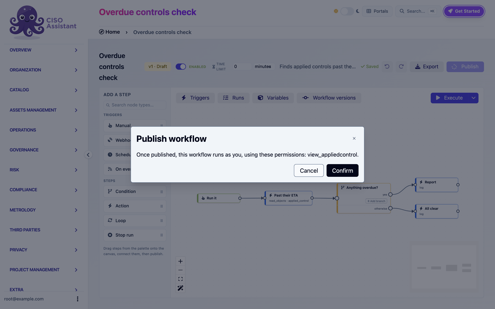

# Permissions and security

Workflows act on your data without a person in the loop, so the engine is strict about whose authority a run uses and what it can reach. This page explains the model so you can predict what a workflow will and will not be allowed to do.

## Who a run acts as

Every published version has a **run identity**: the user who published it. Every run of that version executes with that user's permissions, checked live against the roles they hold at the moment each step executes.

This has three consequences:

- **You can only automate what you could do yourself.** Publishing does not grant anything. If you cannot create incidents in a domain, a workflow you publish cannot either.
- **Revocation works.** If the publisher loses a role, runs of their versions start failing at the step that needs it. The run log shows an `Authorization denied` entry naming the missing permission. Grant the role back or have someone else republish, then run again.
- **Republishing changes the identity.** Whoever publishes next becomes the run identity for the new version.

Draft runs (Execute on an unpublished version) act as the person clicking Execute.


A published version whose publisher was deleted has no run identity. Its automatic triggers stop firing and the header shows an amber **No run-as user** badge. Republish to fix it.


### Permission check at publish time

The publish dialog lists every permission the workflow's steps require and whether you hold each one. You cannot publish a workflow that would run steps you are not allowed to perform.

<figure><figcaption>
The publish dialog listing the permissions the workflow will use
</figcaption></figure>

Which permission each step needs is listed in the [action reference](actions.md).

## What a run can reach

A workflow lives in a domain (folder). Its runs are confined to that domain's subtree:

| Operation | Reach |
|---|---|
| Read objects, Update object, Attach a file to an evidence | The workflow's domain and its sub-domains, further narrowed to what the run identity may view or change |
| Create object | Created in the workflow's domain. Referenced objects (a framework, a perimeter, an entity) may also come from parent domains and the root, since shared referentials live there |
| On event triggers | Only fire for objects inside the workflow's subtree, whatever the filters say |
| Provision domain | Only under the workflow's domain |
| Manage group membership | Only groups in the workflow's subtree |
| Secrets | Only the workflow's own secrets |

A workflow in a sub-domain can never see or touch another sub-domain's data, even if its publisher could. Put a workflow in the root domain when it must span everything, and accept that its publisher's rights at the root then apply.

### Names resolve narrowly

When a step names an object by name rather than id (a category, a perimeter), the name is only looked up in the workflow's subtree and the root. It is not looked up in intermediate parent domains, where a same-named object could be silently bound. Reference parent-domain objects by id or urn instead.

## Facts, not decisions

The Update object step can only write fields that record facts. Assessment results, risk levels, approval decisions and similar judgments are not writable by a workflow, and a few fields accept a restricted set of values:

| Object | Restriction |
|---|---|
| Evidence status | Only `expired` or `missing` |
| Security exception status | Only `expired` or `deprecated` |
| Assessments (audit, risk assessment, entity assessment, findings binder) status | Only planning states: `planned`, `in_progress`, `in_review`, `done`, `deprecated` |
| Requirement assessment | Status, dates and observation only. Never the result or score |

Name fields are not writable either, so **Update when it already exists** can always match the object it created.

## Secrets

Secrets hold credentials for HTTP requests and file downloads. They are:

- Scoped to one workflow. Another workflow, even in the same domain, cannot read them.
- Write-only. Once saved, a value is never displayed again. You can only overwrite or delete it.
- Never exported. An exported workflow lists the names of the secrets it requires, never the values.
- Never logged. Request headers are not written to the run log.
- Only resolved inside HTTP request and Attach a file to an evidence steps.

A step that references a secret is refused over plain `http`. Credentials travel over `https` only.

## Inbound webhooks

A webhook trigger is an unauthenticated URL. Its security rests on the secret embedded in the path:

- The secret is 64 random characters, unique per trigger, and rotatable from the builder.
- A wrong secret, a disabled trigger, an inactive workflow and an unknown workflow all answer `404`. Callers cannot probe which workflows exist.
- Inbound calls are rate-limited per sender.
- Renaming the trigger step rotates the URL, since the step ref is part of the path. The builder warns before you do it.

Your administrator can disable inbound webhooks for the whole instance.

## Outbound requests

HTTP request and Attach a file to an evidence (URL source) go through the platform's outbound safety checks:

- Private, loopback and link-local addresses are refused unless the deployment allows them.
- Redirects are not followed. Only the initial URL was checked, so a `3xx` comes back as a response for the workflow to handle.
- Requests time out after at most 30 seconds.
- Downloaded files respect the instance's attachment size limit and extension allowlist.

## Loop containment

Workflows can trigger other workflows through the changes they make. To stop a change from cascading forever:

- Each run carries a depth. Changes made by a run at depth 1 can start runs at depth 2, up to depth 5. Beyond that the trigger records **Skipped (too many chained triggers)**.
- Several changes produced by one user action on one object start a single run.
- A scheduled trigger never starts a run while its previous run is still active.
- A workflow can set an absolute time limit on its runs. Past it, the run is terminated.

## Deployment requirements

A background worker must be running for scheduled triggers, event triggers, email delivery and time limits to work. Without one, those parts of a workflow silently never happen. This is the same worker the platform's notification emails use. If schedules never advance or emails never leave, ask your administrator to check it.

Your administrator can also adjust, at deployment level: whether inbound webhooks are accepted at all, the webhook rate limit, the maximum rows a Read objects step returns per page (500 by default), the maximum items a loop processes (500) and pages it pulls (20), and whether outbound requests may reach private addresses.

## Feature flag

Workflows are behind the **Workflows** feature flag in the instance settings. When the flag is off, the menu entry disappears, webhook URLs answer `404`, schedules do not fire and events fall through. Turning the flag back on resumes everything where it was.
