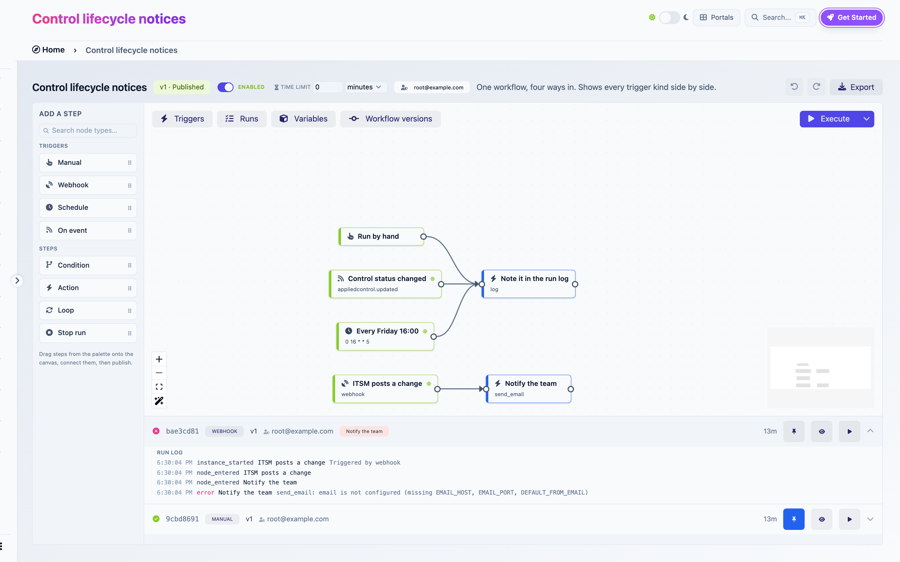

# Runs

A run is one execution of one version of a workflow. This page covers starting runs, reading them, and what to do when one fails.

## Starting a run

| How | Who it runs as |
|---|---|
| **Execute** on a draft | You |
| **Execute** on a published version | The version's publisher |
| A webhook call, a schedule, an event | The version's publisher |

**Execute** starts from the Manual trigger. If there is none and several other triggers exist, a picker asks which one to start from. **Run with variables**, under the chevron, overrides variable values for that one run. Values are checked against each variable's type.

Automatic triggers only fire for the published version, only when the trigger is enabled, and only when the workflow's **Enabled** switch is on. Execute ignores all three, so you can always test a paused workflow.

## The Runs panel

Open **Runs** in the top-left toggles. The panel lists this workflow's runs, newest first, refreshing every few seconds.

<figure><figcaption>
The Runs panel: a failed webhook run expanded to its log, and a completed manual run
</figcaption></figure>

Each row shows the status, the run id, how it was triggered, the version, the run-as user, the steps currently executing (in red if one failed), and its age.

| Status | Meaning |
|---|---|
| Active (spinner) | Executing, or waiting for an email to be delivered |
| Completed | Every path finished |
| Failed | A step failed, or the run hit its time limit |

Three buttons per run:

- **Use as reference data.** Pins this run. The builder then shows real values from it everywhere: next to variables, in the Available data browser, in loop collection pickers and per-item chips. Pin a representative run before configuring downstream steps.
- **Show on canvas.** Paints the run over the graph: green wires and checks on the visited path, a red ring on the failed step, `×N` on loops.
- **Replay.** Animates the run step by step.

## The run log

Expand a run to read its log. Each line is `time · event · step · message`.

| Event | Meaning |
|---|---|
| `instance_started` | The run began. Its data holds the starting variables |
| `node_entered` | A step began |
| `action_executed` | An action finished. Green. Its data holds the output. A created object's name and an HTTP status get their own badge |
| `loop_completed` | A loop finished, with its count and any item errors |
| `authorization_denied` | The run identity lacks a permission. The message names it |
| `run_terminated` | A Stop run step ran, or the time limit hit. Amber |
| `instance_completed` | Every path finished |
| `error` | A step failed. Red. The message is the reason |

The log is the first place to look when an expression renders empty or a Condition takes the wrong branch: `action_executed` lines show what each step actually produced.

## Execution model

A run executes its paths one step at a time, in order, inside the platform. One thing leaves that path: email. Sending is handed to the background worker, the step waits for the result, and a delivery failure fails the step like any other error.

A manual run usually finishes before the Runs panel refreshes. Scheduled and event runs start in the background worker, typically within a second of their trigger.

## Time limit

The **Time limit** in the header caps a run's duration. Past it, the run is stopped, marked Failed, and its log ends with "Run exceeded its N s time limit". The check runs every minute and also applies to runs already in flight when you change the value. `0` means no limit.

Runs stop by themselves after 5000 step executions, a safety net for loops that never return.

## When a run fails

A failed run stays as it is, with its failed step in red and the reason in its log. Runs are history: they are not edited or resumed. Fix the cause, then run again.

- A missing permission (`authorization_denied`): grant the role to the run identity, or have someone who holds it republish.
- A missing or out-of-scope object: check the expression that names it against the reference run.
- A configuration error (a status value the object does not accept, a secret over plain `http`): fix the step, publish, run again.
- An external system that refused or timed out: fix it, then run again. Automatic triggers will produce the next run on their own.

## Housekeeping

- A run parked on an email that the worker never picked up is failed after 15 minutes, with the message "deferred action was never delivered".
- Runs cannot be edited or deleted. They are the audit trail of what the workflow did.
