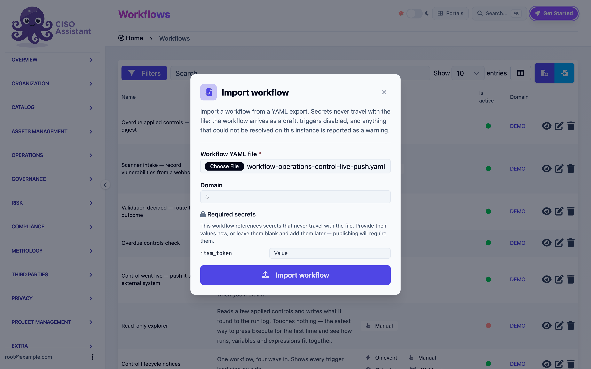
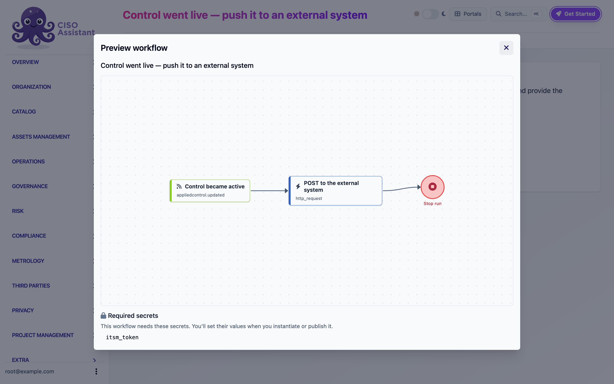

# Sharing workflows

A workflow can leave your instance as a file and come back in on another, or be installed from the library catalog.

## Export

Click **Export** in the builder header. You get a file named after the workflow. It contains the draft if one exists, otherwise the published version.

The file carries:

- The name, description and reference id.
- The variables with their types and defaults.
- Every step with its label, ref and settings.
- Every wire.
- The names of the secrets the steps reference, never their values.

It does **not** carry secret values, webhook URLs, run history, trigger on/off states or step positions. The layout is recomputed on import.

## Import

On the Workflows list, click the import button next to **+**.

<figure><figcaption>
The Import workflow modal
</figcaption></figure>

1. Pick the **Workflow YAML file**.
2. Pick the **Domain** the workflow will live in.
3. If the file references secrets, a **Required secrets** section appears with one field per name. Fill them now, or leave them blank and add them in the builder before publishing.
4. Click **Import workflow**.

The workflow arrives as a new draft with every automatic trigger disabled. Anything the file names that does not exist on this instance (a framework by urn, a category by name) is reported as a warning. The builder opens on the imported draft, laid out automatically. Publish checks are the safety net for anything the warnings mentioned.

Importing the same file twice gives you two workflows. The second gets `(2)` appended to its name.

## Libraries

Templates ship as libraries. In the library catalog, a library that contains workflows shows a **Workflows** row with two actions:

- **Preview workflow** opens the graph read-only, with the list of secrets it needs. Libraries with several workflows show one tab per workflow.
- **Instantiate workflow** asks for a domain, then creates the workflow there: a draft, triggers disabled, secrets to be provided.

<figure><figcaption>
Previewing a library workflow
</figcaption></figure>

Once instantiated, the workflow is yours. Updating the library later does not touch your copy, and your changes never go back to the library.

Your own exports are libraries too. A file you exported can be loaded through the library import as well as through the workflow import dialog. The difference is only where the workflow lands: the dialog asks for a domain.
