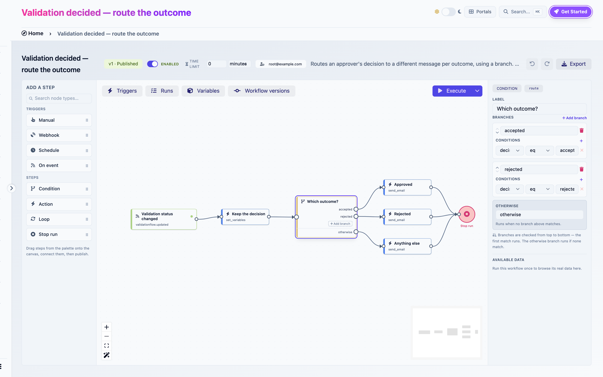
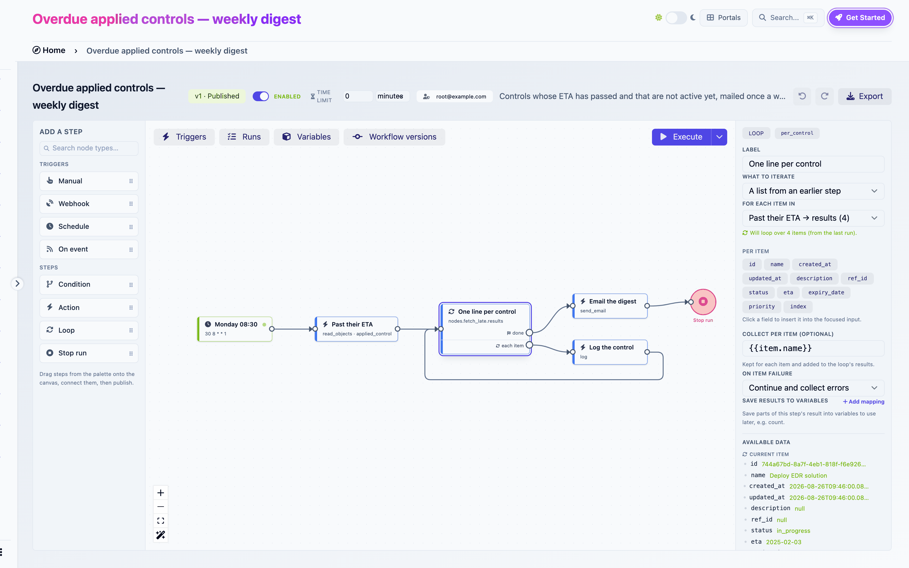

# Steps

Four kinds of step do the work between a trigger and the end of a run.

| Step | Purpose |
|---|---|
| **Action** | Does one thing |
| **Condition** | Chooses one path out of several |
| **Loop** | Repeats a body for each item |
| **Stop run** | Ends the run now |

## Action

An action does one thing: reads objects, creates one, sends an email, calls an external system. Pick what it does in the **Action** select, then fill the settings that appear. Every setting accepts [expressions](expressions.md).

| Action | Does |
|---|---|
| Create object | Creates an object of a chosen kind, optionally updating an existing one with the same name |
| Update object | Changes fields and links on one existing object |
| Attach a file to an evidence | Adds a file, typed or downloaded, to an evidence |
| Read objects | Queries objects with filters, as a page or a single match |
| HTTP request | Calls an external URL |
| Send email | Sends plain-text email |
| Provision domain | Creates a domain |
| Provision user | Creates or updates a user |
| Manage group membership | Adds a user to a group or removes them |
| Set variables | Assigns variables |
| Date offset | Computes a date from a base date and an offset |
| Log | Writes a line to the run log |

Every action's settings, outputs and required permission are in the [action reference](actions.md).


### Outputs

Each action produces an output, a small structure other steps can reference as `{{nodes.<ref>.<path>}}`. A Read objects step exposes `count` and `results`, a Create object step exposes `created_object_id`, an HTTP request exposes `status` and `body`. **Save results to variables** copies chosen paths into variables, which is what a Condition needs.

### Failures

An action can fail: a network error, an object that does not exist, a permission the run identity lacks, a value the object does not accept. A failed action fails the run, and the run log shows exactly which step and why. See [Runs](runs.md#when-a-run-fails).

## Condition

A Condition picks exactly one of its branches. Branches are checked top to bottom, the first whose conditions are all true is taken, and the **otherwise** branch is taken when none is. Only one path leaves a Condition, which is what makes it different from a plain step with several wires, where every wire runs.

<figure><figcaption><p>A Condition step with three branches</p></figcaption></figure>

### Branches

Click **Add branch** in the inspector, or on the step itself. Each branch has a name, an order (move it with the chevrons) and one or more conditions. The **otherwise** branch is always present. You cannot delete or reorder it, and publish refuses a Condition without it, so no case is ever left unhandled.

A branch that exists but is not wired to a next step blocks publication too. Wire it or delete it.

### Conditions

A condition compares a **variable** to a value:

```
overdue_count   gt    0
decision        eq    accepted
severity        in    3,4
```

The value can itself be an expression, so `{{item.severity}}` or `{{payload.new_values.status}}` work. With several conditions on one branch, choose **AND** or **OR** between them.

Operators: `eq`, `neq`, `gt`, `lt`, `gte`, `lte`, `in`, `not_in`, `contains`, `is_null`. Comparison follows the variable's type: a `number` variable compares numerically, a `boolean` variable understands `true`, `1` and `yes`, everything else compares as text. `in` and `not_in` take a comma-separated list.

Conditions compare variables, not step outputs directly. To branch on a step's output, first copy it into a variable with **Save results to variables** on that step, or with a Set variables step. The variable select in a condition ends with **New variable…** so you can declare one on the spot.

## Loop

A Loop runs its body once per item. It has two output ports: **each item** starts one iteration, **done** continues once every item has been processed. The body is whatever you wire from **each item**, and it must come back to the Loop's input to close the iteration.

```
[Read overdue controls] ──▶ [Loop] ──each item──▶ [Log one line] ──┐
                              ▲                                    │
                              └────────────────────────────────────┘
                              └──done──▶ [Email the digest]
```

<figure><figcaption><p>A Loop and its body</p></figcaption></figure>

### What to iterate

**A list from an earlier step.** Pick a list from the **For each item in** select. It offers every list the builder can find in the reference run, such as `Past their ETA → results`, or `Scanner posts results → vulnerabilities`, with the number of items when known. **Custom expression…** accepts any single `{{path}}` that resolves to a list. Until a run exists to look at, the select reads "Run the workflow once to find lists you can loop over."

**Objects, page by page.** The Loop performs its own Read objects, page after page, until the objects run out. Pick the object kind, the order and the page size. The graph stays the same size whether you have twelve objects or twelve hundred, and no intermediate list is stored. The ids are frozen when the loop starts, so a body that changes an object out of the filter does not make the loop skip the next one.

### Inside the body

`{{item}}` is the current element and `{{index}}` its position, starting at 0. `{{item.name}}`, `{{item.id}}`, `{{item.eta}}` reach into it. The **Per item** chips in the inspector list the fields of the first item from the reference run. Click one to insert it into the field you are editing.

A body is a single path. It may contain Conditions, other Actions and even nested Loops, but it may not fan out into parallel wires, and every path must return to the Loop. Publish checks enforce both. In a nested loop, `{{item}}` is the innermost loop's item.

### Collect

**Collect per item** is an expression evaluated at the end of each successful iteration, such as `{{item.name}}` or `{{nodes.create_finding.created_object_id}}`. The values accumulate into the loop's `results`, so the step after **done** can write `{{nodes.per_control.results}}` and get the whole list.

### On item failure

**Continue and collect errors**: a failed iteration is recorded in the loop's `errors` and the next item starts. The run finishes with an amber marker on the Loop. **Stop the run**: the first failure fails the run.

### Output

After **done**, the Loop exposes `count` (items processed), `results` (collected values), `errors` (index and message per failed item) and `pages` (for a paged loop). In run view the Loop shows `×N` with the iteration count.

### Limits

A loop processes at most 500 items and a paged loop pulls at most 20 pages, by default. Beyond that the loop stops cleanly and records why in `errors`. Both limits are deployment settings.

## Stop run

Stop run ends the whole run right away, including steps still running on other paths and any loop in progress. The run is marked completed unless a step had already failed elsewhere.

You rarely need it. A path simply ends when its last step has no outgoing wire, and sibling paths carry on. Use Stop run when you mean "nothing else in this run should happen", for example on the branch of a Condition that decides the event was not interesting after all.

Nothing can be wired after a Stop run.

## Wires and parallelism

Any step except a Condition may have several outgoing wires. All of them run: the paths execute one after the other within the run, and each completes independently. A step with several incoming wires runs once per arriving path. There is no join step that waits for every path, so if two paths must both finish before a third step, chain them instead.
