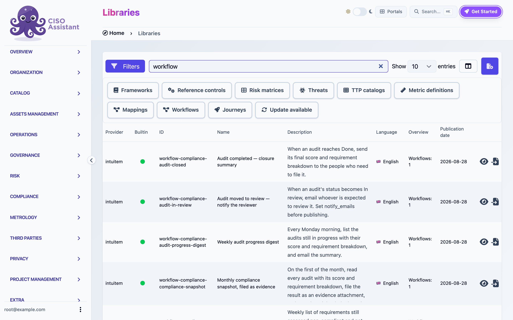

# Template catalog

CISO Assistant ships ready-made workflows as libraries. Install one from the library catalog and it becomes a normal workflow in the domain you choose: a draft you can inspect, adjust and publish. Nothing syncs back to the library afterwards, so you can change anything.

Every template follows the same rules:

- It never renders a judgment. Templates notify, file, link and record facts (a date passed, a control opened). Approvals, results and severities stay with people.
- It carries a `notify_emails` variable or similar. Set it before publishing.
- It arrives with automatic triggers disabled. Nothing fires until you enable the trigger.

<figure><figcaption>
The library catalog filtered on workflow libraries
</figcaption></figure>

## Compliance

| Template | Trigger | What it does |
|---|---|---|
| Audit completed, closure summary | Audit updated to Done | Reads the audit's final score and requirement breakdown and emails them. |
| Audit moved to review, notify the reviewer | Audit updated to In review | Emails the reviewer. |
| Weekly audit progress digest | Monday 08:00 | Lists audits still in progress with their score and breakdown. |
| Monthly compliance snapshot, filed as evidence | 1st of the month 06:00 | Reads every audit, files the result as an evidence attachment, emails where it landed. An auditor can be shown the posture on a date. |
| Remediation backlog digest | Friday 16:00 | Lists requirements assessed non-compliant and not yet done. |
| Non-compliant requirement, open and link a remediation control | Requirement assessment updated | Creates an applied control, links it to the requirement, notifies the owner. Never touches the result. |
| Validation decided, route the outcome | Validation flow updated | Branches on the decision and sends a different email per outcome. The reference example for branches. |
| Validation requested, notify the approver | Validation flow created | Emails the approver with the deadline. |

## Risk

| Template | Trigger | What it does |
|---|---|---|
| Risk acceptance lifecycle, submitted and decided | Acceptance created, acceptance updated | Two triggers in one workflow. A new acceptance notifies the approver, a decision notifies the requester. |
| Critical finding, open and link a remediation control | Finding created | High-severity finding opens an applied control, links it, notifies responders. |
| High-severity vulnerability recorded, notify | Vulnerability created | Notice for severity 3 and above, whatever created it. |
| Security exceptions past their date, mark expired | Daily 06:00 | Marks lapsed exceptions as expired and mails the list. Expiry is a fact about a date. |
| Overdue findings, daily digest | Daily 07:00 | Findings past their due date and not closed. |
| Untreated high risks, weekly sweep | Monday 09:00 | Risk scenarios at or above a level whose treatment is still open. The level index depends on your matrix. |

## Operations

| Template | Trigger | What it does |
|---|---|---|
| Control went live, push it to an external system | Applied control updated | Posts JSON to your ITSM or chat webhook. Needs a `target_url` variable and an `itsm_token` secret. |
| Overdue applied controls, weekly digest | Monday 08:30 | Controls past their ETA and not active, one line each, mailed. The reference example for loops. |
| Domain onboarding pack | Manual | Creates a domain with default groups, provisions a user, adds them to the analyst group. Fill the variables and run it per new team. |
| Third party added, start its assessment | Entity created | Creates an entity assessment for the new third party. |
| Third party added, tiered due diligence | Entity created | Branches on dependency. Critical gets the full questionnaire and two weeks, the rest the core implementation group and six weeks. Uses Date offset. |
| External report, download it and file it as evidence | Webhook | Downloads a file from a base URL you control plus a caller-supplied path, attaches it to a new evidence. |
| Personal access token created, notify security | Token created | Notice whenever a long-lived credential is minted. |
| Read-only explorer | Manual | Reads a few applied controls and logs them. Touches nothing. The safest first Execute. |
| Scanner intake, record vulnerabilities from a webhook | Webhook | Each posted entry becomes a vulnerability, matched on name so re-posting updates instead of duplicating. |
| Third-party portfolio review, every active vendor | Manual | Walks the whole portfolio page by page. Same four steps for twelve vendors or twelve hundred. The reference example for paged loops. |

## Privacy

| Template | Trigger | What it does |
|---|---|---|
| Processing intake, record a new processing and its data | Webhook | Creates a processing, its purpose and each personal data entry. Categories match by name against your instance's terminology. |

## Where to start

- Never ran a workflow before: **Read-only explorer**.
- Want a scheduled digest: **Overdue applied controls, weekly digest**, then change the model and the filters.
- Want to react to a status change: **Validation decided, route the outcome**.
- Want to receive data from another system: **Scanner intake**.
- Want to send data to another system: **Control went live, push it to an external system**.

See [Sharing workflows](sharing.md) for how installation, provenance and secrets work.
