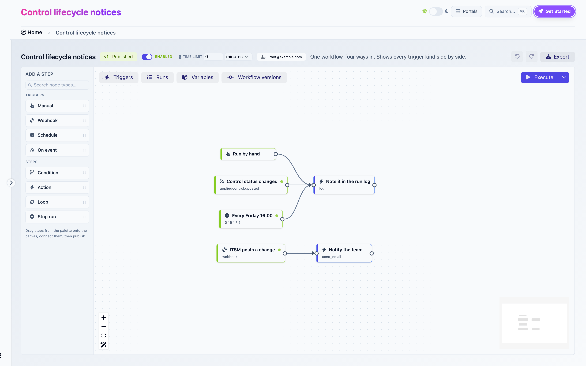
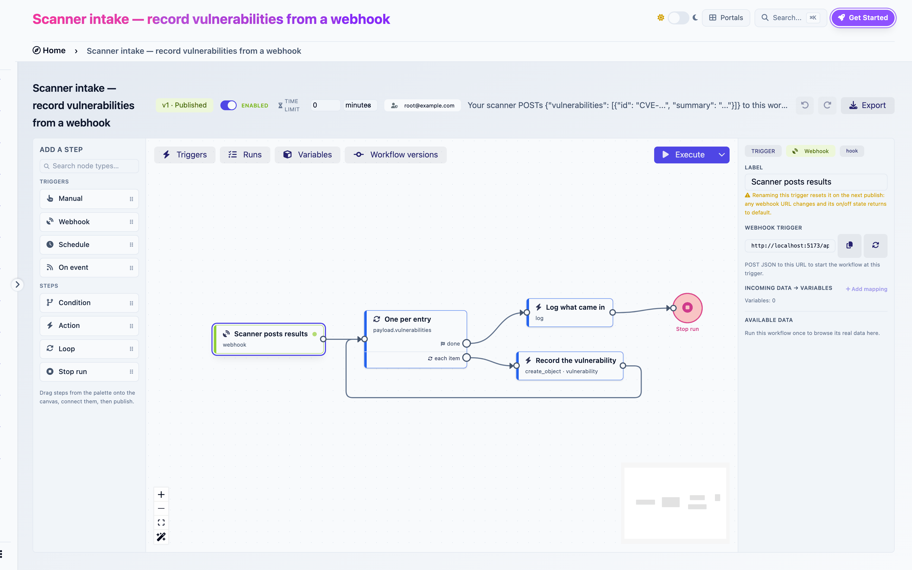
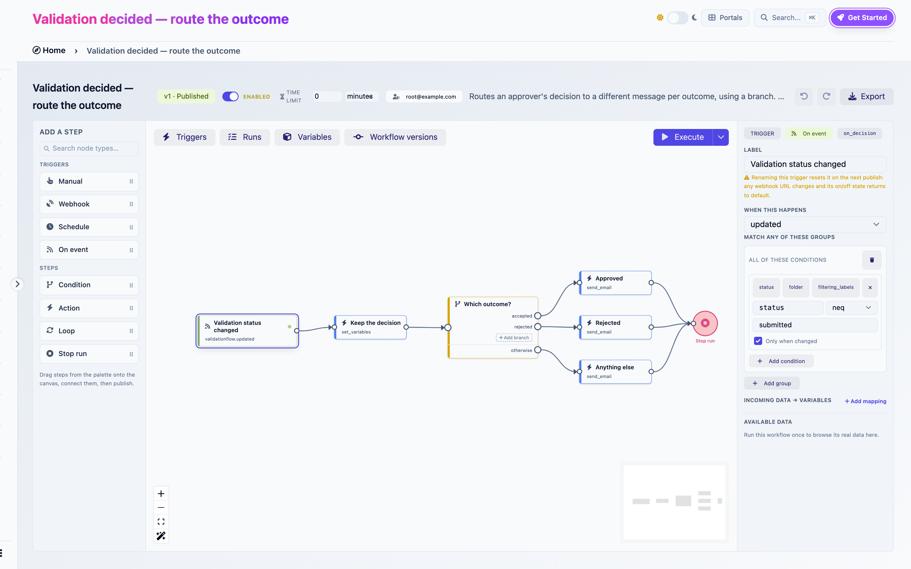
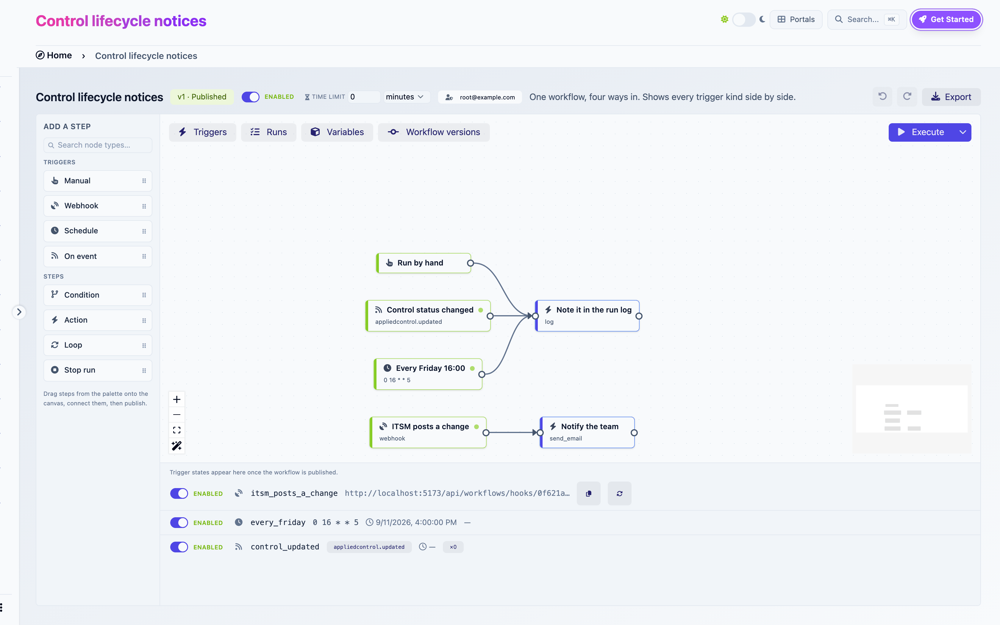

# Triggers

A trigger is the step a run starts at. A workflow needs at least one. It can have several, of any kind, each leading into the graph wherever you wire it. Two triggers can lead into the same step, and a run always starts at exactly one of them.

<figure><figcaption><p>The four trigger kinds</p></figcaption></figure>

## Common settings

**Label.** The name shown on the canvas. It also determines the step's ref, which for a webhook is part of the URL. Renaming a registered trigger resets it at the next publish: the builder warns, "Renaming this trigger resets it on the next publish: any webhook URL changes and its on/off state returns to default."

**Incoming data → variables.** Maps fields of the incoming payload into variables at the start of the run. Each row is a variable and a path in the payload. A row pointing at a variable that does not exist yet shows a **Create** button. Mapping is optional: the whole payload is always available as `{{payload}}` anyway. Map when you want a Condition step to compare the value, since conditions compare variables.

A trigger's kind is fixed when you add it. To change kind, delete the trigger and add another.

## Manual

Starts when someone clicks **Execute**. A new workflow comes with one, and a workflow can hold at most one.

**Run with variables**, under the chevron next to Execute, lets you set variable values for one run. This is the way to test a Condition without changing defaults.

Manual triggers have no on/off state and no row in the Triggers panel.

## Webhook

Starts when an external system sends an HTTP `POST` with a JSON body to the trigger's URL.

### Getting the URL

Publish first. Before publication the inspector says "Publish this workflow to get its webhook URL." After it, the inspector and the Triggers panel show the URL with a copy button. Only users who can change the workflow see the URL, because whoever holds it can start runs.

```
https://your-instance.example.com/api/workflows/hooks/<workflow id>/<trigger ref>/<secret>/
```

The secret is a 64-character random string, unique to this trigger. **Rotate secret** replaces it, and the old URL stops working immediately.

<figure><figcaption><p>A webhook trigger after publication</p></figcaption></figure>

### Calling it

```bash
curl -X POST "https://your-instance.example.com/api/workflows/hooks/<id>/<ref>/<secret>/" \
  -H "Content-Type: application/json" \
  -d '{"vulnerabilities": [{"id": "CVE-2026-1234", "summary": "Example"}]}'
```

A `201` answer carries the run id. The body becomes `{{payload}}`: here `{{payload.vulnerabilities}}` is a list a Loop can iterate.

| Answer | Meaning |
|---|---|
| `201` | A run started |
| `404` | Wrong URL, trigger disabled, workflow disabled, feature off. Deliberately the same, so callers cannot probe |
| `409` | Published version no longer has this trigger. Republish |
| `429` | Too many calls from one sender in a minute |

### State

Webhook triggers arrive **enabled** at publish. Someone has to call the URL, so there is nothing to start by surprise. Disable one in the Triggers panel to make its URL answer `404` without rotating the secret.

## Schedule

Starts on a cron expression.

| Setting | |
|---|---|
| **Cron expression** | Five fields: minute, hour, day of month, month, weekday. `30 8 * * 1` is Monday 08:30 |
| **Timezone** | An IANA name such as `Europe/Paris`. Default `UTC`. Also the timezone of `{{today}}` and `{{now}}` for this run |

Some expressions:

| Expression | Fires |
|---|---|
| `0 7 * * *` | Every day at 07:00 |
| `30 8 * * 1` | Mondays at 08:30 |
| `0 16 * * 5` | Fridays at 16:00 |
| `0 6 1 * *` | The 1st of each month at 06:00 |
| `*/15 * * * *` | Every 15 minutes |

The minimum interval is one minute.

### Behaviour

- Schedules arrive **disabled** at publish. Enable them in the Triggers panel. When enabled, the panel shows **Next run**.
- A schedule never overlaps itself. If the previous run is still active when the next occurrence comes, that occurrence is skipped and the panel shows **Skipped (previous run still active)**.
- Occurrences missed while the background worker was down collapse into a single run when it comes back. There is no catch-up storm.
- Changing the expression takes effect at the next publish. The row keeps its enabled state.


Schedules fire from the background worker. If your deployment does not run one, nothing fires. See [Permissions and security](permissions-and-security.md#deployment-requirements).


## On event

Starts when an object is created, updated or deleted inside CISO Assistant.

<figure><figcaption><p>Configuring an On event trigger</p></figcaption></figure>

### When this happens

A select grouped by object kind, offering `created`, `updated` and `deleted` for each. Anything audited by the platform is available: applied controls, findings, vulnerabilities, audits, requirement assessments, risk acceptances, validation flows, entities, users, personal access tokens and more.

### Filters

Without filters, every event of that kind starts a run. Filters narrow it down. They are groups of conditions: a run starts when **any** group matches, and a group matches when **all** its conditions do. Quick chips insert the common fields `status`, `folder` and `filtering_labels`. Any field of the object can be typed in.

Each condition has a field, an operator, a value and a checkbox:

**Only when changed.** Off, the condition is about the object's state after the event: "status is done". On, it is about the transition: "status just changed to done". Use it for reactions that must fire once, when the value is reached, and not on every later edit of the object.

| Operator | Meaning |
|---|---|
| `eq`, `neq` | Equal, not equal |
| `gt`, `lt`, `gte`, `lte` | Numeric comparison |
| `in`, `not_in` | Value in a comma-separated list, or not |
| `contains` | Text contains. On a label list: has this label |
| `is_null` | Empty or missing |

For `folder`, the value picker is a domain select. For `filtering_labels`, `contains` tests membership.

A filter that cannot be shown as groups (some imported files) is shown as **Filters (JSON)** for editing as text.

### Scope

An event only reaches a workflow when the object lives in the workflow's domain or one of its sub-domains. This holds whatever the filters say. A folder filter pointing outside the subtree is refused at publish.

Objects without a domain (users, tokens) count as living in the root. Only a workflow in the root domain can react to them.

### Payload

The run's payload describes the event. The [expressions page](expressions.md#payloads) lists every key. The two you will use most: `{{payload.object_repr}}` for the object's name and `{{payload.new_values.<field>}}` for the value a field just took.

### Behaviour

- Event triggers arrive **disabled** at publish. Enable them in the Triggers panel.
- One user action on one object starts at most one run per trigger, even if it wrote several audit entries. The panel then shows **Coalesced (same user action already handled)**. A bulk edit of several objects still starts one run per object.
- Changes made by a run can start other runs, up to five levels deep. Past that the trigger shows **Skipped (too many chained triggers)**. This stops two workflows from feeding each other forever.
- Events are processed by the background worker. A run typically starts within a second of the change.

## The Triggers panel

The **Triggers** toggle opens the panel. It lists one row per webhook, schedule and event trigger of the published version. Manual triggers are not listed.

<figure><figcaption><p>The Triggers panel with a webhook, a schedule and an event trigger</p></figcaption></figure>

Each row shows:

- The **Enabled / Disabled** switch.
- The trigger's icon and ref.
- For a schedule, the cron expression, **Next run** and **Last run**. For an event trigger, the event key, **Last fired** and a count. For a webhook, the URL, a copy button and **Rotate secret**.
- The last result:

| Result | Meaning |
|---|---|
| Triggered | A run started |
| Skipped (previous run still active) | Schedule overlap protection |
| Skipped (not published) | The published version no longer has this trigger |
| Skipped (too many chained triggers) | Event chain depth exceeded |
| Coalesced (same user action already handled) | See above |
| Error | The engine refused to start. Check the workflow's run identity and recent publish |

On the canvas, registered triggers carry a small dot: pulsing green when enabled, grey when disabled.

### What survives a publish

Trigger rows are keyed by the step's ref. Publishing again keeps each row's enabled state, secret and history as long as the ref and kind are unchanged. New schedule and event triggers arrive disabled, new webhooks enabled. A renamed or re-kinded trigger is a new row: state resets, the webhook URL changes.

### Master switch

The **Enabled** switch in the header disables every automatic trigger at once. Rows keep their own state, so re-enabling the workflow brings back exactly what was on. A schedule occurrence that falls while the workflow is paused is skipped, and the schedule resumes at its next occurrence once re-enabled.
