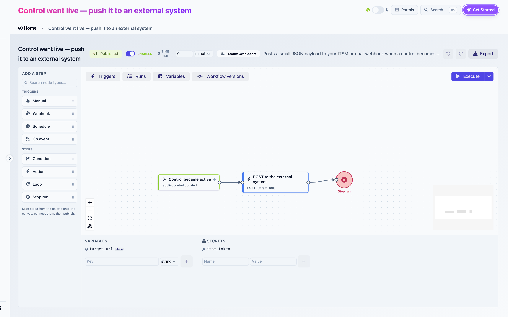
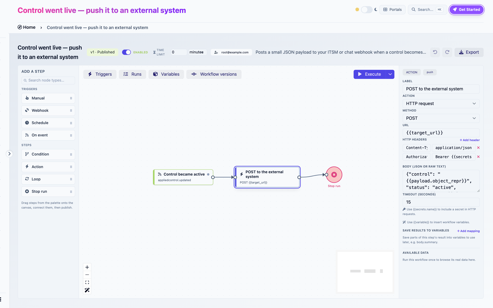

# Variables and secrets

Open the **Variables** toggle in the top-left of the canvas. The panel at the bottom has two columns: variables on the left, secrets on the right.

<figure><figcaption>
The Variables panel: one declared variable and one secret, with their creation forms
</figcaption></figure>

## Variables

A variable is a named value with a type and a default. Every run starts with the defaults, then triggers, mappings and Set variables steps change them.

| Type | Holds | Compared as |
|---|---|---|
| `string` | Text | Text |
| `number` | A number | Numerically |
| `boolean` | `true` or `false` | `true`, `1` and `yes` count as true |
| `date` | An ISO date | Text |
| `json` | Any structure | Text |

### Creating one

Type a **Key**, pick a type, click **+**. Keys are identifiers: letters, digits and underscores, starting with a letter or underscore. `now`, `today` and `payload` are reserved.

You can also create a variable where you need it: the variable select of a condition offers **New variable…**, an incoming-data mapping pointing at an unknown key shows a **Create** button.

### Where values come from

| Source | When |
|---|---|
| Default | At run start |
| **Incoming data → variables** on a trigger | At run start, from the payload |
| **Save results to variables** on a step | After that step runs |
| A **Set variables** step | When it runs |
| A **Date offset** step with **Store the result in** | When it runs |
| **Run with variables** | At run start, for one manual run |

### What variables are for

Three things, in practice:

- **Configuration.** `notify_emails`, `target_url`, `framework_urn`. Set the default once, reference it everywhere, change it without touching the steps. Every template does this.
- **Conditions.** A Condition compares variables. Copy a step output into a variable to branch on it.
- **Carrying values across steps.** Usually `{{nodes.<ref>.<path>}}` is simpler, but a variable survives a Loop boundary and reads better in long graphs.

When a reference run is pinned, the panel shows each variable's value at the end of that run.

## Secrets

A secret is a named credential: a token, a password. Reference it as `{{secrets.NAME}}` in the URL, headers or body of an **HTTP request**, or in the URL and headers of an **Attach a file to an evidence** step with a URL source. Nowhere else.

### Creating one

Type a **Name** and a **Value**, click **+**. Or, from the **Available data** browser of an HTTP step, click **+** next to Secrets.

### Rules

- **Write-only.** Once saved, the value is never shown again, not in the panel, not in run logs. Replace it by saving a new value under the same name.
- **Per workflow.** Each workflow has its own secrets. Two workflows in the same domain may each have a `TOKEN` and they are unrelated.
- **Never exported.** An exported workflow lists the names of the secrets it requires. Importing asks for the values.
- **https only.** A step referencing a secret is refused over plain `http`.
- **Required to publish.** A step referencing a secret that does not exist fails the publish check `secret_missing`. Create it first, spelled the same.

<figure><figcaption>
An HTTP request step whose Authorization header references a secret
</figcaption></figure>
