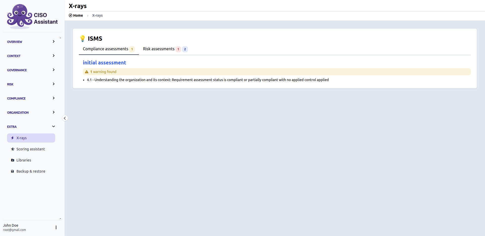
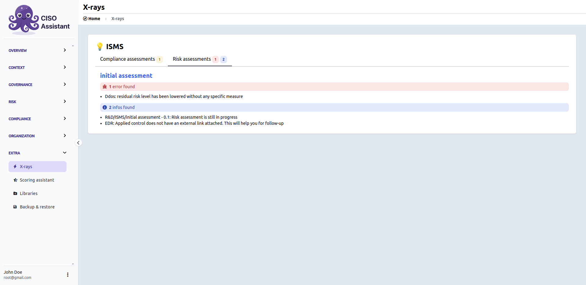

# X-rays

X-rays is a page that detects **inconsistencies** across your assessments for each perimeter. There are three types of reports:

- **info** — advice or reminder for status and relevant empty fields.
- **warning** — potential errors to be determined by the user.
- **error** — errors that must be corrected.

