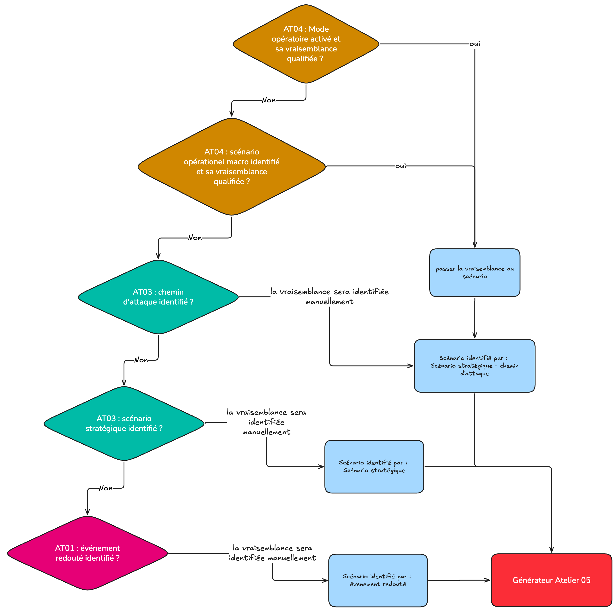

# EBIOS RM study

This guide walks through a full **EBIOS RM** study in CISO Assistant, workshop by workshop. EBIOS RM is the structured risk-management method published by [ANSSI](https://cyber.gouv.fr/securisation/analyse-des-risques/methode-ebios-rm/); CISO Assistant supports it with a dedicated object graph rather than forcing it into a generic risk-assessment shape, which lets each workshop produce the artefacts the method calls for while reusing data that already lives in the platform.

For the conceptual mental model and the user-facing ↔ internal naming map, read [EBIOS RM (concept)](../concepts/ebios-rm.md) first. For the formal methodology, see ANSSI's [EBIOS RM v1.5 guide](https://cyber.gouv.fr/securisation/analyse-des-risques/methode-ebios-rm/) and the supporting training material.

## Prerequisites

Before you start the study, set up:

1. **A domain** (the study lives in a domain — no perimeter; the study itself is the scope envelope).
2. **A risk matrix** loaded from the library (or one you authored). The matrix dictates the grids for gravity, likelihood, and risk level used throughout. _Changing_ the matrix on an existing study is supported and will clamp any out-of-range gravities and likelihoods to the new matrix's scale.
3. **Optional but recommended** — load the objects you intend to reuse:
   - **Assets** for workshop 1 (primary and supporting).
   - **Frameworks and audits** for the security baseline at workshop 1.4.
   - **Entities** (third parties, internal business units) for workshop 3 ecosystem mapping.
   - **Threats** to attach to elementary actions and operational scenarios at workshop 4.
   - **Applied controls** to layer in at workshop 3 (stakeholder controls) and workshop 5 (risk treatment).

You don't need everything upfront — the editor lets you create objects inline — but having a clean catalogue makes the study faster and the deliverables tidier.

## Create the study

1. Go to **EBIOS RM studies** → **Add EBIOS RM study**.
2. Fill in:
   - **Name** and optional **Reference ID** / **Version** (e.g. _v1.0_).
   - **Description** — the study's mission statement.
   - **Domain** — where the study lives.
   - **Reference entity** — the entity the study focuses on (defaults to the main entity of your instance).
   - **Risk matrix** — the matrix the study will quote against.
   - **Quotation method** — _Manual_ or _Express_ (default). See [Quotation methods](#quotation-methods) below.
   - **Authors** / **Reviewers** — actors driving the study.
   - **ETA** and **Due date** — optional planning dates.
3. Save. You land on the study page with the five workshop blocks and their step checklists.

Each workshop block tracks **step status** (`to do` / `in progress` / `done`) per activity. Update them as you progress to keep the dashboard meaningful.

## Workshop 1 — Framing and security foundation

WS1 frames the study and sets its security baseline.

### 1.1 Define the study framework

In the study landing card, capture the mission, scope, and applicable regulations of the study. This is prose-driven — fill in the description and observation fields.

### 1.2 Define the business and technical perimeter

Attach the **primary and supporting assets** that fall inside the study. Use **Select asset** to pick from your existing asset inventory rather than re-creating them in EBIOS RM.

> **EBIOS RM vocabulary bridge**: what ANSSI calls **valeur métier** (the missions, processes, and information that carry value for the organisation) maps to a CISO Assistant **Primary asset**; what ANSSI calls **bien support** (the IT, infrastructure, people, premises supporting those valeurs métiers) maps to a **Supporting asset**. The `type` field on each asset is what you set to mark the distinction. A valeur métier is then composed of one or more biens support through the asset parent/child relationship.

> **Content reuse — assets**: the assets attached here are the same `Asset` objects you manage under **Assets**. Updates to an asset (owner, description, parent linkage) propagate automatically into the study. Use the [Assets concept page](../concepts/assets.md) to model them once and reuse them across studies.

### 1.3 Identify feared events

In **Feared events**, declare the undesirable outcomes that would matter to the organisation if they occurred on the primary assets:

1. Click **Add feared event**, give it a name and optional reference ID.
2. Attach the **assets** the event affects.
3. Pick the **qualifications** (CIA, regulatory, reputational, financial…) from the terminology list — manage the available qualifications under [Terminology](../concepts/terminology.md).
4. Set the **Gravity** (clamped to the matrix's impact scale).
5. Tick **Is selected** for the events that move to subsequent workshops; document the rationale in **Justification**.

### 1.4 Determine the security foundation

The **security foundation** — what ANSSI calls the _socle de sécurité_ — is your existing compliance position: the controls you already have. CISO Assistant lets you attach one or more existing **audits** rather than re-typing them:

1. Open **Workshop 1 → Determine the security foundation**.
2. Pick the compliance assessments to include — ISO 27001, NIST CSF, internal policies, sector-specific framework audits.

> **Content reuse — audits**: the audits attached are live `ComplianceAssessment` objects. Their requirement results and applied controls are pulled into the WS1.4 baseline view and into the published report. Run the audits in the [Audits](../concepts/audits.md) module and let WS1.4 reflect their current state.

## Workshop 2 — Risk origins and target objectives

WS2 turns "who might attack and what they want" into a structured short list.

### 2.1 Identify RO/TO couples

In **Workshop 2 → RO/TO couples**, click **Add RO/TO couple** for each pairing:

- **Risk origin** — picked from the terminology catalogue (states, organised crime, hacktivists, insiders, competitors…). Tune the available list under [Terminology](../concepts/terminology.md).
- **Target objective** — what they would seek by attacking you (free text).

### 2.2 Evaluate RO/TO couples

For each couple, rate **Motivation** (1–4: _very low_ → _strong_) and **Resources** (1–4: _limited_ → _unlimited_). The **Pertinence** is computed automatically from the 4×4 matrix and displayed as _irrelevant_, _partially relevant_, _fairly relevant_, or _highly relevant_. You can also note the threat-actor **Activity** level for context.

### 2.3 Select RO/TO couples

Tick **Is selected** for the couples you'll carry into WS3. Capture the rationale in **Justification** — selection should be defensible at sign-off.

## Workshop 3 — Strategic scenarios

WS3 models how a selected RO/TO would reach its objective by leveraging the ecosystem.

### 3.1 Map the ecosystem

In **Workshop 3 → Ecosystem**, add **Stakeholders**. A stakeholder wraps an **Entity** — the third party, internal business unit, or external partner — and qualifies its relationship to the studied object:

1. Click **Add stakeholder**.
2. Pick the **Entity** from the dropdown (or create one on the fly).
3. Choose the **Category** (provider, partner, client, regulator… — managed under [Terminology](../concepts/terminology.md)).
4. Score the **current** values on the 0–4 scales:
   - **Dependency** — how much you depend on the stakeholder.
   - **Penetration** — how much access the stakeholder has into your perimeter.
   - **Maturity** — the stakeholder's cybersecurity maturity (1–4).
   - **Trust** — your trust in the stakeholder (1–4).
5. The **current criticality** is computed as `(dependency × penetration) / (maturity × trust)`. Higher = more dangerous.

> **Content reuse — third parties**: the entities behind stakeholders are the same `Entity` objects used in [Third-party risk management](../concepts/third-party-risk.md). The criteria entered there (entity-level assessments, contracts, representatives) carry over and inform WS3 scoring.

The **ecosystem radar** at the top of the page visualises stakeholders by criticality — current and residual side by side — which makes it easy to spot which corners of the ecosystem dominate the risk picture.

### 3.2 Develop strategic scenarios

In **Workshop 3 → Strategic scenarios**, build one or more scenarios per selected RO/TO couple:

1. Click **Add strategic scenario**.
2. Pick the **RO/TO couple** and give the scenario a name.
3. Optionally pick a **Focused feared event** — see [Focusing on one feared event](#focusing-on-one-feared-event) below.
4. Inside the scenario, add **Attack paths** — each path picks the **stakeholders** the attacker leverages to reach the objective. Tick **Is selected** for the paths to carry into WS4.

#### Focusing on one feared event

A RO/TO couple often ties to several feared events at once — a single risk origin pursuing a single target objective can plausibly trigger _data exfiltration_, _service disruption_, and _regulatory exposure_ in the same study.

By default, the strategic scenario's gravity is the **maximum** gravity across the RO/TO's selected feared events — the worst-case framing. That's the right default for "headline" reporting, but it hides the texture when several scenarios under the same RO/TO actually target different outcomes.

The **Focused feared event** field on a strategic scenario lets you zoom in on one specific feared event from the RO/TO and use **its** gravity instead of the RO/TO-wide max. Two common uses:

- **Splitting a RO/TO into multiple scenarios** — one strategic scenario per feared event, each focused on its own, so the deliverable shows each outcome's gravity rather than collapsing them into the worst one.
- **Telling a precise story** — the scenario describes a specific attack chain ending on a specific feared event; focusing the field aligns the scenario's gravity with that narrative rather than borrowing the worst sibling's score.

Leave it blank to fall back to the RO/TO max. Changing it later just retargets the gravity reference — no downstream data is lost.

### 3.3 Define ecosystem security measures

Back on the ecosystem page, attach **applied controls** to stakeholders to lower their criticality. Then re-score the **residual** values on the same 0–4 scales — the **residual criticality** is recomputed and shown next to the current one in the radar.

> **Content reuse — applied controls**: stakeholder controls are the same `AppliedControl` objects used everywhere else in the platform. Defining a control once (in [Applied controls](../concepts/applied-controls.md)) and attaching it to stakeholders, requirement assessments, and risk scenarios keeps the action plan singular.

## Workshop 4 — Operational scenarios

WS4 drops into technical detail. This is where attackers' kill chains live.

### 4.0 Prepare elementary actions

**Elementary actions** are the reusable building blocks of operating modes — atomic attacker steps tagged by **attack stage**: _Know_ (reconnaissance), _Enter_ (initial access), _Discover_ (discovery), _Exploit_ (exploitation).

1. Go to **Workshop 4 → Elementary actions** or the global **Elementary actions** page.
2. Click **Add elementary action**. Set:
   - **Name** and optional **Reference ID**.
   - **Attack stage** (one of the four).
   - Optional **Threat** — link to a `Threat` object for richer reporting.
   - Optional **Icon** — for the graph editor.

Build a catalogue you can reuse across operating modes and studies.

### 4.1 Develop operational scenarios

In **Workshop 4 → Operational scenarios**, an **Operational scenario** is wired one-to-one to a selected **attack path**:

1. Click **Add operational scenario** and pick the attack path.
2. Attach the **threats** leveraged in the scenario.
3. Fill the **Operating modes description** — see [Macro vs micro kill chain](#macro-vs-micro-kill-chain) below.
4. Tick **Is selected** to carry forward into the WS5 risk assessment.

For each scenario you'll typically create one or more **Operating modes** — concrete kill chains realising the scenario. From the scenario detail, click **Add operating mode** and give it a name and reference ID (`MO.01`, `MO.02`, …).

#### Macro vs micro kill chain

CISO Assistant supports two levels of detail:

- **Macro** — fill the operational scenario's **Operating modes description** with a markdown summary of the attacker's steps. Quick to write, good for management-level reporting. If left blank, it can be inferred from the graph.
- **Micro** — open the operating mode and switch to its **Graph** view. The graph editor lays out the four attack-stage columns (_Know / Enter / Discover / Exploit_) and lets you drop **elementary action nodes** into each column, then connect them with **AND / OR** logic operators to model antecedents.

A few rules of thumb from the editor:

- Keep **one kill chain per operating mode** — it reads better and lets each be quoted independently when running in _Express_ mode.
- Drag nodes to reduce link crossover — the layout is persisted.
- Mark a step as **highlighted** to flag a pivotal action when you discuss the scenario with stakeholders.

### 4.2 Evaluate the likelihood

Rate the likelihood of each operational scenario. _How_ depends on the [Quotation method](#quotation-methods) you set on the study — see below.

## Workshop 5 — Risk treatment

WS5 is where EBIOS RM crosses back into the platform's general-purpose risk register.

### 5.1 Generate the risk assessment

Click **Generate the risk assessment** on the study page. The platform either:

- **Creates a new** `RiskAssessment` seeded with one risk scenario per selected operational scenario, or
- **Syncs an existing** assessment that was generated previously — the modal walks you through which mode to use (sync mode applies to operational scenarios / attack paths / stakeholders / applied controls).

#### How the generator seeds risk scenarios

The generator does not require a fully completed study. It scans the workshops and, for each candidate, picks the **finest level of detail you've actually filled in**, falling back to coarser data when needed. Whatever's there gets carried through; whatever's missing leaves the corresponding field blank for you to set later on the risk scenario.

Reading the cascade top-down:

1. **Operating mode rated with a quantified likelihood** (WS4.2, Express quotation): seed a risk scenario tied to _strategic scenario + attack path_, carrying the operating mode's likelihood through.
2. **Macro operational scenario rated with a quantified likelihood** (WS4.1, Manual quotation): same identification, with the operational scenario's own likelihood.
3. **Attack path identified at WS3.2** without a quantified likelihood yet: seed a risk scenario tied to _strategic scenario + attack path_ — likelihood is left blank for you to qualify manually on the risk scenario.
4. **Strategic scenario identified at WS3.2** without attack paths: seed a risk scenario tied to the _strategic scenario_ only.
5. **Only a feared event identified at WS1.3**: seed a risk scenario tied to the _feared event_ alone.

The practical consequence: a half-finished study still produces a useful risk register, and a fully completed one brings maximum quantitative detail through without manual re-entry. You can also run the generator early — say, after WS3 — to get an initial risk register seeded from strategic scenarios, then re-sync after completing WS4 to upgrade the likelihoods.

### 5.2–5.5 Treat, control, accept, and monitor

Steps 5.2 onwards run on the resulting **risk assessment** — same flow as a standalone qualitative risk study:

- **Decide on the risk treatment strategy** (reduce / share / avoid / accept).
- **Define security measures** — additional applied controls.
- **Assess and document residual risks** — re-quote likelihood and gravity after controls land.
- **Establish the risk monitoring framework** — action plan, review cadence, sign-off.

See [Risk assessments](../concepts/risk-assessments.md) for the WS5 mechanics. Because EBIOS RM scenarios sit in the same risk register as qualitative ones, the residual-risk picture you produce here aggregates naturally with risk work done elsewhere on the perimeter.

### The consolidated action plan

The final EBIOS RM action plan that lands in the report isn't a single list — it's a stack of **three layers**, each fed by a different workshop:

| Layer | Source | What it contains |
|---|---|---|
| **Compliance** | WS1.4 — the baseline audits | Applied controls attached to the requirement assessments of the linked compliance assessments. These are the controls you need anyway to meet the security baseline. |
| **Ecosystem** | WS3.3 — stakeholder controls | Applied controls attached to selected stakeholders to lower their criticality. These reduce the attack surface offered by partners, suppliers, and other parties. |
| **Scenario-specific** | WS5 — risk treatment | Applied controls attached to the risk scenarios generated from WS4. These address the residual risk that compliance and ecosystem measures don't already cover. |

Because all three layers point at the **same** `AppliedControl` objects used everywhere else in the platform, the consolidated plan is a deduplicated view: a control listed under compliance _and_ as a scenario treatment shows up once, with both its origins traceable. That keeps the deliverable honest — readers see the actual cost of the action plan rather than three padded copies of the same controls.

The Excel export carries the same three layers across its sheets (`1.4.N {audit}` for the compliance layer, `3.3 Stakeholder Controls` for the ecosystem layer, and the action plan section of the generated risk assessment for the scenario layer).

## Quotation methods

The **Quotation method** set at study creation controls how operational-scenario likelihoods are computed.

### Manual

You set each operational scenario's **Likelihood** directly. Operating modes can still be rated for documentation, but the operational scenario's likelihood is whatever you typed. This is the right method when:

- You're running a high-level study and don't want to model individual operating modes in detail.
- You're following an in-house quotation method that overrides the per-mode logic.

### Express (default)

Operating modes are rated individually, and the operational scenario's likelihood is **automatically set to the maximum** likelihood across its operating modes. The propagation happens server-side whenever an operating mode is saved or deleted, and a full sweep runs whenever the study is saved.

Use _Express_ when:

- You want defensible rationales tied to specific kill chains.
- You're modelling multiple parallel kill chains per scenario and the worst one should drive the headline likelihood.

Switching between methods on an existing study is supported, but only changes propagation behaviour going forward — already-rated scenarios keep their values until something triggers a recompute.

## Reports and exports

### The study report

Open **Report** from the study page. It's a printable, workshop-by-workshop dossier covering:

- Study metadata (authors, reviewers, dates, status, observation).
- WS1 — assets, feared events with gravity, baseline (per linked audit, with requirement results and applied controls).
- WS2 — RO/TO couples with motivation, resources, activity, and computed pertinence.
- WS3 — ecosystem radar (current and residual), stakeholders, strategic scenarios with their attack paths.
- WS4 — elementary actions catalogue, operational scenarios with operating modes rendered inline (graphs included), kill-chain flow text.
- WS5 — risk register matrix (inherent / current / residual), action plans from compliance assessments and from the generated risk assessment.

A floating workshop pad on the right-hand side jumps between sections. Click **Export PDF** to open the browser's print dialog with the report's print stylesheet applied — print to file for a clean PDF.

### Visual Analysis

The **Visual Analysis** view is an interactive dashboard of the study: counters per workshop, ecosystem radar, attack-path flow diagrams, and a risk distribution chart. Use it for live walkthroughs at study reviews where flipping between print pages would slow you down.

### Excel export

The **Excel** export produces a multi-sheet workbook covering every workshop:

| Sheet | Content |
|---|---|
| `1.1 Study` | Study metadata |
| `1.2 Assets` | Linked assets |
| `1.3 Feared Events` | Feared events with gravity |
| `1.4.N {audit}` | One sheet per linked audit (requirement results + controls) |
| `2.1 RO-TO Couples` | RO/TO with motivation, resources, pertinence |
| `3.1 Stakeholders` | Stakeholders with criticality (current and residual) |
| `3.2.1 Strategic Scenarios` | Strategic scenarios |
| `3.2.2 Attack Paths` | Attack paths with stakeholder coverage |
| `3.3 Stakeholder Controls` | Applied controls on stakeholders |
| `4.0 Elementary Actions` | The elementary actions catalogue |
| `4.1.1 Operational Scenarios` | Operational scenarios with likelihood, gravity, risk level |
| `4.1.2 Operating Modes` | Operating modes with their kill chains |

### Cross-instance Excel round-trip

The same Excel export is **re-importable** into a different CISO Assistant instance. This is how you share studies across instances (e.g. transferring a study from a consultant's instance to a client's, or restoring an exported study after a migration):

1. **Export** the study from instance A using the **Excel** action.
2. On instance B, go to **Extra → Data Wizard** and pick **EBIOS RM study (CISO Assistant format)**. Upload the file.
3. The wizard recreates the study with all workshops and scaffolds the linked objects (assets, feared events, RO/TOs, stakeholders, strategic scenarios, attack paths, operational scenarios, operating modes, kill chains).

There is also an **EBIOS RM study (ARM format)** import that reads ANSSI's own _Atelier de Risk Manager (ARM)_ Excel files. ARM is a proprietary schema and not all objects map cleanly — header or sheet changes in the source can drop fields silently. Use the CISO Assistant format whenever the source is itself a CISO Assistant export.

## Tips and patterns

- **Reuse aggressively.** The point of having an asset inventory, an entity directory, a control library, and an audit module is that you don't re-type them inside the study. Reuse keeps the study consistent with the rest of the GRC picture and saves time on the next iteration.
- **Keep elementary actions atomic.** A reusable catalogue is worth more than a sprawling per-scenario list. Name them by the act, not by the target (`Phish credentials`, not `Phish admin@example.com`).
- **One kill chain per operating mode.** Multiple chains in the same mode make the graph hard to read and break independent quotation under _Express_.
- **Iterate WS1.4 with your audits.** As the audits progress over the year, WS1.4 stays current automatically — the baseline isn't frozen at study creation.
- **Version the study.** Bump the `version` field at each material revision (new RO/TO, scope change, post-incident reassessment). The exported Excel carries the version, which makes round-trips traceable.

## Related

- [EBIOS RM (concept)](../concepts/ebios-rm.md) — the mental model and data graph.
- [Risk assessments](../concepts/risk-assessments.md) — the WS5 destination.
- [Assets](../concepts/assets.md) — the WS1.2 source.
- [Audits](../concepts/audits.md) — the WS1.4 source.
- [Third-party risk management](../concepts/third-party-risk.md) — the WS3.1 source.
- [Applied controls](../concepts/applied-controls.md) — used at WS3.3 and WS5.
- [Terminology](../concepts/terminology.md) — risk origins, qualifications, stakeholder categories.
- ANSSI references — [EBIOS RM v1.5 guide and supporting training material](https://cyber.gouv.fr/securisation/analyse-des-risques/methode-ebios-rm/).
