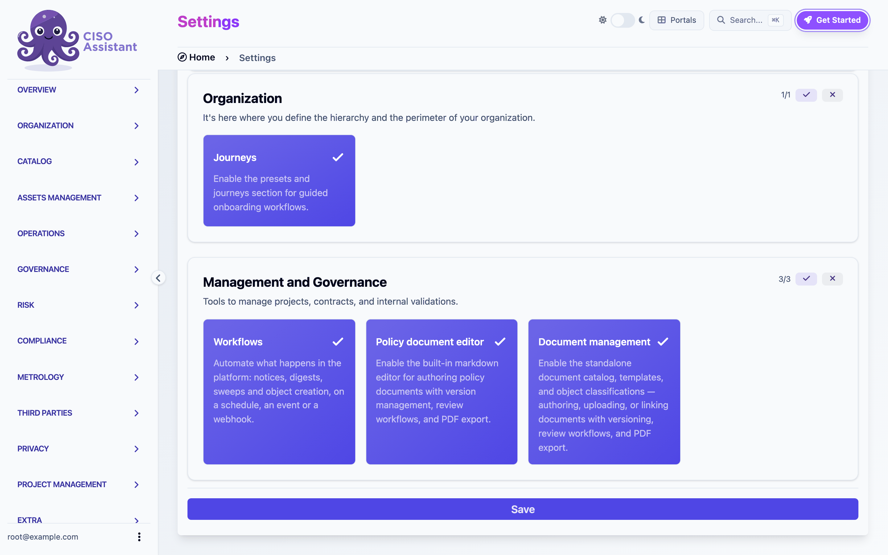
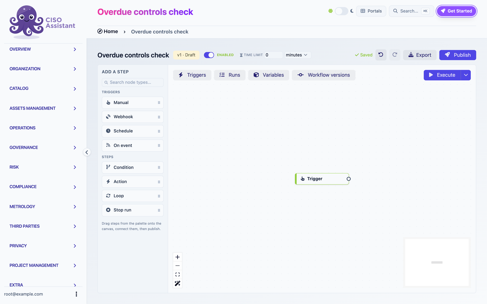
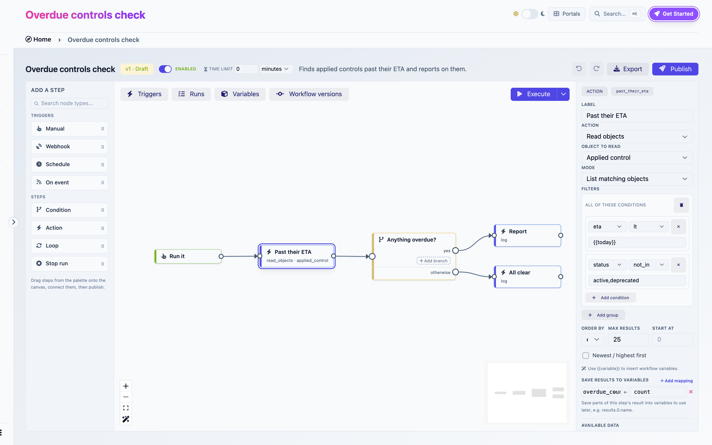
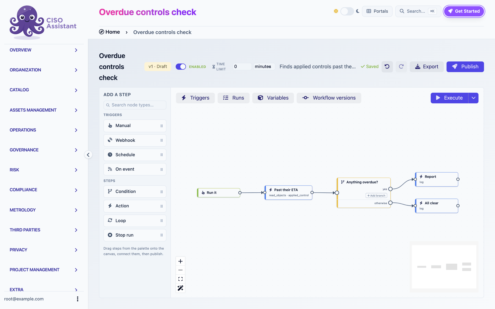
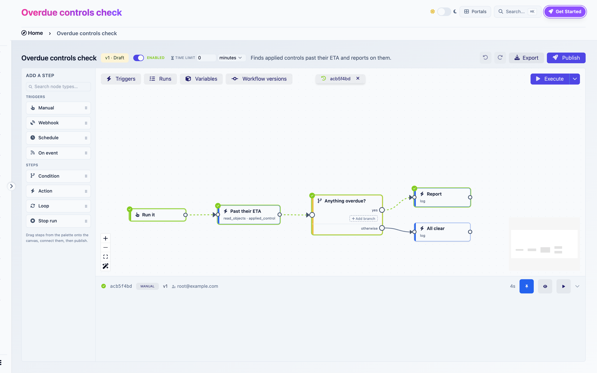
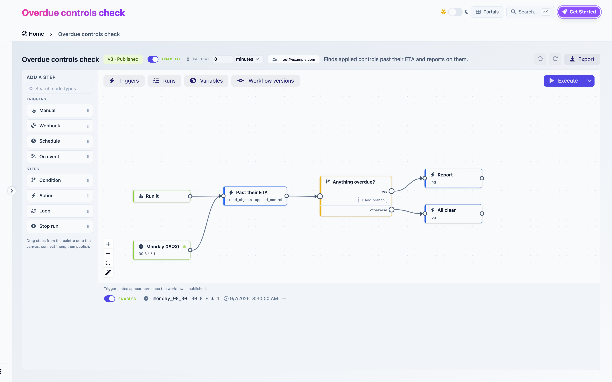

# Building your first workflow

This walkthrough takes about fifteen minutes. You will enable the feature, build a workflow that finds overdue applied controls and reports on them, run it, read the run log, then put it on a weekly schedule.

You need a user who can view applied controls in at least one domain, and who can create workflows there.

## 1. Enable the feature

Workflows ship behind a feature flag.

1. Open **Extra > Settings**, then the **Feature flags** tab.
2. Turn on **Workflows**. The description reads: "Automate what happens in the platform: notices, digests, sweeps and object creation, on a schedule, an event or a webhook."
3. Save. **Workflows** appears in the sidebar under **Operations**.

<figure><figcaption><p>Enabling the Workflows feature flag</p></figcaption></figure>

## 2. Create a workflow

1. Go to **Operations > Workflows** and click the **+** button.
2. Name it `Overdue controls check`, pick a domain, save.

You land in the builder. A new workflow starts with a **Manual** trigger already on the canvas.

<figure><figcaption><p>A new draft with its Manual trigger</p></figcaption></figure>

## 3. Declare a variable

The Condition step you will add compares a variable, so declare it first.

1. Click **Variables** in the top-left of the canvas. A panel opens at the bottom.
2. Under Variables, type the key `overdue_count`, pick the type `number`, click **+**.

## 4. Read the overdue controls

1. In the palette, under **Steps**, click **Action**. An action step appears. Drag it to the right of the trigger.
2. Drag from the trigger's output handle to the action's input handle to wire them.
3. With the action selected, fill the inspector on the right:
   - **Label**: `Past their ETA`
   - **Action**: `Read objects`
   - **Object to read**: `Applied control`
   - **Mode**: `List matching objects`
   - Under **Filters**, click **Add group**, then **Add condition** twice inside it:
     - `eta` `lt` `{{today}}`
     - `status` `not_in` `active,deprecated`
   - **Order by**: `eta`
4. Under **Save results to variables**, click **Add mapping** and map `overdue_count` to `count`.

The mapping copies the total number of matches into your variable after the step runs.

<figure><figcaption><p>Configuring the Read objects step</p></figcaption></figure>

## 5. Branch on the count

1. Add a **Condition** step and wire it after the read step.
2. Label it `Anything overdue?`.
3. Click **Add branch**. In the new branch, set the condition to `overdue_count` `gt` `0` and name the branch `yes`.
4. The **otherwise** branch is always there. You do not configure it.

## 6. Report

1. Add an **Action** step, label it `Report`, set **Action** to `Log`, and write this message:

   ```
   {{overdue_count}} control(s) past their ETA on {{today}}. First one: {{nodes.past_their_eta.results.0.name}}
   ```

   Wire the `yes` branch to it.

2. Add another **Action**, label it `All clear`, action `Log`, message `Nothing overdue on {{today}}.` Wire the **otherwise** branch to it.

Notice the reference `{{nodes.past_their_eta...}}`. `past_their_eta` is the ref the builder derived from the label `Past their ETA`. Open **Available data** at the bottom of the inspector while editing the message: it lists what each earlier step produces, and clicking a value inserts the right expression.

<figure><figcaption><p>The finished graph</p></figcaption></figure>

## 7. Run it

Click **Execute** in the top-right of the canvas. The Runs panel opens and a run appears, with its status and each step it passes through.

Expand the run to read its log. Every line is `time · event · step · message`. Find the `action_executed` line of your Log step: the message shows the expressions resolved with real values.

Click **Show on canvas**: the steps that ran turn green, the branch that matched is highlighted.

Click **Use as reference data**. From now on, while you edit, the builder shows real values from this run next to every variable and every step output.

<figure><figcaption><p>The first run shown on the canvas, with the Runs panel below</p></figcaption></figure>

Until you publish, you are running a draft. Drafts run with your own permissions.

## 8. Publish

Click **Publish**. The dialog lists what the workflow will be allowed to do once published, in your name. Here that is one permission: viewing applied controls. Confirm.

If the publish fails, a panel appears bottom-right listing what is wrong, and each faulty step gets a red marker. Click an entry to jump to the step.

The badge now reads **Published**.

## 9. Put it on a schedule

1. In the palette, click **Schedule**. A second trigger appears.
2. Label it `Monday 08:30`, set **Cron expression** to `30 8 * * 1` and **Timezone** to yours.
3. Wire it to the `Past their ETA` step. Two triggers can lead into the same step.
4. Publish again. The first edit turned the published version into a new draft, so Publish is available.
5. Open the **Triggers** panel. The schedule is listed as **Disabled**. Schedules always arrive disabled so a publish never starts something by surprise. Flip the switch to **Enabled**. The next run time appears.

<figure><figcaption><p>Enabling the schedule</p></figcaption></figure>

Every Monday at 08:30 a run will appear in the Runs panel, executed with your permissions.

## Where to next

- Replace the Log steps with **Send email** to actually notify someone. The [Send email](../features/workflows/actions.md#send-email) reference lists the settings.
- Add a **Loop** over `{{nodes.past_their_eta.results}}` to build one line per control. The [Steps](../features/workflows/steps.md#loop) page explains loops.
- Install the **Overdue applied controls, weekly digest** [template](../features/workflows/templates.md) and compare it with what you built.
