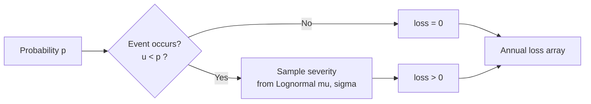

# Cyber risk quantification — methodology

This page explains **what's happening behind** every CRQ simulation: the model, the inputs, the math, and the numbers the platform shows you. It complements the click-by-click walkthrough in [Cyber Risk Quantification](quantitative-risk.md), which is the right starting point if you want to _run_ a study; come here when you want to _trust_ the numbers, calibrate inputs, or explain a result to a stakeholder.

If you'd like to skim the object graph first (study → scenario → hypothesis), see the [Quantitative risk studies](../concepts/quantitative-risk-studies.md) concept page.

## The two-stage model

CISO Assistant models annual loss from a risk scenario as a **frequency × severity** process — the standard quantitative-risk approach used in FAIR, OpenFAIR, and most modern CRQ literature.

For each simulated year, two questions are answered independently:

1. **Does the event occur this year?** A Bernoulli draw with probability *p*.
2. **If it does, how much does it cost?** A draw from a lognormal severity distribution.

If the event doesn't occur, the year's loss is exactly zero. If it does, the year's loss is the sampled severity. Repeating this many times produces a distribution of annual losses — most years zero, occasional years with a sampled loss — which is the raw material for everything else on the page.

The platform runs this loop **100,000 times** by default — that's the Monte Carlo. The output is a 100k-long array of annual loss outcomes, and every metric you see comes from summarising that array.

## What you actually type in

You give the platform three numbers per hypothesis:

| Input | Meaning |
|---|---|
| **Probability** | Annual likelihood the event occurs, between 0 and 1. `0.4` means "in any given year there's a 40% chance of this happening at least once". |
| **Lower bound (LB)** | The **5th percentile** of the loss when the event _does_ occur — your "things went well, but it still happened" cost. |
| **Upper bound (UB)** | The **95th percentile** of the loss when the event _does_ occur — your "really bad outcome" cost, but not the absolute worst. |

LB and UB together form a **90% confidence interval** on the severity. You are saying: "if this happens, I'm 90% sure the loss lands between LB and UB". You're _not_ saying LB is the minimum or UB is the maximum — the distribution has a tail beyond UB.

This three-number form is deliberate. Most teams cannot draw a full distribution from memory, but they _can_ bracket "best case if it goes wrong" and "bad case if it goes wrong", and they _can_ assign an annual probability. The platform takes care of turning that into a distribution.

## From two bounds to a distribution

The severity model is a **lognormal distribution** — the standard choice for "positive, right-skewed loss" quantities. The platform back-solves the distribution's two parameters *μ* and *σ* from your LB and UB.

The derivation is short. If *X* is lognormal, then ln(*X*) is normal with mean *μ* and standard deviation *σ*. The 5th and 95th percentiles of a standard normal sit at ±1.6449 (call them *z*05 and *z*95). So:

$$
\ln(\text{LB}) = \mu + \sigma \cdot z_{05}, \qquad \ln(\text{UB}) = \mu + \sigma \cdot z_{95}
$$

Subtracting and solving:

$$
\sigma = \frac{\ln(\text{UB}) - \ln(\text{LB})}{z_{95} - z_{05}}, \qquad \mu = \ln(\text{LB}) - \sigma \cdot z_{05}
$$

| Symbol | Meaning |
|---|---|
| LB, UB | The 5th and 95th percentile loss values you typed in |
| *μ*, *σ* | The lognormal's parameters — mean and standard deviation of ln(loss) |
| *z*05, *z*95 | Standard-normal quantiles, approximately −1.6449 and +1.6449 |

You don't need to interact with *μ* and *σ* — they're computed for you. The point of showing the derivation is so you understand _why doubling your UB doesn't double the resulting loss_: the distribution is fit on log-space, so a 10× UB shifts mass in the tail more than it does at the centre.


LB must be **strictly positive** (`> 0`) and UB must be **strictly greater than LB**. The platform refuses to simulate otherwise — a lognormal can't be fit to non-positive values, and a zero-width interval makes the fit degenerate.


## The simulation

Once the platform has *p*, *μ*, and *σ*, the simulation is straightforward:

$$
\text{loss}_i = \begin{cases} \mathrm{Lognormal}(\mu,\,\sigma) & \text{if } u_i < p \\ 0 & \text{otherwise} \end{cases} \qquad u_i \sim \mathrm{Uniform}(0,1)
$$

for *i* = 1, 2, …, *N* with *N* = 100,000. The random seed is fixed for single-scenario runs so the chart stays stable between two views of the same hypothesis — if you re-open the page tomorrow without changing inputs, the LEC will look identical.

## The loss exceedance curve (LEC)

The **LEC** is the curve you see at the top of every hypothesis page. It plots, for every loss level *L*, the probability of an annual loss being at least *L*:

$$
\text{LEC}(L) = \Pr(\text{annual loss} \geq L)
$$

Operationally the platform computes it by sorting all *N* simulated losses and assigning each one an exceedance probability of 1 − *k*/*N*, where *k* is its rank. The result is a monotonically decreasing curve starting near 1 (small losses are very likely to be exceeded) and trailing off toward 0 (huge losses are very unlikely).

A few ways to read the LEC, all equivalent:

- The **height** at loss *L* — "how often does our annual loss reach at least *L*?"
- The **right edge** — your "1-in-a-thousand-years" tail loss.
- The **area under the curve** — proportional to ALE, the expected annual loss.

A flatter LEC means heavier tails (the catastrophic case is non-negligible); a steeper drop means losses cluster tightly.

## Risk metrics

Every metric on the hypothesis page is a one-line summary of the loss array. Concretely:

| Metric | Definition | What it answers |
|---|---|---|
| **ALE** (Mean annual loss) | Mean of all simulated annual losses — the average of *L* across the *N* iterations | "What loss should we budget for, on average each year?" |
| **VaR 95** | 95th percentile of the loss distribution | "The 1-in-20-year bad year" |
| **VaR 99** | 99th percentile | "The 1-in-100-year bad year" |
| **VaR 99.9** | 99.9th percentile | "The 1-in-1000-year bad year" |
| **Expected shortfall (99)** | Mean of every simulated loss that lands above VaR 99 — the conditional expectation *E*[*L* &#124; *L* ≥ VaR99] | "When the 1-in-100 year hits, how bad is it on average?" |
| **Maximum credible loss** | The largest single loss across all *N* iterations | The worst single simulated year |
| **P(loss > threshold)** | Fraction of iterations whose loss exceeds the threshold — Pr(*L* > threshold) | "What's our chance of breaching the tolerance we set?" |

Two distinctions worth keeping in mind:

- **ALE includes the zero-loss years.** It's the long-run average annualised loss, not the typical loss when the event happens. If you'd rather see the conditional expected loss when something does occur, look at the severity distribution directly — it's the lognormal with *μ* and *σ* you parameterised.
- **VaR vs Expected shortfall.** VaR tells you the cutoff loss for a given tail probability; expected shortfall tells you the average loss _conditional on being in that tail_. ES is always ≥ VaR; the gap between them measures how heavy the tail is.

## Hypotheses — inherent, current, residual

A scenario can hold multiple **hypotheses**, each one a separate parameterisation of the same risk. The conventional triplet is:

- **Inherent** — without any controls in place. Mostly useful for "before/after" storytelling.
- **Current** — with the controls you have today. This is the baseline against which improvement is measured.
- **Residual** — with the controls you _plan to add_ (and any you'd retire). This is the after-treatment view.

Each hypothesis has its own probability and LB/UB. You don't model controls themselves — you model how _they shift the inputs_. Adding a strong control on ransomware might drop the probability from 0.4 to 0.1, or shrink the UB by an order of magnitude, or both. That's the modeller's judgement; the platform doesn't decide it for you.

The hypotheses also carry the **applied controls** they assume:

- **Existing controls** — the baseline, present in both _current_ and _residual_.
- **Added controls** — only present in _residual_; the proposed investment.
- **Removed controls** — only present in _residual_; controls you'd retire because the new ones supersede them.

The added/removed split is what makes ROSI possible.

## ROSI — return on security investment

For a **residual** hypothesis, the platform computes the **Return on Security Investment (ROSI)**:

$$
\text{ROSI} = \frac{\text{ALE}_{\text{current}} - \text{ALE}_{\text{residual}} - \text{Treatment cost}}{\text{Treatment cost}}
$$

Where the **Treatment cost** is derived from the [applied controls](../concepts/applied-controls.md#financial-tracking) on the residual hypothesis:

$$
\text{Treatment cost} = \sum_{c \in \text{added}} \text{annual\_cost}(c) - \sum_{c \in \text{removed}} \text{annual\_cost}(c)
$$

The interpretation:

- **ROSI > 0** — the avoided expected loss is bigger than the cost of the treatment. The investment pays for itself.
- **ROSI = 0** — break-even.
- **ROSI < 0** — you'd spend more on the controls than you'd save in expected loss.

ROSI is shown as a percentage. A ROSI of `150%` means you avoid €1.50 of expected loss for every €1 spent on the treatment, net of the spend itself.


**You need cost data on the added controls for ROSI to compute.** If the residual hypothesis pulls in an applied control whose `cost` is unset (or all zero), it contributes nothing to the Treatment cost and the displayed ROSI may look implausibly large. Fill in build / run cost on the controls themselves; see [Applied controls → Financial tracking](../concepts/applied-controls.md#financial-tracking).


A couple of subtleties:

- The platform assumes **existing controls are part of the baseline** — their cost is _not_ in the Treatment cost (the team is already paying for them; the decision is about the marginal investment).
- Treatment cost is the **annualised** cost of added controls (build amortised + run yearly), so it's directly comparable with ALE — both are €/year quantities.
- Residual ALE must be **below** current ALE for a positive ROSI. If your residual ALE comes out higher (the simulation says the treatment made things worse), revisit the residual probability / LB / UB — the inputs are probably wrong before the formula is.

## Risk tolerance — the overlay curve

A study can declare its **risk tolerance** as two anchor points: pairs of `(probability, acceptable loss)`. For example:

- _Point 1_: at a 10% annual probability, we accept losses up to €100k.
- _Point 2_: at a 1% annual probability, we accept losses up to €1M.

The platform fits a lognormal through those two points (same *μ*, *σ* derivation as before, but with the two custom probabilities instead of 5%/95%) and draws the resulting curve. Overlaid on a scenario's LEC, it gives you an instant visual check:

- **LEC sits below tolerance** — the scenario fits within your stated appetite.
- **LEC sits above tolerance** — the scenario exceeds appetite at one or more probability levels.

This is the formal version of "are we okay with this risk?" If LEC and tolerance cross, you can read off the loss range where they diverge.

You can also set a single **loss threshold** — a flat dollar line. The metric **P(loss > threshold)** then tells you the annual probability of breaching it.

## Portfolios — combining scenarios

The **Executive Summary** view aggregates every scenario in a study into a portfolio LEC and portfolio metrics. By default the platform assumes **independent** scenarios — each year, the frequency draws for every scenario are made independently.

For each Monte Carlo iteration, the portfolio loss is the sum of every scenario's loss in that iteration:

$$
\text{loss}_i^{\text{portfolio}} = \sum_{s \in \text{scenarios}} \text{loss}_i^{(s)}
$$

The portfolio LEC and metrics are then computed from this combined loss array exactly the same way as for a single scenario.

When scenarios are genuinely correlated (a ransomware event and a data-breach event might co-occur), the platform supports a **correlation matrix** between scenario frequencies, sampled via a multivariate-normal copula. Correlation only affects the **frequency** stage — severities are still independent given that the events occurred. This is appropriate when the linkage is "if A happens, B is also more likely to happen this year", not "if A is severe, B is also severe".

If correlation is left unset, the simulation falls back to the independent case.

## Calibrating inputs — practical advice

Three numbers in, distribution out — the model is only as good as the inputs. A few rules of thumb:

- **Calibrate your bounds, don't guess them.** The 5th/95th-percentile framing isn't just decoration — if you'd actually bet your salary that the true loss falls between LB and UB nineteen times out of twenty, then your bounds are honest. If you'd rather not, widen them.
- **Probability is the easier number.** A historical rate ("we've had two incidents like this in the last five years") or an industry rate is a defensible starting point. The frequency stage matters as much as the severity stage to ALE — halving probability halves ALE just as much as halving the severity median.
- **Resist false precision.** UB = €923,847 looks rigorous but isn't — round to €1M and accept that the lognormal's tail handles the rest. The platform's strength is comparing scenarios on the same scale, not pinpointing a single number.
- **Iterate the residual.** If your residual ALE only drops 5% but you're claiming a major control upgrade, your residual inputs probably aren't reflecting the upgrade. Sanity-check by halving residual probability or shifting the UB and re-running.
- **Refresh after changes.** Whenever you change inputs, applied controls, or the risk tolerance, the platform marks the cached simulation stale — use **Retrigger all simulations** to refresh the portfolio view before sharing it.

## Related

- [Cyber Risk Quantification (click walkthrough)](quantitative-risk.md) — the step-by-step guide for running a study.
- [Quantitative risk studies](../concepts/quantitative-risk-studies.md) — the object graph (study / scenario / hypothesis).
- [Applied controls → Financial tracking](../concepts/applied-controls.md#financial-tracking) — the build / run cost model that feeds Treatment cost in ROSI.
- [Risk assessments](../concepts/risk-assessments.md) — the qualitative sibling for when monetary modelling isn't appropriate.
