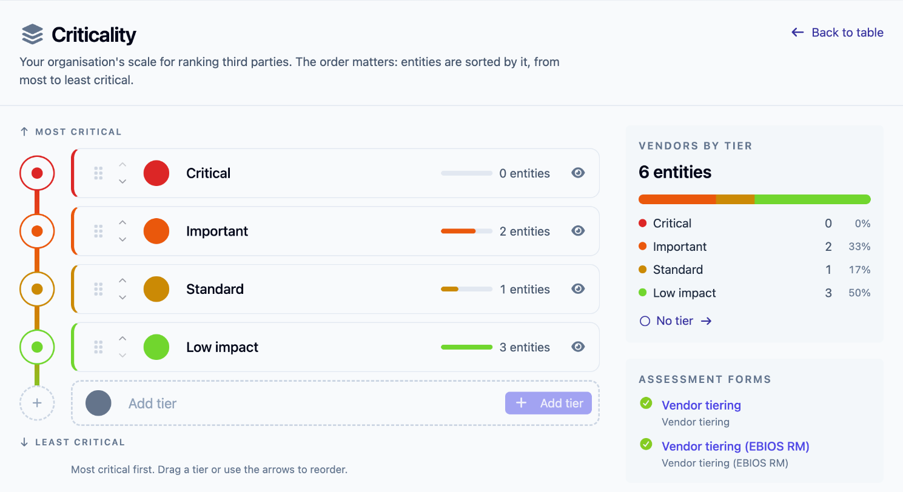
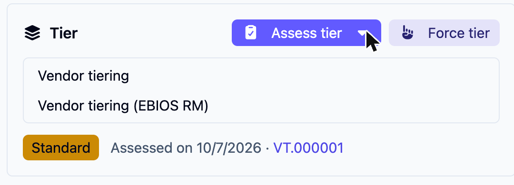
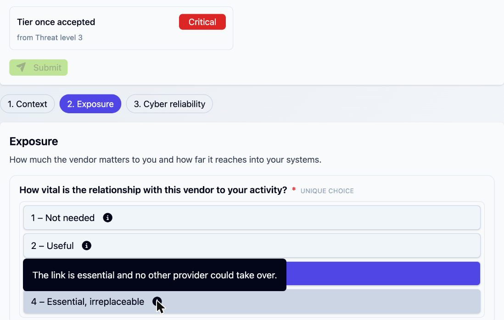
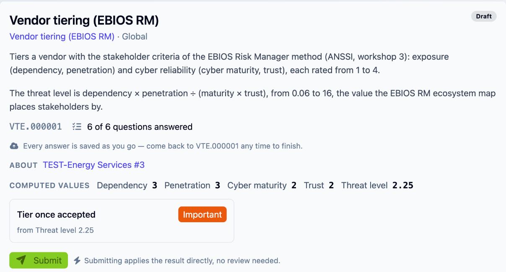
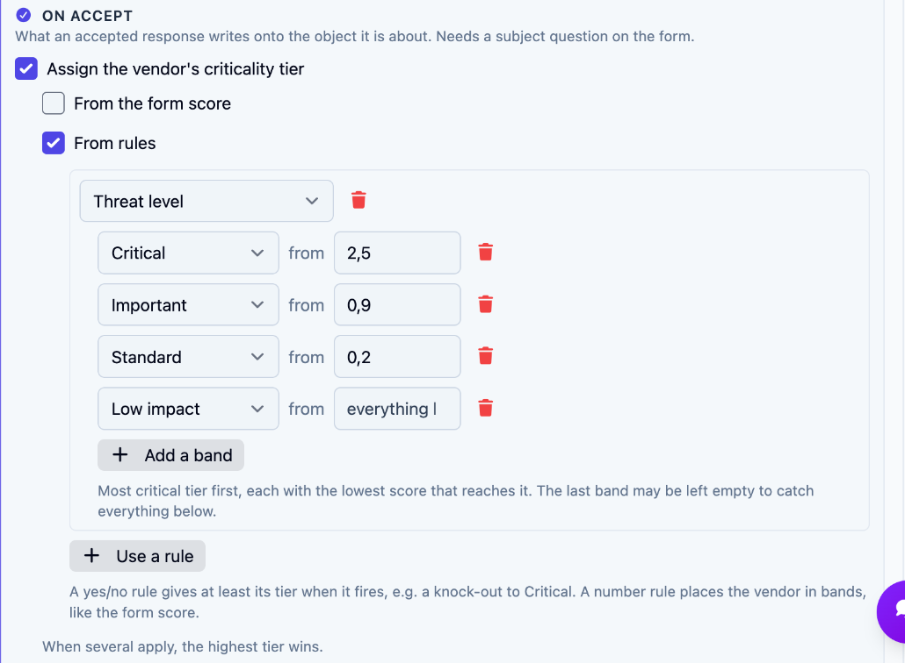

# Tiering your vendors

A vendor's **tier** says how critical it is to you, on your organisation's own scale: _Critical_, _Important_, _Standard_ or _Low impact_ by default. The tier drives how closely you follow the vendor. A critical one gets the full questionnaire and frequent reviews; a low-impact one, a light check.

You can set a tier by hand, but the point of this guide is to set it from a short **tiering form**. Someone answers a few questions about the vendor, a reviewer accepts the result, and the tier is written onto the vendor along with the answers that justify it.

This walkthrough takes about fifteen minutes. You need an administrator to review the scale and load a form; the rest can be done by anyone who can edit the vendor.

## 1. Review your scale

Open **Third parties > Criticality**.

<figure><figcaption>
The scale, how many vendors sit in each tier, and the forms that assess tiers
</figcaption></figure>

The scale is ordered from most to least critical, and entities are sorted by it. Administrators can rename a tier, change its colour, add one with **Add tier**, and reorder by dragging or with the arrows. A tier that is in use cannot be deleted, so hide it instead: it stays on the vendors that have it but can no longer be picked.

The right-hand column shows how your vendors spread across the tiers. Under **Assessment forms** it also lists the forms that can set a tier.


Forms name tiers by a fixed key (`critical`, `important`, `standard`, `low-impact`), taken from the name when the tier was created. Renaming or reordering your tiers does not break a form. A form that names a key your scale does not have, or a hidden tier, sends its responses to review instead of guessing.


## 2. Load a tiering form

Two forms ship with the platform. Go to **Libraries**, search for **Vendor tiering**, and load the one that matches how you want to reason:

| | **Vendor tiering** | **Vendor tiering (EBIOS RM)** |
|---|---|---|
| Asks | Six questions on business impact (outage, tolerance, replaceability) and data exposure (sensitivity, volume, access), plus whether the vendor supports a regulated critical function | The four EBIOS Risk Manager stakeholder criteria: dependency, penetration, cyber maturity and trust, each rated 1 to 4 |
| Computes | **Inherent risk**: the higher of the two page averages, from 1 to 4 | **Threat level**: dependency × penetration ÷ (maturity × trust), from 0.06 to 16 |
| Tier | Critical from 3.3, Important from 2.6, Standard from 2.0, Low impact below | Critical from 2.5, Important from 0.9, Standard from 0.2, Low impact below — the default zones of the EBIOS RM ecosystem map |
| Knock-outs | A regulated critical function or a single point of failure makes the vendor at least Critical. Special-category data or privileged access makes it at least Important | None |
| Fits | A business-impact view, close to most vendor-risk questionnaires | Teams that already run EBIOS RM, or want tiering consistent with workshop 3 |

Both work on the default scale. Choose one tiering method for the organisation (see [Using more than one tiering form](#using-more-than-one-tiering-form)).

## 3. Assess a vendor

1. Open **Third parties > Entities** and open a vendor.
2. In the **Tier** card, click **Assess tier**. When several forms can set a tier, use the arrow next to it to pick one. You can also right-click a vendor in the list and choose **Assess tier**.

<figure><figcaption>
Pick a form from the Tier card
</figcaption></figure>

3. A response opens with the vendor already filled in and locked. You don't need a portal or a published form to start it.
4. Answer the questions. In the EBIOS RM form, each level has an info icon with a short description to help you choose consistently. The descriptions are adapted from the ANSSI guidance.

<figure><figcaption>
Each level carries a short description
</figcaption></figure>

As you answer, the response shows the values computed so far and the **Tier once accepted**, with the value it comes from:

<figure><figcaption>
The projected tier updates with each answer
</figcaption></figure>

5. Click **Submit**. The hint next to the button says what happens next:
   - **Submitting applies the result directly, no review needed.** This shows when you could change the vendor's tier yourself and every scored question is answered. The tier is written at once and the response closes as accepted.
   - **Submitting sends it to a reviewer before anything is changed.** This shows in every other case, or when the form was published with **Always require review**.

## 4. Review and accept

A reviewer opens the response from **Requests**. Before deciding, the response shows **On accept, this will write** and the tier it would set. The reviewer can:

- **Accept** it as is.
- **Override** the tier. A justification is required, and the vendor then shows _Adjusted at acceptance_.
- Send it back or reject it, like any [request](../concepts/quick-forms.md#lifecycle).

If the vendor's current tier was set by a different tiering form, the preview says so: _The current tier comes from "Vendor tiering" (date). Accepting replaces it with this form's result._

Once accepted, the vendor's **Tier** card shows the tier, _Assessed on_ the date and a link to the response. Every change is kept in the vendor's **Tier history**, with who made it, when, and from which response.

## Force a tier by hand

You don't need a form to set a tier. Click **Force tier** on the vendor's **Tier** card, pick a tier and, optionally, give a **Reason for the change**. The card then shows _Set manually on_ the date. To set several vendors at once, select them in the entity list and use **Force tier** in the batch actions.

The latest decision wins: a form accepted later replaces a forced tier, and a forced tier replaces an assessed one.

## Using more than one tiering form

Nothing stops you from loading both forms, or adding your own. A vendor has one tier, and the **last accepted response wins**. The other form's answers stay on record, and the preview warns the reviewer before one method overwrites the other.

Mixing methods across vendors makes tiers hard to compare. Pick one form for the organisation and keep the other for a deliberate change of method.

## Customize the tiering

What to change depends on how far your method departs from the shipped one.

**Your scale is different.** Edit it on **Third parties > Criticality**. Renaming, recolouring and reordering need nothing else. If you add a tier or change which tiers exist, update the form so its bands and knock-outs name your tiers; until then, responses that land on a missing tier go to review.

**The questions or thresholds are different.** Make your own copy of a shipped form in the library builder:

1. Open **Catalog > Library Builder** and click **New Library Draft**. Give it a name and a Reference ID, then **Create**.
2. In **Import objects (clone)**, pick **Vendor tiering** or **Vendor tiering (EBIOS RM)** as the source, tick **quick forms**, and click **Import**.
3. Click **Edit visually** on the quick form, then open **Form settings**.
4. Change what you need:
   - The questions, choices and level descriptions, on the pages below.
   - The rules that compute the value, under **Outcome rules**.
   - The bands and knock-outs, under **On accept**.

<figure><figcaption>
On accept: the tier bands on the threat level
</figcaption></figure>

5. Save, then **Publish** the draft from its page. Your form appears under **Assessment forms** on the Criticality page and in the **Assess tier** menu.

[Authoring quick forms](../configuration/authoring/library-builder.md#authoring-quick-forms) describes every setting of the editor, including how bands and knock-outs combine.

## Where to go next

- [Third-party risk](../concepts/third-party-risk.md#tier) — the tier among the other third-party objects.
- [Quick forms and requests](../concepts/quick-forms.md) — how responses, reviews and outcomes work.
- [EBIOS RM study](ebios-rm.md) — the full method the second form borrows its criteria from.
