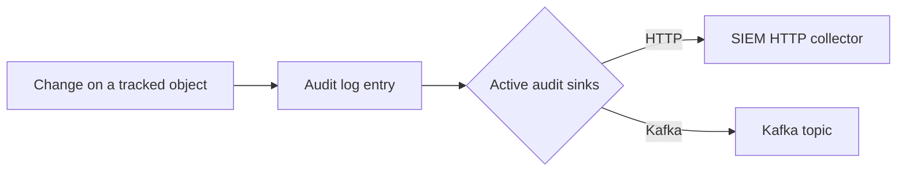

# Audit log forwarding


Audit log forwarding is a **PRO** capability, gated by the `audit_log_forwarding` feature flag. The underlying [audit log](../features/audit-log.md) records every change; this feature ships those records to your SIEM.


CISO Assistant can forward its [audit log](../features/audit-log.md) — every create, update, and delete on a tracked object — to an external SIEM as the events happen. Each change becomes one event, carrying who made it, what changed, when, and the domain it belongs to.

It reuses the hardened [outgoing webhooks](webhooks.md) delivery pipeline (async workers, retries, SSRF protection), but is configured separately as a set of **audit sinks** managed by administrators.

### When to use it

- **Centralised monitoring.** Feed governance activity into Splunk, Elastic, Microsoft Sentinel, or any SIEM alongside the rest of your security telemetry.
- **Tamper-evident retention.** Archive the audit trail outside the application, beyond CISO Assistant's own 90-day retention window.
- **Detection & alerting.** Trigger SOC rules on sensitive changes (e.g. a control marked inactive, a user role changed).

### How it works



Every recorded change is fanned out to each active audit sink whose domain scope matches. Delivery runs asynchronously on the background worker, so forwarding never blocks the user action that produced the event.

***

### Transports

Choose a **Transport** per sink:

- **HTTP** — POST each event as JSON to a collector URL (Splunk HEC, Elastic, Sumo Logic, etc.). Authentication is carried by static **HTTP headers**.
- **Kafka** — produce each event to a **Topic** on your own broker, or to a managed bus such as Azure Event Hubs (Kafka endpoint). Connection and SASL settings live under **Security & authentication**.

### Event formats

Choose an **Event format** per sink:

- **OCSF** — the [Open Cybersecurity Schema Framework](https://schema.ocsf.io/) API Activity class. A vendor-neutral schema understood by most SIEMs. Recommended.
- **Raw** — the native CISO Assistant shape (a flat pass-through of the log-entry fields).

***

### Setting up an audit sink

1. Enable **Audit log forwarding** under **Settings → Feature flags**.
2. Open the **Audit log forwarding** tab in **Settings** and click **Add audit sink**.
3. Pick the **Transport** and **Event format**.
4. Fill in the transport details:
   - **HTTP** — the collector **URL** and any **HTTP headers** (a JSON object of static auth headers, e.g. an `Authorization` header for a Splunk HEC token).
   - **Kafka** — **Bootstrap servers** (a comma-separated `host:port` list) and the **Topic**. Open **Security & authentication** for **Security protocol**, **SASL mechanism**, **SASL username**, and **SASL password**.
5. Optionally set **Target Domains** to limit forwarding to specific domains. Leave empty to forward events from all domains.
6. Save.

Audit sinks are administrator-managed and apply instance-wide; they are not owner-scoped like integration webhooks.

#### Secrets

Authentication secrets — the HTTP headers and the Kafka SASL password — are write-only. They are never returned to the browser after saving. When editing an existing sink, those fields show *"A value is already set. Leave blank to keep it, or enter a new one to replace it."* — leave them blank to keep the stored value.

***

### Backfilling with replay

If a sink was unreachable during an outage, use **Replay events** on the sink to re-send historical events. Pick a **From** date and an optional **To** date; matching events are read from the database and re-queued for delivery.

Replay is bounded by the audit log's retention (90 days) and capped per run; very large ranges are truncated.

***

### Technical reference

#### OCSF payload

Each event maps to an OCSF API Activity event (`class_uid` 6003, `category_uid` 6). `activity_id` reflects the action — Create → 1, Update → 3, Delete → 4 — and `type_uid` is `class_uid * 100 + activity_id`.

```json
{
  "activity_id": 1,
  "category_uid": 6,
  "class_uid": 6003,
  "type_uid": 600301,
  "severity_id": 1,
  "status_id": 1,
  "time": 1763043306000,
  "metadata": {
    "version": "1.8.0",
    "product": { "name": "CISO Assistant", "vendor_name": "intuitem" },
    "correlation_uid": "req-abc-123"
  },
  "actor": { "user": { "uid": "…", "email_addr": "john.doe@example.com" } },
  "api": { "operation": "create", "service": { "name": "appliedcontrol" } },
  "src_endpoint": { "ip": "10.0.0.5" },
  "resources": [
    { "type": "appliedcontrol", "uid": "53709ff2-…", "name": "MFA Enforcement" }
  ],
  "unmapped": {
    "changes": { "name": ["None", "MFA Enforcement"] },
    "folder_id": "…"
  }
}
```

The field-level diff and the originating domain (`folder_id`) ride in `unmapped` — the OCSF-sanctioned place for vendor data. `metadata.correlation_uid` is the request correlation id: a single user action that produces several log entries (the object plus each many-to-many change) shares one `correlation_uid`, so a SIEM can group them.

#### Raw payload

```json
{
  "action": "create",
  "model": "appliedcontrol",
  "object_id": "53709ff2-…",
  "object_repr": "MFA Enforcement",
  "changes": { "name": ["None", "MFA Enforcement"] },
  "actor": { "uid": "…", "email_addr": "john.doe@example.com" },
  "remote_addr": "10.0.0.5",
  "folder_id": "…",
  "correlation_id": "req-abc-123",
  "timestamp": "2025-11-13T14:35:06+00:00"
}
```

***

### Operational details

- **Delivery & retries.** HTTP delivery treats any `2xx` as success; other statuses, redirects, or timeouts are retried (roughly 5 times over ~15 minutes with exponential backoff) before the event is dropped. Kafka delivery retries on producer errors. Forwarding is best-effort — replay is the backstop for gaps.
- **Egress safety.** Every HTTP sink URL is validated to point at a public host (no private, loopback, or internal addresses) at save time and again at send time; redirects are not followed.
- **SaaS.** Forwarding is pure egress to a destination you own — a SIEM collector URL or a Kafka broker you operate. CISO Assistant runs no per-tenant infrastructure for this.

### Related

- [Audit log](../features/audit-log.md) — the source record being forwarded.
- [Outgoing webhooks](webhooks.md) — the delivery pipeline this reuses, for per-object event subscriptions.
- [Feature flags](../configuration/settings/feature-flags.md) — enabling the capability.
