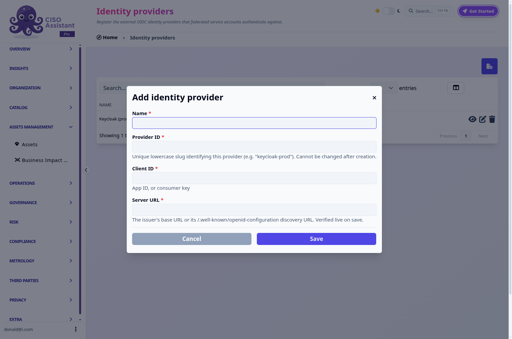
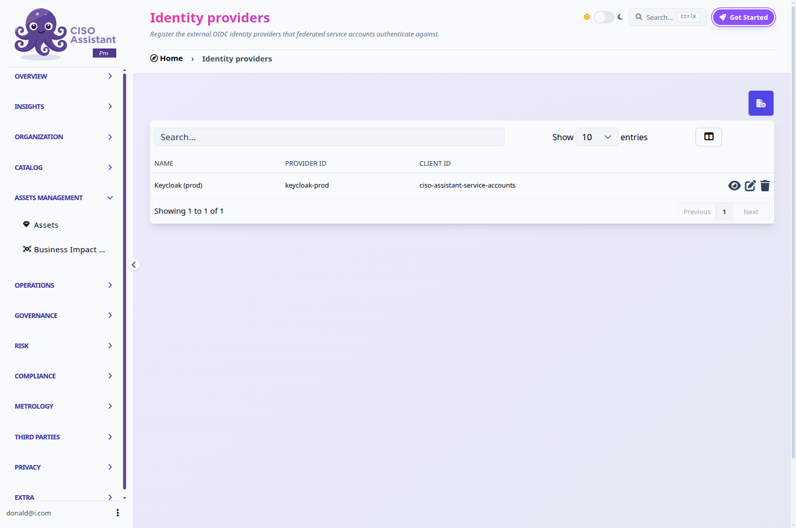

# Identity providers (for service accounts)


This is not the same screen as [SSO's Identity providers](../configuration/sso/identity-providers/README.md), which controls how humans log into CISO Assistant. This one is a registry of external clients that [federated service accounts](service-accounts.md) authenticate as. The two features can point at the same underlying OIDC provider (say, the same Keycloak realm) without being linked to each other in any way, editing or removing an entry here has no effect on human SSO login, and vice versa.



This is a **PRO** feature, part of [service accounts](service-accounts.md). It shares that feature's `Service accounts` flag (see [feature-flags.md](../configuration/settings/feature-flags.md "mention")) and its admin-only access.


## Registering a provider

Identity providers live under **Organization > Identity providers** in the sidebar, next to Service accounts. Registering one asks for:

* **Name**, a display label.
* **Provider ID**, a unique lowercase slug (e.g. `keycloak-prod`), fixed once set.
* **Client ID**, the identifier your federated service accounts will present as their token's audience.
* **Server URL**, the provider's issuer URL or its `/.well-known/openid-configuration` discovery URL directly.

<figure><figcaption>
Registering a provider: name, provider ID, client ID, and server URL.
</figcaption></figure>

On save, CISO Assistant resolves the discovery document and fetches the provider's signing keys right away: a typo'd URL or an unreachable provider is rejected immediately, not on the first service account that tries to use it. The same live check runs again on every edit, so an update that breaks the configuration is also rejected up front.

<figure><figcaption>
Registered identity providers.
</figcaption></figure>

### Managing a provider

* **Edit** updates any of the four fields, subject to the same live check as registration.
* **Delete** removes the entry, unless a federated service account still references it: delete or repoint those first.

A provider you register here says nothing about permissions or domain access on its own, it only tells CISO Assistant which external client and signing keys to trust. What a federated service account can actually do is still entirely controlled by its own role and domain assignment, exactly as for a local one.
