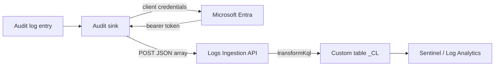

# Microsoft Sentinel


This page covers the **direct** path: CISO Assistant posts audit events straight to the Azure Monitor **Logs Ingestion API**, authenticated with OAuth 2.0 client credentials. No intermediate Event Hub is required.

For the Event Hubs route — useful when you would rather manage a static connection string than a token lifecycle — use the **Kafka** transport described in [Audit log forwarding](audit-log-forwarding.md).


Sentinel is a set of SIEM capabilities layered on a Log Analytics workspace. Events are ingested into the **workspace**, so everything below works against a plain Log Analytics workspace; enabling Sentinel on top changes nothing about the delivery path.

## What it costs to try


A validation run is effectively free. Log Analytics includes a **5 GB/month free ingestion grant per billing account**, and the audit feed is measured in kilobytes. The DCR, the data collection endpoint and the app registration are themselves free — you pay only for ingested data.


You do **not** need to enable Sentinel to validate ingestion, and doing so starts a clock: Sentinel's own trial is 31 days at 10 GB/day, on *new* workspaces only. Validate against the workspace first, enable Sentinel afterwards if you want to demonstrate the analyst experience.

***

## Overview



Three things have to line up: the **token** (Entra app + role assignment), the **shape** (a JSON array matching the DCR stream declaration), and the **destination** (a custom table with a `TimeGenerated` column).

***

## Part 1 — Azure setup

### 1. Create the custom table

In your Log Analytics workspace, create a custom table named `CISOAssistantAudit_CL`. Custom table names must carry the `_CL` suffix.

If you create the table through the Azure portal using sample data, the DCR and its transformation are generated for you. Creating it any other way means building the DCR by hand, as below.


Column names must start with a letter and may contain up to 45 alphanumeric characters and underscores. `_ResourceId`, `id`, `_SubscriptionId`, `TenantId`, `Type`, `UniqueId` and `Title` are reserved. The OCSF field names CISO Assistant emits avoid all of these.


### 2. Create the data collection rule

Create a DCR with `"kind": "Direct"`. Since March 2024 such a DCR exposes its own `logsIngestion` endpoint, so a separate data collection endpoint is only needed for Private Link or for older DCRs.

The stream declaration must match what CISO Assistant sends. The OCSF event has seven scalar fields and six nested objects, so the nested ones are declared `dynamic`:

```json
{
  "location": "westeurope",
  "kind": "Direct",
  "properties": {
    "streamDeclarations": {
      "Custom-CISOAssistantAudit": {
        "columns": [
          { "name": "time",         "type": "long"    },
          { "name": "activity_id",  "type": "int"     },
          { "name": "category_uid", "type": "int"     },
          { "name": "class_uid",    "type": "int"     },
          { "name": "type_uid",     "type": "int"     },
          { "name": "severity_id",  "type": "int"     },
          { "name": "status_id",    "type": "int"     },
          { "name": "metadata",     "type": "dynamic" },
          { "name": "actor",        "type": "dynamic" },
          { "name": "api",          "type": "dynamic" },
          { "name": "src_endpoint", "type": "dynamic" },
          { "name": "resources",    "type": "dynamic" },
          { "name": "unmapped",     "type": "dynamic" }
        ]
      }
    },
    "destinations": {
      "logAnalytics": [
        {
          "workspaceResourceId": "/subscriptions/<sub>/resourceGroups/<rg>/providers/Microsoft.OperationalInsights/workspaces/<workspace>",
          "name": "LogAnalyticsDest"
        }
      ]
    },
    "dataFlows": [
      {
        "streams": ["Custom-CISOAssistantAudit"],
        "destinations": ["LogAnalyticsDest"],
        "transformKql": "source | extend TimeGenerated = unixtime_milliseconds_todatetime(tolong(['time'])) | extend Actor = tostring(actor.user.email_addr), Operation = tostring(api.operation), ObjectType = tostring(api.service.name), CorrelationId = tostring(metadata.correlation_uid)",
        "outputStream": "Custom-CISOAssistantAudit_CL"
      }
    ]
  }
}
```


**`TimeGenerated` is mandatory and is not set for you.** CISO Assistant emits OCSF `time` as epoch milliseconds; the transformation above converts it. Without that `extend`, ingestion fails or every row lands with the wrong timestamp.


The extra `extend` clauses are optional conveniences — they lift the most-queried values out of the nested objects into flat columns. Add matching columns to the custom table if you keep them.

### 3. Register the application

Create a Microsoft Entra app registration and generate a client secret. Record the **Application (client) ID**, the **Directory (tenant) ID**, and the secret **Value**.

### 4. Grant the app access to the DCR


This is the step that most often goes wrong. Open the **DCR** (not the workspace, not the subscription) → **Access control (IAM)** → **Add role assignment** → **Monitoring Metrics Publisher**, and assign it to the app registration.

Role assignments take **up to 30 minutes to propagate**. Requests sent before then return **403 Forbidden** even though the configuration is correct. Wait before concluding anything is broken.


### 5. Collect the values you need

| Value | Where to find it |
| --- | --- |
| Ingestion endpoint | DCR → JSON view → `logsIngestion` endpoint (or the DCE hostname) |
| DCR immutable ID | DCR → **Overview** |
| Stream name | The key in `streamDeclarations`, e.g. `Custom-CISOAssistantAudit` |
| Tenant ID, client ID, secret | The app registration |

***

## Part 2 — CISO Assistant setup

1. Enable **Audit log forwarding** under **Settings → Feature flags**.
2. Open the **Audit log forwarding** tab in **Settings** and click **Add audit sink**.
3. Set **Transport** to `HTTP` and **Event format** to `OCSF`.
4. Set **URL** to the ingestion endpoint, assembled as:

```
{endpoint}/dataCollectionRules/{immutableId}/streams/{stream}?api-version=2023-01-01
```

For example:

```
https://my-dcr-a1b2.westeurope-1.ingest.monitor.azure.com/dataCollectionRules/dcr-000a00a000a00000a000000aa000a0aa/streams/Custom-CISOAssistantAudit?api-version=2023-01-01
```

5. Set **Body envelope** to **JSON array**.


The Logs Ingestion API rejects a bare JSON object — the body must be an array. Leaving **Body envelope** at **None** produces a `400`.


6. Set **Authentication** to **OAuth 2.0 client credentials**, then fill in:

| Field | Value |
| --- | --- |
| **Token endpoint** | `https://login.microsoftonline.com/<tenant-id>/oauth2/v2.0/token` |
| **Client ID** | Application (client) ID |
| **Client secret** | The secret **Value** |
| **Scope** | `https://monitor.azure.com/.default` |


Microsoft's own PowerShell sample requests this scope with a **double** slash — `https://monitor.azure.com//.default`. Both forms are widely reported to work. If you get an `invalid_scope` error or a token that is rejected with `403`, try the other form before changing anything else.


7. Leave **HTTP headers** empty. The bearer token is added automatically; static headers are for collectors that authenticate with a fixed token instead.
8. Optionally restrict **Target Domains**. Leave empty to forward events from all domains.
9. Save.

***

## Part 3 — Verify it works

### Generate an event

Make any tracked change — create an applied control, rename a domain, deactivate a user. One change produces one audit entry, which is delivered asynchronously by the background worker.


Ingestion is not instantaneous. Expect **up to 5 minutes** between the change and the row appearing, and rather longer the very first time a new custom table receives data.


### Query the workspace

In **Log Analytics → Logs**, or in Sentinel under **Logs**:

```kusto
CISOAssistantAudit_CL
| sort by TimeGenerated desc
| take 20
```

A successful run looks like this — one row per change, with the actor, the operation and the object:

```kusto
CISOAssistantAudit_CL
| where TimeGenerated > ago(1h)
| project TimeGenerated,
          Actor      = tostring(actor.user.email_addr),
          Operation  = tostring(api.operation),
          ObjectType = tostring(api.service.name),
          Object     = tostring(resources[0].name),
          Changes    = unmapped.changes
| sort by TimeGenerated desc
```

### Confirm the round trip, not just the arrival

Delivery is proven when the row matches the change you made. Check three things:

- **`Operation`** is `create`, `update` or `delete`, matching what you did.
- **`Object`** is the object's name as it appears in CISO Assistant.
- **`Changes`** holds the field-level diff — for a rename, `{"name": ["Old", "New"]}`.

### Confirm token renewal

The point of client credentials is that nothing expires silently. Entra access tokens last roughly an hour; CISO Assistant caches each token until a minute before expiry, then re-mints it.

To prove renewal rather than assume it, leave the sink running and make a change **more than an hour** after the first one. A row from the second change confirms the token was renewed without intervention. Rotating the client secret in Entra and entering the new value on the sink exercises the same path faster: the next event is delivered with a freshly minted token.

### Backfill anything missed

If events were generated before the sink was working, use **Replay events** on the sink and pick a **From** date. Historical entries are re-read from the database and re-queued, so a misconfigured first attempt costs nothing.

***

## Troubleshooting

| Symptom | Cause |
| --- | --- |
| `403 Forbidden` | The **Monitoring Metrics Publisher** role is missing on the DCR, or was assigned less than 30 minutes ago. Check it is on the *DCR*, not the workspace. |
| `400 Bad Request` | **Body envelope** is not set to **JSON array**, or the payload does not match the stream declaration. |
| `401 Unauthorized`, repeatedly | Wrong scope, wrong tenant in the token endpoint, or an expired client secret. CISO Assistant retries once with a fresh token before backing off, so a persistent 401 is a credential problem, not a timing one. |
| `invalid_scope` from the token endpoint | Try the single/double-slash variant of `https://monitor.azure.com/.default`. |
| `404 Not Found` | The DCR immutable ID or the stream name in the URL is wrong. The stream name must match the `streamDeclarations` key exactly, including the `Custom-` prefix. |
| Events accepted, nothing in the table | The DCR transformation dropped the rows, or `outputStream` names a table that does not exist. Verify `outputStream` is `Custom-<table>_CL`. |
| Rows present, `TimeGenerated` wrong | The `transformKql` is missing the `unixtime_milliseconds_todatetime` conversion. |
| Nothing sent at all | The `audit_log_forwarding` feature flag is off, the sink is inactive, or **Target Domains** excludes the domain you changed. |


Since 1 March 2026 the Logs Ingestion API requires **TLS 1.2 or higher**.


***

## Related

- [Audit log forwarding](audit-log-forwarding.md) — transports, event formats, replay, and the OCSF payload reference.
- [Audit log](../features/audit-log.md) — the source record being forwarded.
- [Feature flags](../configuration/settings/feature-flags.md) — enabling the capability.
