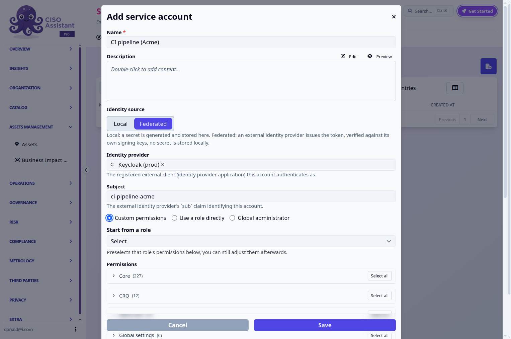
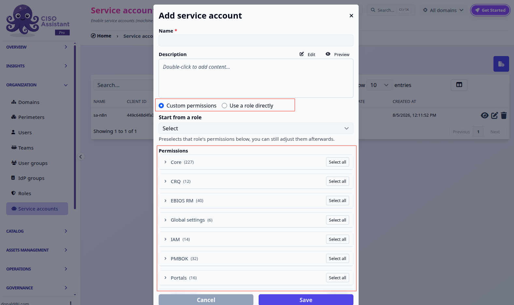
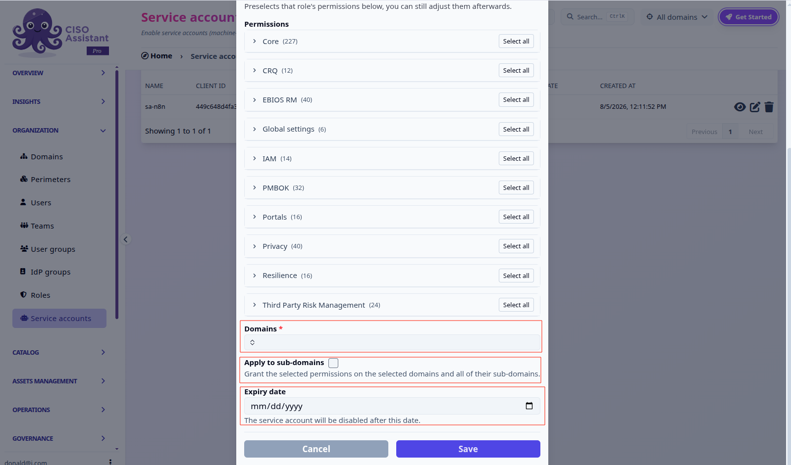
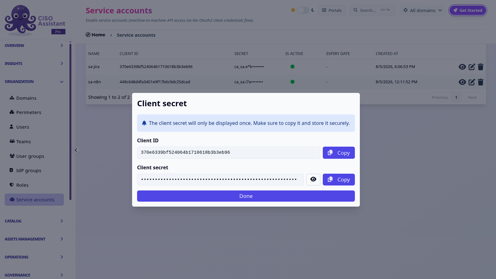
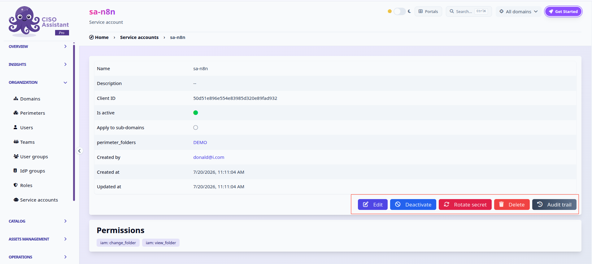
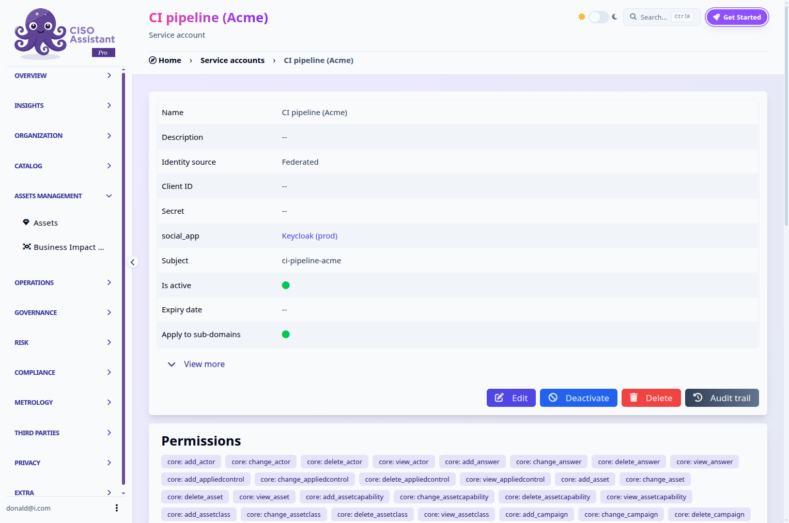
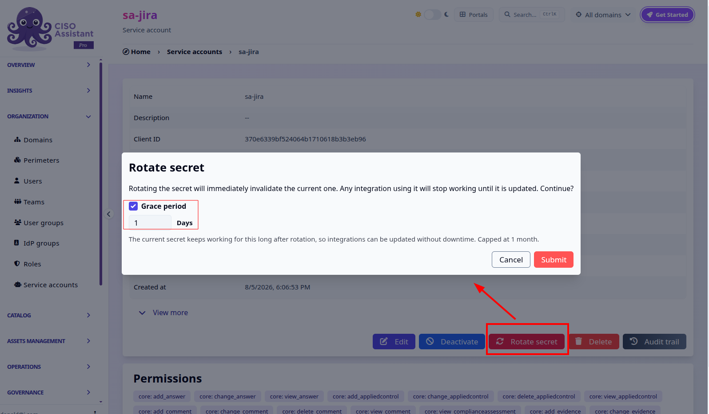

# Service accounts

A **service account** is an identity for a script, CI pipeline, or external system to call the CISO Assistant API on its own, no human, no session, no interactive login. It authenticates using the OAuth2 **client credentials** grant, either against the OIDC identity provider built into CISO Assistant (local) or against an external one (federated) — see below.


This is a **PRO** feature. It is gated by the `Service accounts` feature flag (see [feature-flags.md](../configuration/settings/feature-flags.md "mention")). While the flag is off, the **Service accounts** menu stays hidden and its API is unreachable.


## Identity source: local or federated

A service account authenticates one of two ways, chosen at creation and fixed afterwards — switching a service account from one to the other isn't supported:

* **Local** (the default): CISO Assistant generates the Client ID and secret itself, as described below.
* **Federated**: an external identity provider issues the token, verified against that provider's own signing keys. No secret is generated or stored here at all, there's nothing to leak on our side, and consequently nothing to rotate: **Rotate secret** isn't offered for a federated account.

Federated mode requires the external provider to already be registered as an [identity provider](identity-providers.md) (distinct from the SSO identity providers used for human login, see that page for the difference). Creating a federated service account asks for which provider it authenticates as, and the **subject** (`sub` claim) the provider's tokens will carry for it — both can be changed later, e.g. if the account is re-pointed at a new provider or the upstream subject changes.

Everything else, including the permission model below, works identically regardless of identity source.

<figure><figcaption><p>Federated identity source: identity provider, subject, and the same permission model as a local account.</p></figcaption></figure>

### Creating a service account

Service accounts live under **Organization > Service accounts** in the sidebar, right next to Roles. Creating one asks for a **name**, an optional description, the identity source above, how it gets its **permissions**, and the **domains** to scope it to.

There are two ways to grant permissions:

* **Custom permissions**, hand-pick permissions from the same grouped picker used by [custom roles](../configuration/organization/custom-roles.md), by app and model. The **Start from a role** dropdown preselects a built-in role's permissions as a starting point, which you can still adjust afterwards.
* **Use a role directly**, link the account to a built-in role. Its permissions then track that role live: if the role changes later, the service account's access changes with it.

<figure><figcaption><p>Custom permissions, with the "start from a role" preset and the grouped picker.</p></figcaption></figure>

Scrolling down, pick the **domains** the account can act on, with an option to extend the grant to their sub-domains automatically, and an optional **expiry date** after which the account is disabled.

<figure><figcaption><p>Domain scope, "apply to sub-domains", and expiry date.</p></figcaption></figure>

For a **local** account, on save the **Client ID** and **Client secret** are both shown, but only the secret is one-time:


The Client ID stays visible on the detail page afterwards. <mark style="color:orange;">Copy the secret now, it cannot be retrieved again.</mark> If you lose it, use **Rotate secret** to issue a new one.


<figure><figcaption><p>The client secret is shown only once, right after creation.</p></figcaption></figure>

Afterwards, the list and detail views show a **secret preview** (a masked prefix, e.g. `ca_sa.e*k········`) so you can recognize which secret is in use without ever re-exposing it in full. None of this, Client ID, secret, or secret preview, applies to a **federated** account: there is no local credential to show.

### Using it

For a **local** account, use the OAuth2 **client credentials** grant against CISO Assistant's own token endpoint:

```
curl https://<your-instance>/api/identity/o/api/token \
  -d "grant_type=client_credentials" \
  -d "client_id=<client_id>" \
  -d "client_secret=<client_secret>"
```

For a **federated** account, request the token from the external identity provider directly, using whatever flow that provider offers for machine-to-machine access (typically also client credentials, against the provider's own token endpoint, not CISO Assistant's). CISO Assistant never issues or sees that token being requested, it only verifies it on arrival.

Either way, the result is a bearer access token, scoped to the permissions and domains you granted. Use it like any other API token:

```
curl https://<your-instance>/api/users/ \
  -H "Authorization: Bearer <access_token>"
```

### Managing a service account

A service account's detail page shows its scope and granted permissions, plus (for a local account) its Client ID and secret preview, alongside the actions to manage its lifecycle:

<figure><figcaption><p>Edit, Deactivate, Rotate secret, Delete and Audit trail.</p></figcaption></figure>

<figure><figcaption><p>A federated account's detail page: Client ID and Secret both show "--", and there's no Rotate secret button.</p></figcaption></figure>

* **Edit** lets you change permissions, domains, and expiry date, including switching between **custom permissions** and **use a role directly** at any time. Switching to a role links live to that role's permissions; switching to custom detaches it into its own dedicated set, seeded with whatever permissions it had. The identity source, and for a federated account its provider and subject, can't be changed after creation, delete and recreate the account instead.
* **Deactivate** immediately revokes any outstanding local access token and blocks new ones from being issued, without deleting the account. For a federated account, deactivating rejects new authentication attempts even if the identity provider itself would still consider the underlying token valid, CISO Assistant checks the account's own active state on every request. **Activate** restores it.
* **Rotate secret** (local accounts only) invalidates the current secret and issues a new one on the spot, keeping the same Client ID. An optional **grace period** (in days, capped at one month) keeps the old secret working alongside the new one, so integrations can be updated without downtime. There's nothing to rotate on a federated account, the button isn't shown for one.

<figure><figcaption><p>Rotate secret, with an optional grace period for the old secret.</p></figcaption></figure>

* **Delete** removes the underlying local OAuth2 client entirely (for a local account); its Client ID stops being valid. A federated account has no client to remove, deleting it simply stops it from authenticating.

Unlike a [PAT](pat.md), a service account isn't tied to a human user and doesn't expire on a fixed schedule, it stays active until you deactivate or delete it, or until its optional expiry date passes, which makes it the right choice for long-running integrations rather than personal, short-lived API access.
