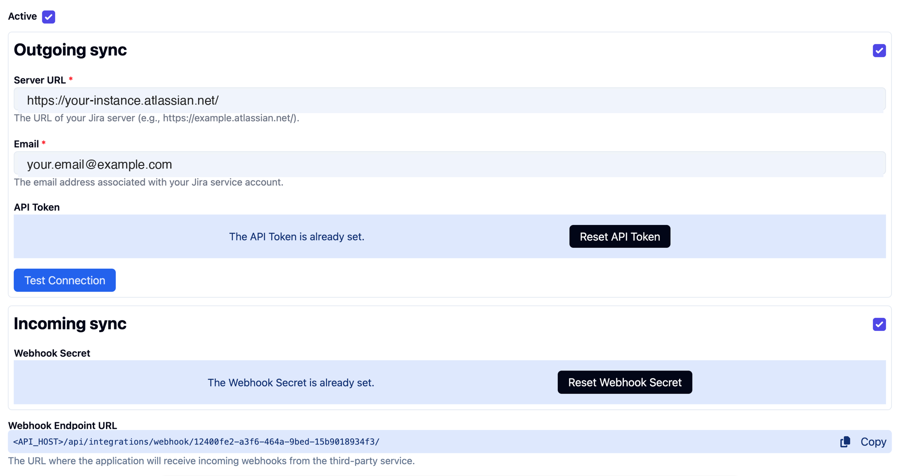
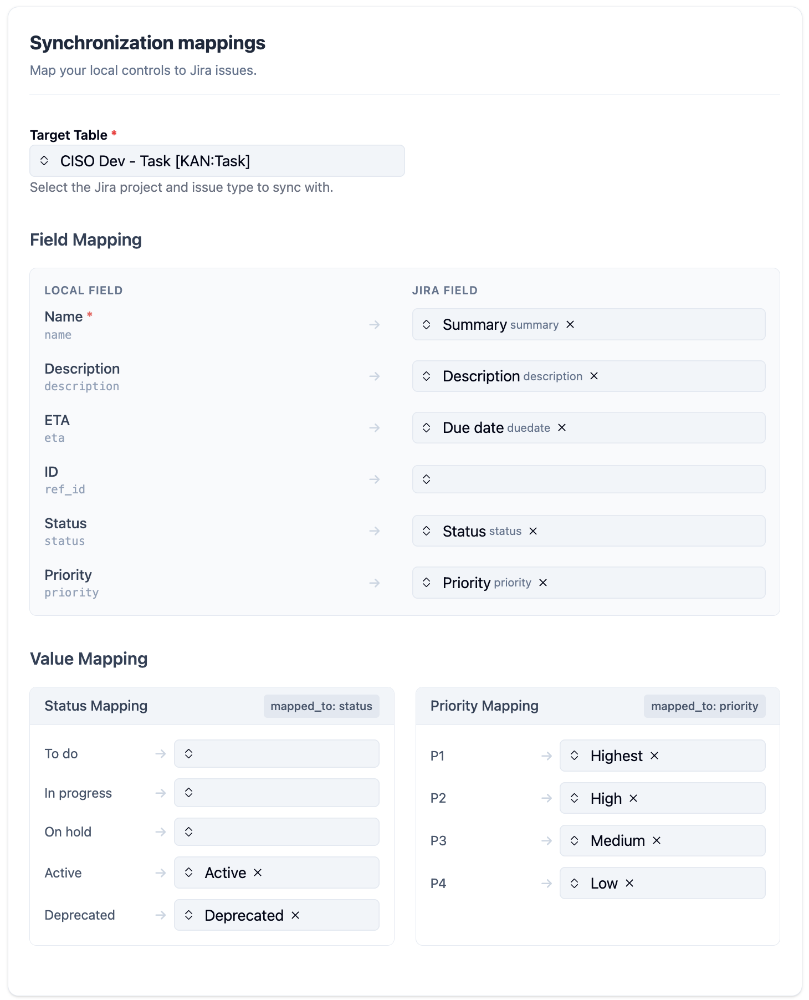

# Jira

## Overview

The Jira integration allows you to synchronize applied controls from CISO Assistant with issues in your Jira projects. This helps you track the implementation and status of your controls directly in Jira, leveraging your existing workflows.

When the integration is active, CISO Assistant will allow linking applied controls to Jira issues, or creating new issues when creating an applied control. Updates to the applied control in CISO Assistant will be reflected in the corresponding Jira issue, and vice-versa.

Two sync modes are available:

* **Incoming sync (pull):** Relies on webhooks to reflect changes made on a Jira issue to its linked applied control
* **Outgoing sync (push):** Pushes changes made on an applied control to its linked Jira issue through the Jira REST API

You can enable one or both of these modes.

### Prerequisites

* A CISO Assistant instance.
* A Jira Cloud account. Any user can create their own API token, but creating an outgoing webhook (required for incoming sync) needs **project admin** permission on the target project.
* A Jira project with at least one issue type you want to sync against.

## Outgoing sync

### Configuration

To configure the integration, you will need to perform steps on both the Jira and CISO Assistant sides.

#### 1. Configure Jira

**Create a Jira API Token**

1. Log in to your Jira account.
2. Go to your Atlassian account settings: click on your profile picture in the bottom left, then "Profile". In the new page, click on "Manage your account".
3. In your Atlassian account page, navigate to **Security** > **API token**.
4. Click on **Create and manage API tokens**.
5. Click **Create API token**.
6. Give your token a descriptive label, for example, "CISO Assistant Integration".
7. Copy the generated API token. You will not be able to see it again. Store it in a safe place. You will need it to configure CISO Assistant.

<figure><figcaption></figcaption></figure>

#### 2. Configure CISO Assistant

1. Log in to your CISO Assistant instance.
2. Navigate to **Extra > Settings > Integrations > Jira**.

    <figure><figcaption></figcaption></figure>
3. Enter the credentials:
   * **Server URL:** The URL of your Jira instance (e.g., `https://your-company.atlassian.net`).
   * **Email:** The email address you use to log in to Jira.
   * **API Token:** The API token you created in the previous step.

    Click **Test Connection** to verify, then **Save**. The Synchronization mappings section appears once the credentials are saved.

    <figure><figcaption></figcaption></figure>

4. Configure field mappings (see [below](jira.md#field-mappings)).

#### Field mappings

The **Synchronization mappings** section tells CISO Assistant which Jira project to sync against, and how its applied control fields map to your Jira issue fields.

<figure><figcaption></figcaption></figure>

**Target table**

Pick the Jira project and issue type to sync with. The dropdown shows every `<project> - <issue type>` combination accessible to your API token (e.g. `CISO Dev - Task`).

**Auto-populated defaults**

When you pick a table, CISO Assistant queries Jira for the fields and choice values that issue type exposes, then pre-fills sensible defaults: `Name → Summary`, `Description → Description`, `Status → Status`, `Priority → Priority`, `ETA → Due date`. Status and priority value rows are pre-filled with the canonical Jira labels (`Active → Active`, `P1 → Highest`, etc.) when the matching label exists in your Jira instance. Rows for fields or values your Jira project doesn't expose stay empty.

You can override any row. Picking a different table clears the suggestions and re-runs the auto-fill against the new table.

**Field mapping**

Each row maps a CISO Assistant field (left, with its model name in monospace) to a Jira field id (right). `Name` is required: Jira rejects issue creation without a `Summary`. Leave a row empty to skip syncing that field.

**Value mapping**

`Status` and `Priority` use enumerated values on both sides, so they need explicit value-by-value mappings. The blocks under **Value Mapping** appear automatically for each choice field that has a field-mapping row set, listing every CISO Assistant value (e.g. `To do`, `Active`, `P1`...) on the left and asking for the matching Jira value on the right.

Rows left empty behave differently per field at sync time:

* **Status (empty row):** on push, CISO Assistant skips the status transition for that local value. On pull, the local status stays unchanged.
* **Priority (empty row):** on push, the priority field is omitted from the Jira payload (Jira applies its default). On pull, the local priority stays unchanged.

For both, the recommendation is the same: map every local value you want CISO Assistant to keep in sync.

## Incoming sync

> **Note.** Incoming sync requires outgoing sync to be configured first. It reuses the same integration record.

> **SaaS only.** By default, the CISO Assistant API on SaaS is reachable only from within the pod, so Jira's webhook calls cannot reach it. To enable incoming sync, request ingress whitelisting for your tenant via the [customer support portal](https://intuitem.atlassian.net/servicedesk/customer/portal/4). Unless you ask for additional IPs, only Jira's published IP ranges will be allowed through.

#### 1. Configure on Jira

1. Log in to your Jira account.
2. Go to **System settings > WebHooks**.
3. Click **+ Create WebHook** in the top-right corner.
4. Set the **URL** to `<API_URL>/api/integrations/webhook/<INTEGRATION_CONFIG_ID>/`. The exact value is shown at the bottom of CISO Assistant's Jira integration page once the outgoing sync configuration has been saved (**Extra > Settings > Integrations > Jira**). If you don't see the URL, finish the outgoing sync form and press **Save** first.
5. Generate a webhook secret and copy it. You'll paste it into CISO Assistant in the next step.

    <figure><figcaption></figcaption></figure>
6. Tick the issue **created**, **updated**, and **deleted** events. Other events are ignored.

    <figure><figcaption></figcaption></figure>
7. Optionally filter the associated JQL to scope the webhook to the project you sync with (e.g. `project = PROJ`).
8. Save the webhook on Jira.

    <figure><figcaption></figcaption></figure>

#### 2. Configure on CISO Assistant

1. On the Jira integration page in CISO Assistant, paste the **Webhook Secret** you generated in the previous step into the corresponding field.
2. Save the integration configuration.

## What happens once configured

Once the integration is enabled, CISO Assistant will start synchronizing applied controls with Jira issues against the configured target table (project + issue type).

* For each applied control, a new issue is created in the target table if you tick **Create remote object** in the applied control creation form.
* The Jira issue contains the applied control's mapped fields (name, description, status, priority, ETA, etc.).
* A link to the Jira issue is shown on the applied control page in CISO Assistant.

The synchronization is automatic. Any update on an applied control in CISO Assistant is pushed to the corresponding Jira issue; any update on the Jira issue side fires a webhook to CISO Assistant.

#### Attaching an applied control to a Jira issue

There are several ways to link an applied control to a Jira issue:

* **On applied control creation:**
  * Open the `Integrations` dropdown menu located at the bottom of the form.
  * Select the `Jira` integration provider.
  * Check the `Create remote object` checkbox.
  * This will create a Jira issue in the configured target table (project + issue type) and link it to the applied control.

<figure><figcaption></figcaption></figure>

* **On an existing applied control:**
  * Go to an applied control's edit form.
  * Open the `Integrations` dropdown menu located at the bottom of the form.
  * Select the `Jira` integration provider.
  * Select the Jira issue you wish to link to your applied control.

<figure><figcaption></figcaption></figure>

#### Sync events

CISO Assistant pushes to Jira on the following local events:

* Creating an applied control (with `Create remote object` checked, or after manually linking).
* Updating an applied control.

CISO Assistant reacts to the following Jira webhook events on incoming sync:

* `jira:issue_created`
* `jira:issue_updated`
* `jira:issue_deleted`

## Notes

* On SaaS, push and pull are processed by a background queue (Huey). Expect up to ~60 seconds of latency between an action and the corresponding sync. Push to Jira itself is immediate once dequeued; pull is webhook-driven.
* Self-hosted deployments can tune this queue lag via the `scheduler-interval` value in the Huey configuration (`backend/ciso_assistant/settings.py`, `HUEY` block).
* Jira Cloud's REST API is enabled by default. On Jira Server / DC, make sure the REST API is reachable from CISO Assistant's network. SaaS customers can contact support if outbound access is restricted.
